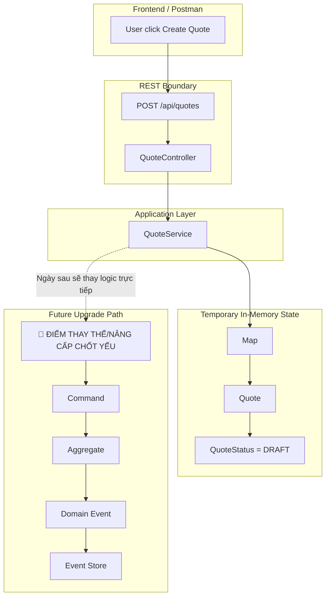

# Tech Note — Ngày 1: Tạo Project Spring Boot + REST Skeleton

> Vai trò kiến trúc: **REST API Skeleton / Command Entry Point Foundation**  
> Trạng thái: **Đã tạo nền HTTP đầu tiên để FE gọi vào BE**

---

## 1. DASHBOARD TIẾN ĐỘ

### ✅ Trạng thái tổng quan

```text
Giai đoạn hiện tại:
  Day 1 / Event Sourcing - CQRS Roadmap

Mục tiêu đã đạt:
  - Tạo project Spring Boot
  - Có REST endpoint cơ bản cho Quote
  - Có Controller nhận request HTTP
  - Có Service xử lý logic tạm thời
  - Có Model in-memory để hiểu Quote state ban đầu
  - Chưa có DB
  - Chưa có Command / Aggregate / Event Store
```

### ⚡ ĐIỂM DỪNG HIỆN TẠI

```text
Code hiện đang dừng ở tầng REST Skeleton.

FE có thể gọi:
  POST /api/quotes
  GET  /api/quotes/{id}
  GET  /api/quotes

BE hiện xử lý bằng:
  Controller -> Service -> In-memory Map

Quote state hiện đang lưu tạm trong RAM:
  Map<String, Quote>

Nếu restart app:
  toàn bộ Quote sẽ mất.
```

### 🎯 BƯỚC TIẾP THEO

```text
Ngày 2 — CRUD in-memory để hiểu state Quote trước khi bước vào Command/Aggregate/Event.

Trọng tâm ngày mai:
  - Hoàn thiện create/detail/list bằng in-memory state
  - Hiểu Quote là object nghiệp vụ
  - Hiểu status DRAFT/SUBMITTED/APPROVED
  - Chuẩn bị tư duy trước khi đưa rule vào Aggregate
```

---

## 2. MÔ PHỎNG CÂY THƯ MỤC

```text
quote-service/
├── build.gradle                         # [NEW] Khai báo dependency Spring Boot/Web/Validation/Test
├── settings.gradle                      # [NEW] Khai báo tên project Gradle
├── src/
│   └── main/
│       ├── java/
│       │   └── com/example/quoteservice/
│       │       ├── QuoteServiceApplication.java
│       │       │   # [NEW] Entry point Spring Boot, nơi app bắt đầu chạy
│       │       │
│       │       └── quote/
│       │           ├── api/
│       │           │   └── QuoteController.java
│       │           │       # [NEW] REST Controller, nhận HTTP request từ FE/Postman
│       │           │
│       │           ├── application/
│       │           │   └── QuoteService.java
│       │           │       # [NEW] Application Service tạm thời, xử lý use case đơn giản
│       │           │
│       │           └── model/
│       │               ├── Quote.java
│       │               │   # [NEW] Object nghiệp vụ Quote, hiện là model đơn giản
│       │               │
│       │               └── QuoteStatus.java
│       │                   # [NEW] Enum trạng thái Quote: DRAFT/SUBMITTED/APPROVED
│       │
│       └── resources/
│           └── application.yml
│               # [NEW] Cấu hình app: port, app name, logging cơ bản
```

Ghi nhớ nhanh:

```text
api/         = nơi HTTP đi vào
application/ = nơi điều phối use case
model/       = nơi đặt object nghiệp vụ ban đầu
```

---

## 3. SƠ ĐỒ LUỒNG DỮ LIỆU



### 🔴 ĐIỂM THAY THẾ/NÂNG CẤP CHỐT YẾU

```text
Hiện tại:
  QuoteService tự tạo Quote và lưu vào Map.

Sau này:
  QuoteService sẽ không tự đổi state trực tiếp.
  Nó sẽ build Command -> gửi vào Aggregate -> Aggregate sinh Event -> lưu Event Store.
```

---

## 4. CHI TIẾT SỰ DỊCH CHUYỂN LOGIC

### File bị tác động mạnh nhất

```text
QuoteService.java
```

### TRƯỚC ĐÓ — Chưa có backend skeleton

```java
// Chưa có REST API.
// Chưa có service.
// FE chưa có endpoint thật để gọi.

// Tư duy phía FE thường là:
const quote = {
  id: crypto.randomUUID(),
  customerName: form.customerName,
  productCode: form.productCode,
  status: "DRAFT"
};

setQuotes([...quotes, quote]);
```

### BÂY GIỜ — Backend bắt đầu giữ state tạm

```java
@Service
public class QuoteService {

    private final Map<String, Quote> quotes = new ConcurrentHashMap<>();

    public Quote create(String customerName, String productCode) {
        Quote quote = new Quote(
                UUID.randomUUID().toString(),
                customerName,
                productCode,
                QuoteStatus.DRAFT
        );

        quotes.put(quote.getId(), quote);

        return quote;
    }

    public Quote detail(String id) {
        return quotes.get(id);
    }

    public List<Quote> list() {
        return new ArrayList<>(quotes.values());
    }
}
```

### Vì sao kiến trúc đổi như vậy?

```text
FE mindset:
  User action -> setState -> re-render

BE mindset ngày 1:
  HTTP request -> Controller -> Service -> mutate server-side state

Lý do:
  Backend cần có một nơi nhận request ổn định trước.
  Chưa cần DB/Event Sourcing ngay.
  Phải hiểu state Quote đơn giản trước khi đưa vào Command/Aggregate/Event.
```

### Tư duy Enterprise cần giữ

```text
Controller:
  Không chứa business logic nặng.

Service:
  Điều phối use case.

Model:
  Đại diện dữ liệu nghiệp vụ ban đầu.

Map:
  Chỉ là storage tạm, sẽ bị thay bằng DB/Event Store.
```

---

## 5. QUY LUẬT ĐỌC LẠI 30 GIÂY

Khi mở lại note này, đọc theo thứ tự:

```text
Bước 1 — Nhìn DASHBOARD TIẾN ĐỘ
  Mục tiêu: biết hôm nay đang ở tầng nào.
  Cần nhớ: REST Skeleton + In-memory Map.

Bước 2 — Nhìn ĐIỂM DỪNG HIỆN TẠI
  Mục tiêu: biết code đang dừng ở đâu.
  Cần nhớ: Controller -> Service -> Map.

Bước 3 — Nhìn Mermaid Flow
  Mục tiêu: khôi phục luồng request.
  Cần nhớ: FE -> REST -> Controller -> Service -> In-memory State.

Bước 4 — Nhìn 🔴 ĐIỂM THAY THẾ/NÂNG CẤP
  Mục tiêu: biết ngày sau sẽ thay phần nào.
  Cần nhớ: Map/Service direct logic sẽ dần được thay bởi Command/Aggregate/Event Store.

Bước 5 — Nhìn phần TRƯỚC ĐÓ / BÂY GIỜ
  Mục tiêu: nối tư duy FE sang BE.
  Cần nhớ: BE không setState; BE nhận HTTP request và quản lý state phía server.
```

---

## 6. GHI NHỚ SIÊU NGẮN

```text
Ngày 1 không phải học Event Sourcing ngay.

Ngày 1 là dựng cổng vào:
  HTTP -> Controller -> Service -> Quote state tạm.

Phần sẽ bị thay sau:
  Map<String, Quote>
  logic create trực tiếp trong Service

Phần sẽ giữ lâu dài:
  REST boundary
  Controller pattern
  Application Service pattern
  Quote là object nghiệp vụ trung tâm
```

---

## 7. NEXT CONTEXT TOKEN

```text
NEXT:
  Day 2 = CRUD in-memory Quote.
  Tập trung hiểu state transition trước khi đưa rule vào Aggregate.
```
