# Tech Note — Ngày 2: CRUD In-memory để hiểu State Quote

> **Chuỗi học:** Java Backend → Event Sourcing / CQRS nâng cao  
> **Mục tiêu ngày:** Nắm `state` của Quote trước khi tách sang `Command / Aggregate / Event`.  
> **Kiểu note:** Kiến trúc động — đọc lại trong 30 giây.

---

## 1. DASHBOARD TIẾN ĐỘ

### Trạng thái tổng quan

```text
Level hiện tại: REST CRUD cơ bản + In-memory State
Persistence: Chưa có Database
Command/Aggregate/Event: Chưa có
Event Store: Chưa có
Projection/CQRS: Chưa có
```

### [⚡ ĐIỂM DỪNG HIỆN TẠI]

```text
Client gọi REST API Quote
  -> QuoteController nhận request
  -> QuoteService xử lý nghiệp vụ CRUD đơn giản
  -> Quote lưu trong Map<String, Quote> in-memory
  -> Trả Quote response về client
```

Code đang dừng ở mức:

```text
Quote đã có state thật: DRAFT / SUBMITTED / APPROVED / CANCELLED
Quote đã có dữ liệu sống tạm trong RAM
CRUD đã chạy được nhưng mất dữ liệu khi restart app
Business rule còn rất mỏng, chưa có Aggregate bảo vệ invariant
```

### [🎯 BƯỚC TIẾP THEO]

```text
Ngày 3 — BusinessException + GlobalExceptionHandler

Mục tiêu:
  - Không throw RuntimeException lung tung
  - Chuẩn hóa lỗi nghiệp vụ
  - Controller không tự try/catch
  - API trả lỗi dạng enterprise-friendly
```

---

## 2. MÔ PHỎNG CÂY THƯ MỤC

```text
src/main/java/com/example/quote/
├── QuoteApplication.java                         // App entrypoint Spring Boot
│
├── controller/
│   └── QuoteController.java                      // [REFACTOR] REST API CRUD: create/get/list/update/delete
│
├── service/
│   └── QuoteService.java                         // [NEW] Application Service tạm thời xử lý CRUD + giữ state in-memory
│
├── model/
│   ├── Quote.java                                // [NEW] Entity/domain model tạm thời biểu diễn state Quote
│   └── QuoteStatus.java                          // [NEW] Enum trạng thái Quote: DRAFT/SUBMITTED/APPROVED/CANCELLED
│
└── dto/
    ├── CreateQuoteRequest.java                   // [NEW] Input DTO cho create quote
    └── UpdateQuoteRequest.java                   // [NEW] Input DTO cho update quote
```

> Ghi chú kiến trúc: `QuoteService` hiện đang làm nhiều việc. Đây là chủ ý học tập để thấy `state` trước. Sau này logic sẽ dần dịch chuyển sang `Command`, `Aggregate`, `Event`.

---

## 3. SƠ ĐỒ LUỒNG DỮ LIỆU — FLOW HIỆN TẠI

```mermaid
graph TD
    Client[Client / Postman / FE]

    subgraph API_Layer[API Layer]
        Controller[QuoteController]
    end

    subgraph Application_Layer[Application Layer]
        Service[QuoteService]
    end

    subgraph Domain_State[Domain State tạm thời]
        Quote[Quote]
        Status[QuoteStatus]
    end

    subgraph InMemory_Storage[In-memory Storage]
        MapStore[Map<String, Quote>]
    end

    Client -->|HTTP CRUD request| Controller
    Controller -->|call service method| Service
    Service -->|create/update state| Quote
    Quote -->|has status| Status
    Service -->|put/get/remove| MapStore
    MapStore -->|return Quote| Service
    Service -->|response| Controller
    Controller -->|JSON response| Client

    Service -.-> Upgrade[🔴 ĐIỂM THAY THẾ/NÂNG CẤP CHỐT YẾU\nNgày sau: QuoteService không tự quyết state nữa\nLogic sẽ chuyển dần sang Command + Aggregate + Event]
```



---

## 4. CHI TIẾT SỰ DỊCH CHUYỂN LOGIC

### File bị tác động mạnh nhất

```text
QuoteController.java
```

### TRƯỚC ĐÓ — Ngày 1: REST skeleton, chưa có state thật

```java
@RestController
@RequestMapping("/api/quotes")
public class QuoteController {

    @PostMapping
    public String createQuote() {
        return "Quote created";
    }

    @GetMapping("/{id}")
    public String getQuote(@PathVariable String id) {
        return "Quote detail: " + id;
    }
}
```

### BÂY GIỜ — Ngày 2: Controller mỏng hơn, state nằm sau Service

```java
@RestController
@RequestMapping("/api/quotes")
public class QuoteController {

    private final QuoteService quoteService;

    public QuoteController(QuoteService quoteService) {
        this.quoteService = quoteService;
    }

    @PostMapping
    public Quote create(@RequestBody CreateQuoteRequest request) {
        return quoteService.create(request);
    }

    @GetMapping("/{id}")
    public Quote getById(@PathVariable String id) {
        return quoteService.getById(id);
    }

    @GetMapping
    public List<Quote> findAll() {
        return quoteService.findAll();
    }

    @PutMapping("/{id}")
    public Quote update(
            @PathVariable String id,
            @RequestBody UpdateQuoteRequest request
    ) {
        return quoteService.update(id, request);
    }

    @DeleteMapping("/{id}")
    public void delete(@PathVariable String id) {
        quoteService.delete(id);
    }
}
```

### Vì sao kiến trúc đổi như vậy?

```text
TRƯỚC ĐÓ:
  Controller trả text giả lập.
  Chưa có Quote state.
  Chưa có nơi lưu dữ liệu.

BÂY GIỜ:
  Controller chỉ điều phối HTTP.
  QuoteService giữ use case CRUD.
  Quote model bắt đầu có state.
  Map<String, Quote> đóng vai trò repository tạm thời.
```

### Ý nghĩa Enterprise Architecture

```text
Controller không nên chứa nghiệp vụ.
Service là Application Boundary tạm thời.
Quote là Domain State đầu tiên.
In-memory Map chỉ là persistence giả lập, sẽ bị thay bằng Repository/Database/Event Store.
```

---

## 5. QUY LUẬT ĐỌC LẠI 30 GIÂY

Khi mở lại note này, đọc theo thứ tự:

```text
Bước 1 — Nhìn DASHBOARD
  -> Biết mình đang ở level nào: CRUD in-memory, chưa Command/Aggregate/Event.

Bước 2 — Nhìn [⚡ ĐIỂM DỪNG HIỆN TẠI]
  -> Khôi phục flow hiện tại: Controller -> Service -> Map.

Bước 3 — Nhìn Mermaid Flow
  -> Nhận ra điểm nâng cấp chốt yếu: QuoteService đang là nơi sẽ bị tách logic sau này.

Bước 4 — Nhìn cây thư mục
  -> Biết file nào mới: Quote, QuoteStatus, QuoteService, DTO.

Bước 5 — Nhìn phần TRƯỚC ĐÓ / BÂY GIỜ
  -> Thấy rõ dịch chuyển từ REST giả lập sang state thật.

Bước 6 — Nhìn [🎯 BƯỚC TIẾP THEO]
  -> Biết ngày mai học lỗi nghiệp vụ: BusinessException + GlobalExceptionHandler.
```

---

## 6. GHI NHỚ CHỐT

```text
Ngày 2 không phải để làm kiến trúc đẹp.
Ngày 2 để nhìn thấy Quote có state thật.

Khi đã thấy state thay đổi qua CRUD,
ta mới có lý do tách tiếp sang:
  Command -> Aggregate -> Event -> Event Store -> Projection.
```
