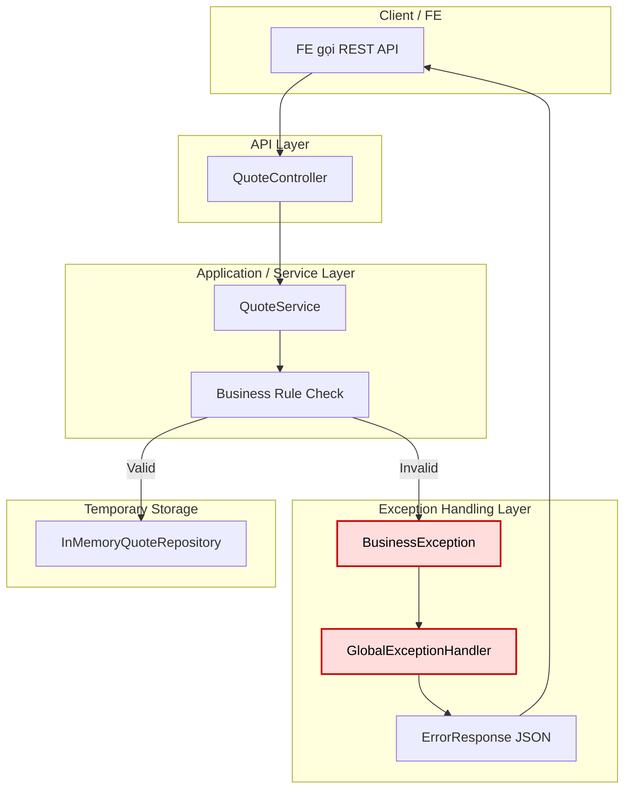

# Tech Note — Ngày 3: BusinessException + GlobalExceptionHandler

> **Chủ đề:** Chuẩn hóa lỗi nghiệp vụ trong Spring Boot  
> **Track:** Java Backend → Event Sourcing / CQRS Foundation  
> **Trạng thái:** ✅ Hoàn thành bước chuẩn hóa error response cho Command API

---

## 1. DASHBOARD TIẾN ĐỘ

### Tổng quan

| Hạng mục | Trạng thái |
|---|---|
| REST API skeleton | ✅ Đã có |
| CRUD Quote in-memory | ✅ Đã có |
| BusinessException | ✅ Mới thêm |
| GlobalExceptionHandler | ✅ Mới thêm |
| Error response chuẩn hóa | ✅ Mới thêm |
| Command / DTO tách riêng | ⏭️ Ngày 4 |

---

### ⚡ ĐIỂM DỪNG HIỆN TẠI

Code hiện đang dừng tại mức:

```txt
Controller
  -> Service
      -> kiểm tra rule nghiệp vụ
      -> nếu sai: throw BusinessException
  -> GlobalExceptionHandler bắt lỗi
  -> trả JSON lỗi chuẩn cho FE
```

Rule nghiệp vụ **không còn trả `null` / string lỗi tùy tiện** nữa.

Ví dụ lỗi hiện tại:

```json
{
  "code": "QUOTE_NOT_FOUND",
  "message": "Quote not found",
  "timestamp": "2026-xx-xxTxx:xx:xx"
}
```

---

### 🎯 BƯỚC TIẾP THEO

**Ngày 4 — Tách DTO → Command**

Mục tiêu ngày mai:

```txt
Request DTO từ Controller
  -> map sang Command
  -> Service xử lý Command
```

Chuẩn bị cho kiến trúc:

```txt
API Layer không gọi thẳng domain model.
Command Layer bắt đầu xuất hiện.
```

---

## 2. MÔ PHỎNG CÂY THƯ MỤC

```txt
src/main/java/com/example/quote
├── QuoteApplication.java
│   └── App entrypoint
│
├── controller
│   └── QuoteController.java
│       └── REST API: create/get/submit quote
│
├── service
│   └── QuoteService.java
│       └── Chứa business rule tạm thời, throw BusinessException khi rule sai
│
├── model
│   ├── Quote.java
│   │   └── Entity/domain object in-memory hiện tại
│   └── QuoteStatus.java
│       └── Enum trạng thái: DRAFT, SUBMITTED, APPROVED
│
├── exception
│   ├── BusinessException.java              // [NEW] Lỗi nghiệp vụ có code/message rõ ràng
│   ├── ErrorResponse.java                  // [NEW] Response lỗi chuẩn trả về FE
│   └── GlobalExceptionHandler.java         // [NEW] Bắt exception toàn app và map sang HTTP response
│
└── repository
    └── InMemoryQuoteRepository.java
        └── Lưu Quote tạm trong Map, chưa dùng DB
```

Ghi chú kiến trúc:

```txt
exception/*
  = lớp cross-cutting concern đầu tiên trong app.

BusinessException
  = lỗi có chủ đích từ business rule.

GlobalExceptionHandler
  = adapter chuyển exception nội bộ thành HTTP response chuẩn.
```

---

## 3. SƠ ĐỒ LUỒNG DỮ LIỆU



### 🔴 ĐIỂM THAY THẾ/NÂNG CẤP CHỐT YẾU

```txt
TRƯỚC:
  Controller/Service tự xử lý lỗi rời rạc.

BÂY GIỜ:
  Service chỉ throw BusinessException.
  GlobalExceptionHandler chịu trách nhiệm chuẩn hóa HTTP error response.
```

Đây là bước đầu để sau này Command Handler / Aggregate có thể throw lỗi nghiệp vụ mà API vẫn trả response thống nhất.

---

## 4. CHI TIẾT SỰ DỊCH CHUYỂN LOGIC

### File bị tác động mạnh nhất

```txt
QuoteService.java
```

---

### TRƯỚC ĐÓ

```java
public Quote getQuote(String id) {
    Quote quote = repository.findById(id);

    if (quote == null) {
        return null;
    }

    return quote;
}

public Quote submitQuote(String id) {
    Quote quote = repository.findById(id);

    if (quote == null) {
        return null;
    }

    if (quote.getStatus() != QuoteStatus.DRAFT) {
        return null;
    }

    quote.setStatus(QuoteStatus.SUBMITTED);
    repository.save(quote);

    return quote;
}
```

Vấn đề:

```txt
- Lỗi không rõ nguyên nhân.
- FE không biết là not found hay sai trạng thái.
- Controller phải tự đoán lỗi.
- Không phù hợp Enterprise API.
```

---

### BÂY GIỜ

```java
public Quote getQuote(String id) {
    Quote quote = repository.findById(id);

    if (quote == null) {
        throw new BusinessException(
            "QUOTE_NOT_FOUND",
            "Quote not found"
        );
    }

    return quote;
}

public Quote submitQuote(String id) {
    Quote quote = repository.findById(id);

    if (quote == null) {
        throw new BusinessException(
            "QUOTE_NOT_FOUND",
            "Quote not found"
        );
    }

    if (quote.getStatus() != QuoteStatus.DRAFT) {
        throw new BusinessException(
            "QUOTE_INVALID_STATUS",
            "Only DRAFT quote can be submitted"
        );
    }

    quote.setStatus(QuoteStatus.SUBMITTED);
    repository.save(quote);

    return quote;
}
```

`GlobalExceptionHandler` chịu trách nhiệm map lỗi:

```java
@ExceptionHandler(BusinessException.class)
public ResponseEntity<ErrorResponse> handleBusinessException(
        BusinessException exception
) {
    ErrorResponse response = new ErrorResponse(
            exception.getCode(),
            exception.getMessage(),
            LocalDateTime.now()
    );

    return ResponseEntity
            .badRequest()
            .body(response);
}
```

---

### Vì sao kiến trúc đổi?

```txt
Lý do chính:
  Tách business error khỏi HTTP handling.

Service:
  chỉ biết rule nghiệp vụ đúng/sai.

GlobalExceptionHandler:
  biết cách biến lỗi thành HTTP response.

Controller:
  sạch hơn, không cần try/catch nghiệp vụ lặp lại.
```

Tác dụng dài hạn:

```txt
Sau này Aggregate.process(command) có thể throw BusinessException.
Command API vẫn trả lỗi chuẩn mà không cần sửa nhiều Controller.
```

---

## 5. QUY LUẬT ĐỌC LẠI 30 GIÂY

Khi mở lại file này, đọc theo thứ tự:

### Bước 1 — Nhìn Dashboard trước

```txt
Xem:
  ⚡ ĐIỂM DỪNG HIỆN TẠI
  🎯 BƯỚC TIẾP THEO
```

Mục tiêu:

```txt
Biết hôm nay code dừng ở đâu và ngày mai nối tiếp chỗ nào.
```

---

### Bước 2 — Nhìn cây thư mục

```txt
Tập trung vào package:
  exception/*
```

Mục tiêu:

```txt
Nhớ 3 file mới:
  BusinessException
  ErrorResponse
  GlobalExceptionHandler
```

---

### Bước 3 — Nhìn Mermaid flow

```txt
Tìm node màu đỏ:
  BusinessException
  GlobalExceptionHandler
```

Mục tiêu:

```txt
Nhớ điểm nâng cấp kiến trúc:
  lỗi nghiệp vụ đi qua exception layer tập trung.
```

---

### Bước 4 — Nhìn phần TRƯỚC ĐÓ / BÂY GIỜ

```txt
So sánh QuoteService.java
```

Mục tiêu:

```txt
Nhớ logic đã dịch chuyển:
  return null / xử lý lỗi rời rạc
  -> throw BusinessException / GlobalExceptionHandler chuẩn hóa response
```

---

## Kết luận 30 giây

```txt
Ngày 3 đã biến lỗi nghiệp vụ từ xử lý rời rạc thành cơ chế Enterprise chuẩn:

Business Rule sai
  -> throw BusinessException
  -> GlobalExceptionHandler bắt
  -> ErrorResponse JSON trả về FE

Đây là nền để ngày sau Command Handler / Aggregate throw lỗi mà API vẫn ổn định.
```
