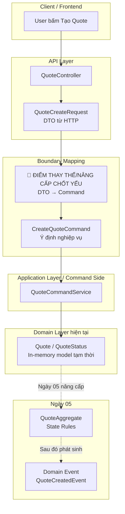

# Tech Note — Ngày 04: Tách DTO → Command để chuẩn bị Command/Aggregate/Event

> **Mục tiêu kiến trúc:** tách dữ liệu API đầu vào khỏi ý định nghiệp vụ.  
> **Từ khóa chính:** DTO Boundary, Command Object, Application Service, CQRS Preparation.

---

## 1. DASHBOARD TIẾN ĐỘ

| Hạng mục | Trạng thái |
|---|---|
| Giai đoạn | Nền tảng Command Side |
| Ngày hiện tại | **Ngày 04** |
| Chủ đề | **Tách DTO → Command** |
| Mức hoàn thành | ✅ Hoàn thành bước chuẩn bị trước Aggregate |
| Kiến trúc hiện tại | Controller nhận Request DTO → map sang Command → Service xử lý Command |
| Kiến trúc chưa có | Aggregate, Domain Event, Event Store |

### ⚡ ĐIỂM DỪNG HIỆN TẠI

Code đang dừng ở trạng thái:

```txt
API Layer đã không còn đẩy DTO thẳng xuống business logic.

Hiện tại:
POST /api/quotes
  -> QuoteCreateRequest       // DTO từ HTTP
  -> CreateQuoteCommand       // Ý định nghiệp vụ
  -> QuoteCommandService      // Application Service xử lý command
  -> Quote in-memory state    // Tạm thời, chưa có Aggregate/Event
```

Điểm quan trọng nhất:

```txt
DTO = dữ liệu từ bên ngoài hệ thống
Command = ý định nghiệp vụ bên trong hệ thống
```

### 🎯 BƯỚC TIẾP THEO

Ngày mai:

```txt
Ngày 05 — Tạo QuoteAggregate + state rules.

Mục tiêu:
Controller không biết rule.
Service không tự quyết toàn bộ rule.
Aggregate bắt đầu chịu trách nhiệm kiểm tra trạng thái:
  DRAFT -> SUBMITTED -> APPROVED
```

---

## 2. MÔ PHỎNG CÂY THƯ MỤC

```txt
src/main/java/com/example/quote/

├── api/
│   └── QuoteController.java
│       // [REFACTOR] Controller chỉ nhận HTTP DTO và chuyển thành Command.
│       // Không chứa business rule.

├── api/dto/
│   ├── QuoteCreateRequest.java
│   │   // [GIỮ] DTO đầu vào từ client khi tạo Quote.
│   │   // Gắn với HTTP/API contract.
│   │
│   ├── QuoteSubmitRequest.java
│   │   // [GIỮ] DTO đầu vào khi submit Quote nếu cần request body.
│   │
│   └── QuoteResponse.java
│       // [GIỮ] DTO đầu ra trả về client.

├── application/
│   ├── QuoteCommandService.java
│   │   // [REFACTOR] Service nhận Command thay vì nhận DTO.
│   │   // Đây là Application Service của Command Side.
│   │
│   └── command/
│       ├── CreateQuoteCommand.java
│       │   // [MỚI] Biểu diễn ý định nghiệp vụ: "tạo Quote".
│       │   // Không phụ thuộc HTTP.
│       │
│       └── SubmitQuoteCommand.java
│           // [MỚI] Biểu diễn ý định nghiệp vụ: "submit Quote".

├── domain/
│   ├── Quote.java
│   │   // [TẠM] Entity/model in-memory hiện tại.
│   │   // Ngày 05 sẽ được nâng cấp tư duy thành QuoteAggregate.
│   │
│   └── QuoteStatus.java
│       // [GIỮ] Trạng thái nghiệp vụ: DRAFT, SUBMITTED, APPROVED.

└── exception/
    ├── BusinessException.java
    ├── NotFoundException.java
    └── GlobalExceptionHandler.java
        // [GIỮ] Chuẩn hóa lỗi nghiệp vụ/API.
```

---

## 3. SƠ ĐỒ LUỒNG DỮ LIỆU



---

## 4. CHI TIẾT SỰ DỊCH CHUYỂN LOGIC

### File bị tác động mạnh nhất

```txt
QuoteController.java
```

### TRƯỚC ĐÓ — Controller đẩy DTO/field xuống Service

```java
@RestController
@RequestMapping("/api/quotes")
public class QuoteController {

    private final QuoteCommandService quoteCommandService;

    @PostMapping
    public QuoteResponse create(@RequestBody QuoteCreateRequest request) {
        return quoteCommandService.createQuote(
                request.getCustomerName(),
                request.getProductCode(),
                request.getPremium()
        );
    }
}
```

Vấn đề:

```txt
Controller biết quá nhiều về input của use case.
Service signature dễ phình to khi nghiệp vụ tăng field.
DTO từ HTTP bị trộn với ý định nghiệp vụ.
Khó chuyển sang Aggregate.process(command) sau này.
```

---

### BÂY GIỜ — Controller map DTO → Command

```java
@RestController
@RequestMapping("/api/quotes")
public class QuoteController {

    private final QuoteCommandService quoteCommandService;

    @PostMapping
    public QuoteResponse create(@RequestBody QuoteCreateRequest request) {
        CreateQuoteCommand command = new CreateQuoteCommand(
                request.getCustomerName(),
                request.getProductCode(),
                request.getPremium()
        );

        return quoteCommandService.createQuote(command);
    }
}
```

Service đổi sang nhận Command:

```java
@Service
public class QuoteCommandService {

    public QuoteResponse createQuote(CreateQuoteCommand command) {
        Quote quote = Quote.createDraft(
                command.getCustomerName(),
                command.getProductCode(),
                command.getPremium()
        );

        // hiện tại vẫn lưu in-memory
        // ngày sau sẽ chuyển thành Aggregate + Event

        return QuoteResponse.from(quote);
    }
}
```

Lý do đổi kiến trúc:

```txt
DTO thuộc API contract.
Command thuộc Application/Domain use case.
Tách DTO → Command giúp code sẵn sàng cho CQRS/Event Sourcing.

Sau này có thể nâng cấp tự nhiên:
QuoteCommandService
  -> QuoteAggregate.process(CreateQuoteCommand)
  -> QuoteCreatedEvent
```

---

## 5. QUY LUẬT ĐỌC LẠI 30 GIÂY

Khi mở lại file này, đọc theo thứ tự sau:

```txt
1. Nhìn DASHBOARD TIẾN ĐỘ
   -> Biết đang ở Ngày 04, trạng thái là DTO đã tách sang Command.

2. Nhìn mục ⚡ ĐIỂM DỪNG HIỆN TẠI
   -> Khôi phục flow code hiện tại:
      Request DTO -> Command -> Service -> in-memory Quote.

3. Nhìn SƠ ĐỒ MERMAID
   -> Tìm ngay ô màu chữ:
      🔴 ĐIỂM THAY THẾ/NÂNG CẤP CHỐT YẾU
      Đây là chỗ kiến trúc đổi trong ngày hôm nay.

4. Nhìn phần TRƯỚC ĐÓ / BÂY GIỜ
   -> Nhớ chính xác file bị refactor mạnh nhất:
      QuoteController.java.

5. Nhìn 🎯 BƯỚC TIẾP THEO
   -> Biết ngày sau sẽ bắt đầu QuoteAggregate + state rules.
```

---

## TÓM TẮT 1 DÒNG

```txt
Ngày 04 chuyển hệ thống từ API-driven code sang Command-driven code,
chuẩn bị để Ngày 05 đưa business rule vào QuoteAggregate.
```
