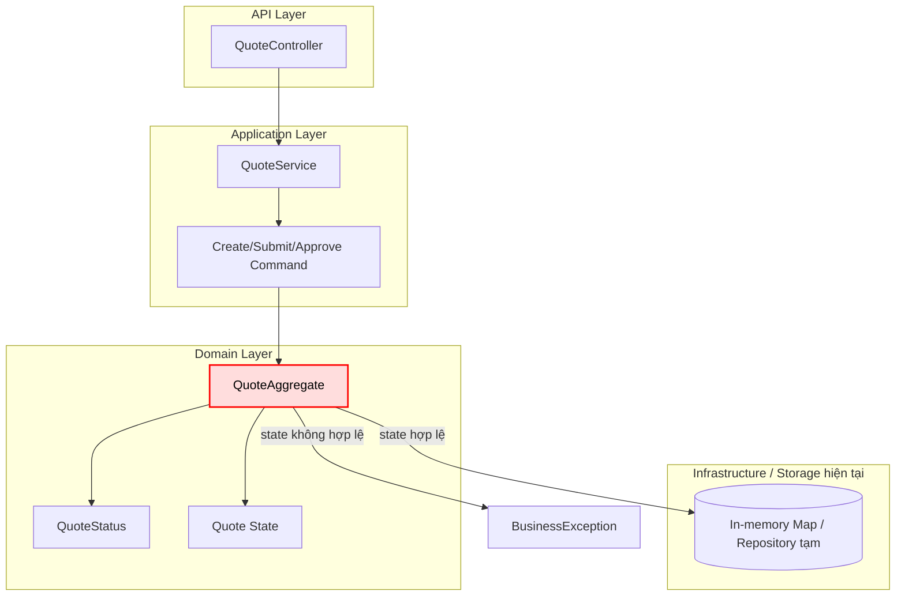

# Tech Note — Ngày 05: QuoteAggregate & State Rules

> **Chủ đề:** Đưa business rule trạng thái vào `QuoteAggregate`  
> **Track:** Java Backend / Event Sourcing / CQRS Foundation  
> **Trạng thái:** ✅ Hoàn thành nền tảng Aggregate trước khi sinh Domain Event

---

## 1. DASHBOARD TIẾN ĐỘ

| Hạng mục | Trạng thái |
|---|---|
| REST API skeleton | ✅ Có |
| DTO → Command | ✅ Có |
| Quote model / QuoteStatus | ✅ Có |
| Business rule nằm trong Aggregate | ✅ Hoàn thành hôm nay |
| Domain Event | ⏭️ Ngày mai |
| Event Store | ⏳ Chưa làm |
| Projection / Read Model | ⏳ Chưa làm |

### ⚡ ĐIỂM DỪNG HIỆN TẠI

```txt
Controller
  -> nhận request

Service
  -> build/use Command
  -> gọi QuoteAggregate

QuoteAggregate
  -> giữ trạng thái Quote hiện tại
  -> kiểm tra rule chuyển trạng thái
  -> mutate state nếu hợp lệ
```

**Code đang dừng ở mức:**  
`QuoteAggregate` đã là nơi quyết định quote có được `submit` / `approve` hay không.

```txt
Rule hiện tại:
DRAFT     -> SUBMITTED  ✅
SUBMITTED -> APPROVED   ✅
APPROVED  -> submit lại  ❌
DRAFT     -> approve     ❌
```

### 🎯 BƯỚC TIẾP THEO

**Ngày 06 — Tạo Domain Events**

```txt
Thay vì Aggregate tự đổi state trực tiếp,
Aggregate sẽ sinh event:

CreateQuoteCommand
  -> QuoteCreatedEvent

SubmitQuoteCommand
  -> QuoteSubmittedEvent

ApproveQuoteCommand
  -> QuoteApprovedEvent
```

Mục tiêu ngày mai:

```txt
Command quyết định ý định.
Aggregate kiểm tra rule.
Event ghi lại sự thật đã xảy ra.
```

---

## 2. MÔ PHỎNG CÂY THƯ MỤC

```txt
src/main/java/com/example/quote
├── controller
│   └── QuoteController.java              // REST API entrypoint
│
├── application
│   ├── QuoteService.java                 // REFACTORED: bớt giữ rule, gọi Aggregate xử lý
│   └── command
│       ├── CreateQuoteCommand.java       // có từ Ngày 04: input dạng use-case command
│       ├── SubmitQuoteCommand.java       // có từ Ngày 04
│       └── ApproveQuoteCommand.java      // có từ Ngày 04
│
├── domain
│   ├── Quote.java                        // Entity/domain state đơn giản
│   ├── QuoteStatus.java                  // Enum trạng thái: DRAFT, SUBMITTED, APPROVED
│   └── QuoteAggregate.java               // NEW: trung tâm giữ rule chuyển trạng thái
│
└── exception
    ├── BusinessException.java            // dùng khi vi phạm rule nghiệp vụ
    └── NotFoundException.java            // dùng khi quote không tồn tại
```

**File tác động mạnh nhất hôm nay:**

```txt
domain/QuoteAggregate.java
```

Vai trò:

```txt
Không để Service quyết định rule nghiệp vụ.
Aggregate là boundary bảo vệ consistency của Quote.
```

---

## 3. SƠ ĐỒ LUỒNG DỮ LIỆU



### 🔴 ĐIỂM THAY THẾ/NÂNG CẤP CHỐT YẾU

```txt
TRƯỚC:
  Service tự check status và tự đổi status.

BÂY GIỜ:
  QuoteAggregate kiểm tra rule và bảo vệ trạng thái.

SAU NÀY:
  QuoteAggregate không mutate trực tiếp nữa,
  mà sinh DomainEvent để Event Store lưu lại.
```

---

## 4. CHI TIẾT SỰ DỊCH CHUYỂN LOGIC

### TRƯỚC ĐÓ — Rule nằm trong Service

```java
public Quote submit(String quoteId) {
    Quote quote = quoteRepository.findById(quoteId)
            .orElseThrow(() -> new NotFoundException("Quote not found"));

    if (quote.getStatus() != QuoteStatus.DRAFT) {
        throw new BusinessException("Only DRAFT quote can be submitted");
    }

    quote.setStatus(QuoteStatus.SUBMITTED);

    return quoteRepository.save(quote);
}
```

Vấn đề:

```txt
Service đang biết quá nhiều rule nghiệp vụ.
Nếu nhiều use-case cùng đổi trạng thái, rule dễ bị duplicate.
Domain model bị thiếu vai trò bảo vệ consistency.
```

---

### BÂY GIỜ — Rule nằm trong Aggregate

```java
public class QuoteAggregate {

    private Quote quote;

    public QuoteAggregate(Quote quote) {
        this.quote = quote;
    }

    public void submit() {
        if (quote.getStatus() != QuoteStatus.DRAFT) {
            throw new BusinessException("Only DRAFT quote can be submitted");
        }

        quote.setStatus(QuoteStatus.SUBMITTED);
    }

    public void approve() {
        if (quote.getStatus() != QuoteStatus.SUBMITTED) {
            throw new BusinessException("Only SUBMITTED quote can be approved");
        }

        quote.setStatus(QuoteStatus.APPROVED);
    }

    public Quote getQuote() {
        return quote;
    }
}
```

Service sau refactor:

```java
public Quote submit(String quoteId) {
    Quote quote = quoteRepository.findById(quoteId)
            .orElseThrow(() -> new NotFoundException("Quote not found"));

    QuoteAggregate aggregate = new QuoteAggregate(quote);

    aggregate.submit();

    return quoteRepository.save(aggregate.getQuote());
}
```

Lý do kiến trúc đổi:

```txt
Service = điều phối use case.
Aggregate = bảo vệ business invariant.
Repository = lưu trạng thái.
```

Enterprise mindset:

```txt
Không để nghiệp vụ quan trọng nằm rải rác trong Service.
Đưa rule vào Aggregate để chuẩn bị cho Event Sourcing.
```

---

## 5. QUY LUẬT ĐỌC LẠI 30 GIÂY

Khi mở lại file này, đọc theo thứ tự:

```txt
1. Nhìn DASHBOARD
   -> biết hôm nay đã làm gì, còn thiếu gì.

2. Nhìn ⚡ ĐIỂM DỪNG HIỆN TẠI
   -> khôi phục chính xác code đang dừng ở đâu.

3. Nhìn cây thư mục
   -> biết file nào mới/refactor và vai trò từng file.

4. Nhìn Mermaid flow
   -> nhớ boundary: Controller / Service / Aggregate / Storage.

5. Nhìn phần TRƯỚC ĐÓ vs BÂY GIỜ
   -> hiểu thay đổi kiến trúc quan trọng nhất.

6. Nhìn 🎯 BƯỚC TIẾP THEO
   -> biết ngày mai phải làm Domain Events.
```

---

## TÓM TẮT 1 DÒNG

```txt
Ngày 05 chuyển rule trạng thái Quote từ Service vào QuoteAggregate,
đặt nền cho Ngày 06: Aggregate sinh DomainEvent thay vì chỉ mutate state.
```
