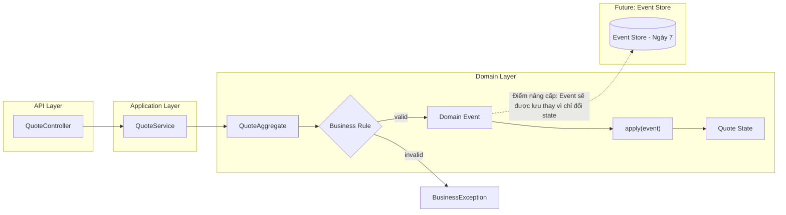

# Tech Note — Ngày 6: Domain Event cho Quote Aggregate

> Chủ đề: **Event Sourcing / CQRS — Aggregate sinh Event thay vì đổi state trực tiếp**  
> Trạng thái: `DONE` — đã chuyển mindset từ **state mutation trực tiếp** sang **event-first domain model**

---

## 1. DASHBOARD TIẾN ĐỘ

### ✅ Trạng thái tổng quan

| Hạng mục | Trạng thái |
|---|---|
| Quote Aggregate | Đã refactor sang sinh Domain Event |
| Domain Event classes | Đã tạo `QuoteCreatedEvent`, `QuoteSubmittedEvent`, `QuoteApprovedEvent` |
| State transition | Không đổi trực tiếp trong command method nữa |
| Event Sourcing mindset | Bắt đầu hình thành: **Command -> Event -> Apply State** |
| Persistence thật | Chưa có |
| Event Store | Chưa có |
| Replay Event | Chưa có |

### ⚡ ĐIỂM DỪNG HIỆN TẠI

Code hiện đang dừng ở trạng thái:

```text
Controller/Service gọi Aggregate
  -> Aggregate nhận command/action
  -> Aggregate kiểm tra business rule
  -> Aggregate sinh Domain Event
  -> Event được apply vào Aggregate để đổi state hiện tại
```

Điểm quan trọng nhất hôm nay:

```text
QuoteAggregate không còn là nơi "đổi state trực tiếp".
QuoteAggregate trở thành nơi "ra quyết định và sinh sự kiện nghiệp vụ".
```

Ví dụ:

```text
submit()
  TRƯỚC: status = SUBMITTED

  BÂY GIỜ:
    validate trạng thái
    tạo QuoteSubmittedEvent
    apply(event)
```

### 🎯 BƯỚC TIẾP THEO

Ngày mai:

```text
Ngày 7 — Tạo Event Store mini:
Lưu các Domain Event đã sinh ra vào bộ nhớ hoặc repository giả lập.
```

Mục tiêu ngày 7:

```text
Command không chỉ sinh event.
Event phải được lưu lại thành event history.
```

---

## 2. MÔ PHỎNG CÂY THƯ MỤC

```text
src/main/java/com/example/quote/
├── domain/
│   └── quote/
│       ├── Quote.java                          // Entity/model trạng thái hiện tại của Quote
│       ├── QuoteStatus.java                    // Enum: DRAFT, SUBMITTED, APPROVED
│       │
│       ├── QuoteAggregate.java                 // [REFACTOR] Không đổi state trực tiếp; sinh event + apply event
│       │
│       └── event/
│           ├── DomainEvent.java                // [NEW] Marker/base interface cho mọi domain event
│           ├── QuoteCreatedEvent.java          // [NEW] Sự kiện Quote đã được tạo
│           ├── QuoteSubmittedEvent.java        // [NEW] Sự kiện Quote đã được submit
│           └── QuoteApprovedEvent.java         // [NEW] Sự kiện Quote đã được approve
│
├── application/
│   └── QuoteService.java                       // [REFACTOR] Gọi Aggregate và nhận event trả về
│
└── api/
    └── QuoteController.java                    // API layer, chưa cần biết Event Sourcing chi tiết
```

Ghi nhớ nhanh:

```text
File bị tác động mạnh nhất:
  QuoteAggregate.java

File mới quan trọng nhất:
  DomainEvent.java
  QuoteCreatedEvent.java
  QuoteSubmittedEvent.java
  QuoteApprovedEvent.java
```

---

## 3. SƠ ĐỒ LUỒNG DỮ LIỆU



### 🔴 ĐIỂM THAY THẾ/NÂNG CẤP CHỐT YẾU

```text
TRƯỚC:
  Aggregate xử lý hành động và đổi state ngay.

BÂY GIỜ:
  Aggregate xử lý hành động, sinh Domain Event, rồi apply event để đổi state.

TƯƠNG LAI:
  Domain Event sẽ được lưu vào Event Store, sau đó có thể replay để dựng lại Aggregate.
```

---

## 4. CHI TIẾT SỰ DỊCH CHUYỂN LOGIC

File bị tác động mạnh nhất:

```text
QuoteAggregate.java
```

### TRƯỚC ĐÓ

```java
public class QuoteAggregate {

    private Quote quote;

    public void create(String customerName, String productCode) {
        this.quote = new Quote(
                UUID.randomUUID().toString(),
                customerName,
                productCode,
                QuoteStatus.DRAFT
        );
    }

    public void submit() {
        if (quote.getStatus() != QuoteStatus.DRAFT) {
            throw new BusinessException("Only DRAFT quote can be submitted");
        }

        quote.setStatus(QuoteStatus.SUBMITTED);
    }

    public void approve() {
        if (quote.getStatus() != QuoteStatus.SUBMITTED) {
            throw new BusinessException("Only SUBMITTED quote can be approved");
        }

        quote.setStatus(QuoteStatus.APPROVED);
    }
}
```

### BÂY GIỜ

```java
public class QuoteAggregate {

    private Quote quote;

    public QuoteCreatedEvent create(String customerName, String productCode) {
        QuoteCreatedEvent event = new QuoteCreatedEvent(
                UUID.randomUUID().toString(),
                customerName,
                productCode
        );

        apply(event);

        return event;
    }

    public QuoteSubmittedEvent submit() {
        if (quote.getStatus() != QuoteStatus.DRAFT) {
            throw new BusinessException("Only DRAFT quote can be submitted");
        }

        QuoteSubmittedEvent event = new QuoteSubmittedEvent(
                quote.getId()
        );

        apply(event);

        return event;
    }

    public QuoteApprovedEvent approve() {
        if (quote.getStatus() != QuoteStatus.SUBMITTED) {
            throw new BusinessException("Only SUBMITTED quote can be approved");
        }

        QuoteApprovedEvent event = new QuoteApprovedEvent(
                quote.getId()
        );

        apply(event);

        return event;
    }

    private void apply(QuoteCreatedEvent event) {
        this.quote = new Quote(
                event.quoteId(),
                event.customerName(),
                event.productCode(),
                QuoteStatus.DRAFT
        );
    }

    private void apply(QuoteSubmittedEvent event) {
        this.quote.setStatus(QuoteStatus.SUBMITTED);
    }

    private void apply(QuoteApprovedEvent event) {
        this.quote.setStatus(QuoteStatus.APPROVED);
    }
}
```

### Lý do kiến trúc đổi

```text
TRƯỚC:
  State là nguồn sự thật.

BÂY GIỜ:
  Event bắt đầu trở thành nguồn sự thật.

LÝ DO:
  Muốn tiến tới Event Sourcing thì phải lưu "điều đã xảy ra",
  không chỉ lưu "trạng thái cuối cùng".
```

Enterprise mindset:

```text
Command:
  yêu cầu muốn làm gì

Aggregate:
  kiểm tra có được làm không

Domain Event:
  ghi nhận điều đã xảy ra

Apply:
  biến event thành state hiện tại
```

---

## 5. QUY LUẬT ĐỌC LẠI 30 GIÂY

Khi mở lại file này, đọc theo thứ tự sau:

```text
1. Nhìn DASHBOARD TIẾN ĐỘ
   -> Biết hôm nay đã hoàn thành gì, chưa làm gì.

2. Nhìn mục ⚡ ĐIỂM DỪNG HIỆN TẠI
   -> Biết code đang dừng ở trạng thái nào.

3. Nhìn Mermaid Flow
   -> Khôi phục nhanh luồng: Controller -> Service -> Aggregate -> Event -> Apply.

4. Nhìn mục 🔴 ĐIỂM THAY THẾ/NÂNG CẤP CHỐT YẾU
   -> Nhớ bản chất thay đổi: đổi state trực tiếp -> sinh event.

5. Nhìn code TRƯỚC ĐÓ / BÂY GIỜ
   -> Nhớ file nào bị refactor và refactor theo hướng nào.

6. Nhìn 🎯 BƯỚC TIẾP THEO
   -> Biết ngày mai cần làm Event Store mini.
```

Câu nhớ trong 5 giây:

```text
Ngày 6 = Aggregate không mutate state trực tiếp nữa.
Aggregate sinh Domain Event, rồi apply Event để dựng state.
```

---

## Snapshot cuối ngày

```text
Current Architecture Level:
  REST CRUD + Aggregate State Rule
  -> chuyển sang Event-first Aggregate

Next Architecture Level:
  Event-first Aggregate
  -> Event Store mini
  -> Replay events
  -> Projection / Read Model
```
