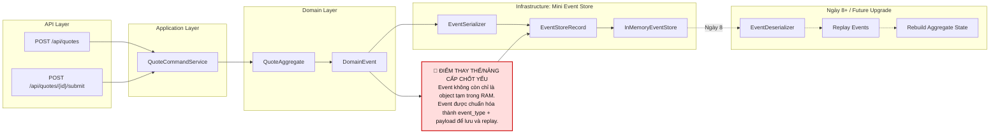

# Tech Note — Ngày 7: Mini Event Store

> **Chủ đề:** Tạo Event Store mini: lưu `event_type` + `payload`, chuẩn bị cho Event Sourcing  
> **Vai trò kiến trúc:** Chuyển từ “event chỉ tồn tại trong RAM/log” sang “event là nguồn sự thật có thể lưu lại”.

---

## 1. DASHBOARD TIẾN ĐỘ

### ✅ Trạng thái tổng quan

```text
Lộ trình: Event Sourcing / CQRS nâng cao
Ngày hiện tại: Day 7
Trọng tâm: Mini Event Store
Trạng thái: Đã bắt đầu tách Event khỏi runtime memory và lưu thành record có thể replay về sau
```

### ⚡ ĐIỂM DỪNG HIỆN TẠI

```text
Code đang dừng ở bước:

Command API
  -> QuoteCommandService
  -> QuoteAggregate xử lý command
  -> sinh DomainEvent
  -> EventStore mini lưu:
       event_id
       aggregate_id
       aggregate_type
       event_type
       payload
       occurred_at

Chưa làm:
  - Deserialize payload về event object
  - Replay event để dựng lại Aggregate
  - PostgreSQL Event Store thật
  - Projection quote_state
```

### 🎯 BƯỚC TIẾP THEO

```text
Ngày 8 — Deserialize + Replay

Mục tiêu:
  - Đọc EventStoreRecord từ EventStore
  - Dựa vào event_type để biết class event thật
  - Convert payload JSON -> DomainEvent object
  - Replay list event -> dựng lại QuoteAggregate state
```

---

## 2. MÔ PHỎNG CÂY THƯ MỤC

```text
src/main/java/com/example/quoteservice
├── quote
│   ├── api
│   │   └── QuoteCommandController.java
│   │       # REST entrypoint: create/submit/approve quote
│   │
│   ├── application
│   │   └── QuoteCommandService.java
│   │       # REFACTOR: không chỉ xử lý command, bắt đầu append event vào EventStore mini
│   │
│   ├── domain
│   │   ├── QuoteAggregate.java
│   │   │   # Aggregate xử lý business rule, sinh DomainEvent
│   │   │
│   │   ├── QuoteStatus.java
│   │   │   # Trạng thái domain: DRAFT / SUBMITTED / APPROVED
│   │   │
│   │   ├── command
│   │   │   ├── CreateQuoteCommand.java
│   │   │   ├── SubmitQuoteCommand.java
│   │   │   └── ApproveQuoteCommand.java
│   │   │       # Command = ý định thay đổi trạng thái
│   │   │
│   │   └── event
│   │       ├── DomainEvent.java
│   │       │   # Base marker/interface cho event
│   │       ├── QuoteCreatedEvent.java
│   │       ├── QuoteSubmittedEvent.java
│   │       └── QuoteApprovedEvent.java
│   │           # Event = sự thật đã xảy ra
│   │
│   └── infrastructure
│       └── eventstore
│           ├── EventStore.java                    # NEW: contract append/find event
│           ├── InMemoryEventStore.java            # NEW: lưu event trong memory
│           ├── EventStoreRecord.java              # NEW: record lưu event_type + payload
│           └── EventSerializer.java               # NEW: convert DomainEvent -> JSON payload
│
└── shared
    └── exception
        ├── BusinessException.java
        └── GlobalExceptionHandler.java
            # Xử lý lỗi domain/application theo chuẩn API
```

---

## 3. SƠ ĐỒ LUỒNG DỮ LIỆU



---

## 4. CHI TIẾT SỰ DỊCH CHUYỂN LOGIC

### File tác động mạnh nhất

```text
QuoteCommandService.java
```

### TRƯỚC ĐÓ — Event chỉ sinh ra rồi dùng tạm

```java
public QuoteResponse create(CreateQuoteCommand command) {
    QuoteAggregate aggregate = new QuoteAggregate();

    QuoteCreatedEvent event = aggregate.handle(command);

    // Event chỉ dùng tạm trong runtime
    aggregate.apply(event);

    return QuoteResponse.from(aggregate);
}
```

### BÂY GIỜ — Event được append vào Mini Event Store

```java
public QuoteResponse create(CreateQuoteCommand command) {
    QuoteAggregate aggregate = new QuoteAggregate();

    QuoteCreatedEvent event = aggregate.handle(command);

    eventStore.append(
            aggregate.getId(),
            "Quote",
            event
    );

    aggregate.apply(event);

    return QuoteResponse.from(aggregate);
}
```

### EventStore mini lưu dạng record

```java
public class EventStoreRecord {

    private String eventId;
    private String aggregateId;
    private String aggregateType;
    private String eventType;
    private String payload;
    private LocalDateTime occurredAt;
}
```

### Lý do kiến trúc đổi

```text
Trước đó:
  Event chỉ là object Java tạm thời.
  App chạy xong thì mất event.
  Không replay được.
  Không audit được lịch sử thay đổi.

Bây giờ:
  Event trở thành persisted fact.
  Có event_type để biết loại event.
  Có payload để lưu dữ liệu event.
  Chuẩn bị cho replay, projection, CQRS và PostgreSQL Event Store thật.
```

---

## 5. QUY LUẬT ĐỌC LẠI 30 GIÂY

```text
Mở file này và đọc theo thứ tự:

1. Nhìn DASHBOARD TIẾN ĐỘ
   -> Biết hôm nay đang ở Day 7, đã làm Mini Event Store.

2. Nhìn [⚡ ĐIỂM DỪNG HIỆN TẠI]
   -> Biết code đang dừng ở append event_type + payload, chưa deserialize/replay.

3. Nhìn SƠ ĐỒ FLOW
   -> Thấy luồng Command -> Aggregate -> Event -> EventStoreRecord.

4. Nhìn [🔴 ĐIỂM THAY THẾ/NÂNG CẤP CHỐT YẾU]
   -> Nhớ thay đổi kiến trúc quan trọng:
      Event không còn là object tạm; event đã thành dữ liệu có thể lưu/replay.

5. Nhìn phần TRƯỚC ĐÓ / BÂY GIỜ
   -> Khôi phục nhanh file bị tác động mạnh nhất: QuoteCommandService.java.

6. Nhìn [🎯 BƯỚC TIẾP THEO]
   -> Biết ngày mai phải làm Deserialize + Replay.
```

---

## GHI NHỚ KIẾN TRÚC

```text
Ngày 7 là bước chuyển từ:
  "State-driven CRUD mindset"

sang:
  "Event as Source of Truth mindset"

Mini Event Store chưa phải Event Sourcing hoàn chỉnh,
nhưng là nền móng bắt buộc để đi tới:
  - Replay Aggregate
  - PostgreSQL Event Store
  - Projection quote_state
  - CQRS Query Model
  - Kafka / CDC / Eventuate thật
```
