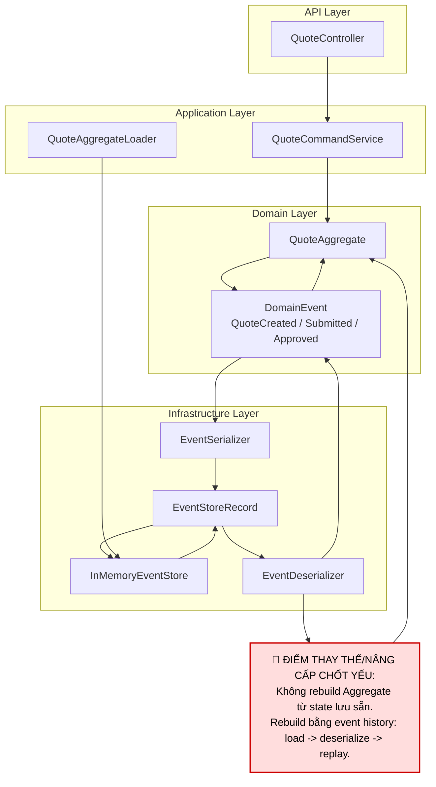

# Tech Note — Ngày 8: Deserialize Event + Replay Event để rebuild `QuoteAggregate`

> **Mục tiêu 30 giây:** Nắm được hệ thống đã chuyển từ “lưu event dạng object trong memory” sang “lưu event dạng record + deserialize + replay để rebuild Aggregate”.

---

## 1. DASHBOARD TIẾN ĐỘ

### Trạng thái tổng quan

```text
Level hiện tại: Event Sourcing mini — Stage 2
Trọng tâm hôm nay: Deserialize Event + Replay Event
Mức độ giống production: Trung bình — đã có replay aggregate, chưa có PostgreSQL event_store thật
```

| Hạng mục | Trạng thái |
|---|---|
| Command sinh Event | ✅ Đã có |
| Aggregate `apply(event)` đổi state | ✅ Đã có |
| Event được lưu dạng record | ✅ Đã có |
| Deserialize event từ record | ✅ Mới hoàn thành |
| Replay event history để rebuild Aggregate | ✅ Mới hoàn thành |
| Event Store PostgreSQL | ⏭️ Ngày tiếp theo |
| Projection / Read Model | ⏭️ Sau PostgreSQL Event Store |

### ⚡ ĐIỂM DỪNG HIỆN TẠI

```text
Code đang dừng ở chỗ:

API / Service
  -> tạo command
  -> Aggregate xử lý command
  -> sinh DomainEvent
  -> EventStore lưu EventStoreRecord

Khi cần lấy lại QuoteAggregate:
  -> EventStore tìm event theo aggregateId
  -> EventDeserializer convert EventStoreRecord -> DomainEvent object
  -> QuoteAggregate replay từng event bằng apply(event)
  -> rebuild lại state hiện tại của QuoteAggregate
```

**Điểm quan trọng:** `QuoteAggregate` không còn phụ thuộc state lưu sẵn. State có thể được dựng lại từ event history.

### 🎯 BƯỚC TIẾP THEO

```text
Ngày 9 — Đưa Event Store xuống PostgreSQL.

Mục tiêu:
  - Tạo bảng event_store
  - Lưu EventStoreRecord thật vào DB
  - Load events từ DB theo aggregateId
  - Replay lại QuoteAggregate từ DB events
```

---

## 2. MÔ PHỎNG CÂY THƯ MỤC

```text
src/main/java/com/example/quote/

├── quote/
│   ├── api/
│   │   └── QuoteController.java
│   │       # REST entrypoint: nhận request Create/Submit/Approve
│   │
│   ├── application/
│   │   └── QuoteCommandService.java
│   │       # Orchestrate use case: command -> aggregate -> event -> event store
│   │
│   ├── domain/
│   │   ├── QuoteAggregate.java
│   │   │   # REFAC: thêm replay(List<DomainEvent>) để rebuild state từ event history
│   │   │
│   │   ├── QuoteStatus.java
│   │   │   # Enum trạng thái: DRAFT / SUBMITTED / APPROVED
│   │   │
│   │   ├── command/
│   │   │   ├── CreateQuoteCommand.java
│   │   │   ├── SubmitQuoteCommand.java
│   │   │   └── ApproveQuoteCommand.java
│   │   │       # Input nghiệp vụ cho Aggregate xử lý
│   │   │
│   │   └── event/
│   │       ├── DomainEvent.java
│   │       │   # Marker interface/base contract cho event
│   │       ├── QuoteCreatedEvent.java
│   │       ├── QuoteSubmittedEvent.java
│   │       └── QuoteApprovedEvent.java
│   │           # Sự thật nghiệp vụ đã xảy ra
│   │
│   └── infrastructure/
│       └── eventstore/
│           ├── EventStore.java
│           │   # REFAC: lưu và load EventStoreRecord thay vì chỉ giữ object event
│           │
│           ├── InMemoryEventStore.java
│           │   # Event Store tạm thời trong memory
│           │
│           ├── EventStoreRecord.java
│           │   # NEW: record lưu trữ event dạng generic: id, type, payload, version...
│           │
│           ├── EventSerializer.java
│           │   # NEW: DomainEvent -> payload JSON + eventType
│           │
│           ├── EventDeserializer.java
│           │   # NEW: EventStoreRecord -> DomainEvent object
│           │
│           └── QuoteAggregateLoader.java
│               # NEW: load records -> deserialize -> replay -> QuoteAggregate hiện tại
```

---

## 3. SƠ ĐỒ LUỒNG DỮ LIỆU



---

## 4. CHI TIẾT SỰ DỊCH CHUYỂN LOGIC

### File bị tác động mạnh nhất

```text
QuoteAggregateLoader.java
```

### TRƯỚC ĐÓ — Bài cũ

```java
// Service xử lý command rồi dùng Aggregate hiện tại trong memory.
// Chưa có cơ chế rebuild state từ Event Store.

QuoteAggregate aggregate = new QuoteAggregate();

DomainEvent event = aggregate.handle(command);

eventStore.append(event);

aggregate.apply(event);
```

### BÂY GIỜ — Bài mới

```java
// Load event records từ Event Store
List<EventStoreRecord> records = eventStore.findByAggregateId(quoteId);

// Deserialize record -> DomainEvent
List<DomainEvent> events = records.stream()
        .map(eventDeserializer::deserialize)
        .toList();

// Replay events -> rebuild Aggregate
QuoteAggregate aggregate = new QuoteAggregate();

for (DomainEvent event : events) {
    aggregate.apply(event);
}

return aggregate;
```

### Vì sao kiến trúc đổi?

```text
TRƯỚC:
  Aggregate state phụ thuộc object đang sống trong memory.

BÂY GIỜ:
  Aggregate state phụ thuộc event history.

Lý do:
  Event Sourcing không tin state hiện tại là nguồn sự thật chính.
  Nguồn sự thật là chuỗi Domain Events đã xảy ra.
```

---

## 5. QUY LUẬT ĐỌC LẠI 30 GIÂY

Khi mở lại note này, đọc theo thứ tự:

```text
1. Nhìn DASHBOARD TIẾN ĐỘ
   -> Biết hôm nay đang ở stage nào của Event Sourcing.

2. Nhìn ⚡ ĐIỂM DỪNG HIỆN TẠI
   -> Biết code đang dừng tại flow nào.

3. Nhìn Mermaid Flow
   -> Tìm ngay 🔴 ĐIỂM THAY THẾ/NÂNG CẤP CHỐT YẾU.

4. Nhìn cây thư mục
   -> Biết file nào mới xuất hiện:
      EventStoreRecord
      EventSerializer
      EventDeserializer
      QuoteAggregateLoader

5. Nhìn phần TRƯỚC ĐÓ / BÂY GIỜ
   -> Khôi phục nhanh sự dịch chuyển logic:
      object in-memory state
        -> event history replay
```

---

## Ghi nhớ Enterprise

```text
Event Store không lưu object Aggregate.
Event Store lưu facts/events.

Aggregate hiện tại không được query trực tiếp từ DB state.
Aggregate hiện tại được rebuild bằng replay event history.

Deserialize + Replay là bước chuyển từ CRUD mindset sang Event Sourcing mindset.
```
