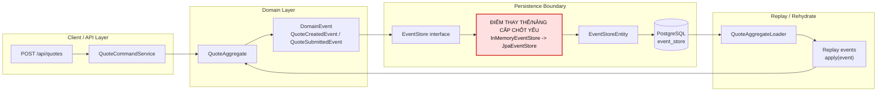

# Tech Note — Ngày 9: PostgreSQL Event Store

> Chủ đề: Chuyển **Event Store mini in-memory** sang **PostgreSQL persistence** để event không mất sau khi restart app.

---

## 1. DASHBOARD TIẾN ĐỘ

| Hạng mục | Trạng thái |
|---|---|
| Giai đoạn | Event Sourcing nền tảng |
| Bài học | Ngày 9 — Persistent Event Store |
| Trạng thái tổng quan | ✅ Đã chuyển event từ RAM sang PostgreSQL |
| Kiến trúc đạt được | `Command -> Aggregate -> DomainEvent -> EventStore interface -> JpaEventStore -> PostgreSQL` |
| Rủi ro còn lại | Chưa có projection/read model, replay mới chỉ dựa trên events đã persist |

### ⚡ ĐIỂM DỪNG HIỆN TẠI

```txt
Code đang dừng tại mốc:

1. Đã có bảng event_store trong PostgreSQL.
2. Đã có EventStoreEntity ánh xạ table event_store.
3. Đã có JpaEventStore implement EventStore interface.
4. Khi command tạo/submits quote, event không còn lưu trong RAM.
5. Restart app không làm mất event history.
6. Aggregate có thể load lại bằng cách đọc event từ DB và replay.
```

### 🎯 BƯỚC TIẾP THEO

```txt
Ngày 10 — Tạo Projection quote_state:

Mục tiêu:
  Event Store chỉ là lịch sử sự kiện.
  Cần thêm read model quote_state để Query API đọc nhanh trạng thái hiện tại.

Flow ngày mai:
  event_store
    -> Projection Handler
    -> quote_state table
    -> Query API list/detail
```

---

## 2. MÔ PHỎNG CÂY THƯ MỤC

```txt
src/main/java/com/example/quote
├── domain/
│   └── quote/
│       ├── QuoteAggregate.java                 // Aggregate xử lý command và apply event
│       ├── command/
│       │   ├── CreateQuoteCommand.java         // Command tạo quote
│       │   └── SubmitQuoteCommand.java         // Command submit quote
│       └── event/
│           ├── QuoteCreatedEvent.java          // Domain event: quote được tạo
│           └── QuoteSubmittedEvent.java        // Domain event: quote được submit
│
├── application/
│   └── quote/
│       ├── QuoteCommandService.java            // Điều phối command -> aggregate -> event store
│       └── QuoteAggregateLoader.java           // Refactor: load events từ EventStore interface
│
├── infrastructure/
│   └── eventstore/
│       ├── EventStore.java                     // Port/interface: append + load events
│       ├── InMemoryEventStore.java             // [CŨ] Lưu event trong RAM, dùng cho bài trước/demo
│       ├── JpaEventStore.java                  // [MỚI] Adapter lưu event xuống PostgreSQL
│       ├── EventStoreEntity.java               // [MỚI] JPA Entity map table event_store
│       ├── EventStoreJpaRepository.java        // [MỚI] Spring Data JPA repository
│       └── EventSerializer.java                // Serialize/deserialize event payload JSON
│
└── resources/
    ├── application.yml                         // [REFACTOR] Thêm datasource + JPA config
    └── db/migration/
        └── V1__create_event_store.sql          // [MỚI] DDL tạo bảng event_store
```

---

## 3. SƠ ĐỒ LUỒNG DỮ LIỆU



---

## 4. CHI TIẾT SỰ DỊCH CHUYỂN LOGIC

File bị tác động mạnh nhất: `EventStore` implementation.

### TRƯỚC ĐÓ — In-memory Event Store

```java
@Component
public class InMemoryEventStore implements EventStore {

    private final Map<String, List<DomainEvent>> store = new ConcurrentHashMap<>();

    @Override
    public void append(String aggregateId, DomainEvent event) {
        store.computeIfAbsent(aggregateId, id -> new ArrayList<>())
             .add(event);
    }

    @Override
    public List<DomainEvent> load(String aggregateId) {
        return store.getOrDefault(aggregateId, List.of());
    }
}
```

Vấn đề:

```txt
Event nằm trong RAM.
Restart app => mất toàn bộ event history.
Không thể debug bằng DB.
Không phù hợp với Event Sourcing thật.
```

### BÂY GIỜ — PostgreSQL-backed Event Store

```java
@Component
public class JpaEventStore implements EventStore {

    private final EventStoreJpaRepository repository;
    private final EventSerializer eventSerializer;

    @Override
    @Transactional
    public void append(String aggregateId, DomainEvent event) {
        EventStoreEntity entity = new EventStoreEntity();
        entity.setId(UUID.randomUUID().toString());
        entity.setAggregateId(aggregateId);
        entity.setAggregateType("Quote");
        entity.setEventType(event.getClass().getSimpleName());
        entity.setPayload(eventSerializer.serialize(event));
        entity.setCreatedAt(LocalDateTime.now());

        repository.save(entity);
    }

    @Override
    public List<DomainEvent> load(String aggregateId) {
        return repository.findByAggregateIdOrderByCreatedAtAsc(aggregateId)
                .stream()
                .map(eventSerializer::deserialize)
                .toList();
    }
}
```

Lý do kiến trúc đổi:

```txt
InMemoryEventStore chỉ phù hợp học process/apply.
JpaEventStore đưa hệ thống sang persistent event history.
Event trở thành source of truth, có thể replay sau restart.
Application layer vẫn phụ thuộc EventStore interface, không phụ thuộc trực tiếp JPA.
```

---

## 5. GHI NHỚ KIẾN TRÚC ENTERPRISE

```txt
Event Store không phải read model.
Event Store là audit log bất biến của domain facts.

PostgreSQL event_store hiện là source of truth.
Query API sau này không nên đọc trực tiếp event_store để list/detail.
Ngày 10 sẽ tạo quote_state projection để phục vụ query nhanh.
```

---

## 6. QUY LUẬT ĐỌC LẠI 30 GIÂY

Khi mở lại file này, đọc theo thứ tự:

```txt
00s - 05s:
  Nhìn DASHBOARD TIẾN ĐỘ để biết hôm nay đang ở mốc nào.

05s - 10s:
  Nhìn ⚡ ĐIỂM DỪNG HIỆN TẠI để biết code đã dừng ở đâu.

10s - 18s:
  Nhìn Mermaid flow và tìm node đỏ:
  🔴 InMemoryEventStore -> JpaEventStore

18s - 25s:
  Nhìn cây thư mục để biết file mới cần mở lại:
  EventStoreEntity.java
  EventStoreJpaRepository.java
  JpaEventStore.java
  V1__create_event_store.sql

25s - 30s:
  Nhìn 🎯 BƯỚC TIẾP THEO:
  Ngày 10 tạo quote_state Projection.
```

---

## 7. ONE-LINE SUMMARY

```txt
Ngày 9 biến Event Store từ bộ nhớ tạm trong RAM thành persistent event log trong PostgreSQL, giúp Aggregate có thể replay lại lịch sử sau khi restart app.
```
