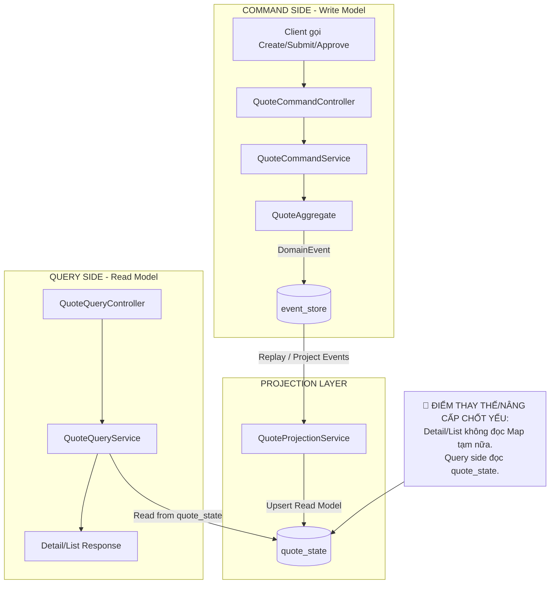

# Tech Note — Day 10: Projection `quote_state` từ Event Store

> **Chủ đề:** Event Sourcing / CQRS — Build Read Model từ Event Store  
> **Mục tiêu 30 giây:** Hiểu nhanh hệ thống đã chuyển từ `Map` tạm sang `quote_state` projection để phục vụ Detail/List.

---

## 1. DASHBOARD TIẾN ĐỘ

| Hạng mục | Trạng thái |
|---|---|
| Event Store PostgreSQL | ✅ Đã có |
| Quote Events | ✅ `QuoteCreatedEvent`, `QuoteSubmittedEvent`, `QuoteApprovedEvent` |
| Read Model `quote_state` | ✅ Đã tạo |
| Detail/List API | ✅ Đọc từ `quote_state` |
| In-memory Map tạm | 🔴 Đã bị thay thế |
| Async/Event Publisher | ⏭️ Ngày 11 |

### ⚡ ĐIỂM DỪNG HIỆN TẠI

```text
Command API
  -> ghi event vào event_store PostgreSQL
  -> Projection đọc event_store
  -> build/update bảng quote_state
  -> Detail/List API đọc quote_state
```

**Code đang dừng ở trạng thái:**

```text
Create/Submit/Approve Quote không còn phụ thuộc Map tạm để xem Detail/List.
Read model quote_state đã trở thành nguồn đọc chính cho Query side.
```

### 🎯 BƯỚC TIẾP THEO

```text
Ngày 11 — Tạo internal Event Publisher:
Sau khi append event vào Event Store, hệ thống sẽ publish event cho Projection tự xử lý thay vì gọi projection thủ công.
```

---

## 2. MÔ PHỎNG CÂY THƯ MỤC

```text
src/main/java/com/example/quoteservice
├── quote
│   ├── command
│   │   ├── QuoteCommandController.java       // API ghi: create/submit/approve
│   │   ├── QuoteCommandService.java          // append event vào Event Store
│   │   └── dto
│   │       ├── CreateQuoteRequest.java
│   │       └── QuoteCommandResponse.java
│   │
│   ├── domain
│   │   ├── QuoteAggregate.java               // xử lý command + sinh domain event
│   │   ├── QuoteStatus.java
│   │   ├── command
│   │   │   ├── CreateQuoteCommand.java
│   │   │   ├── SubmitQuoteCommand.java
│   │   │   └── ApproveQuoteCommand.java
│   │   └── event
│   │       ├── DomainEvent.java
│   │       ├── QuoteCreatedEvent.java
│   │       ├── QuoteSubmittedEvent.java
│   │       └── QuoteApprovedEvent.java
│   │
│   ├── eventstore
│   │   ├── EventStore.java                   // interface append/load events
│   │   ├── JpaEventStore.java                // lưu event vào PostgreSQL
│   │   ├── EventStoreEntity.java
│   │   └── EventStoreRepository.java
│   │
│   ├── projection                            // 🆕 Vùng projection/read model
│   │   ├── QuoteProjectionService.java       // 🆕 replay events -> update quote_state
│   │   ├── QuoteStateEntity.java             // 🆕 table quote_state
│   │   └── QuoteStateRepository.java         // 🆕 repository đọc/ghi quote_state
│   │
│   └── query                                 // 🔁 Refactor: Query đọc read model
│       ├── QuoteQueryController.java         // 🔁 Detail/List API
│       ├── QuoteQueryService.java            // 🔁 đọc quote_state, không đọc Map
│       └── dto
│           ├── QuoteDetailResponse.java
│           └── QuoteListItemResponse.java
```

---

## 3. SƠ ĐỒ LUỒNG DỮ LIỆU



---

## 4. CHI TIẾT SỰ DỊCH CHUYỂN LOGIC

### File tác động mạnh nhất

```text
QuoteQueryService.java
```

### TRƯỚC ĐÓ — Query đọc từ Map tạm / state tạm

```java
public class QuoteQueryService {

    private final Map<String, Quote> quoteMap;

    public QuoteDetailResponse getDetail(String quoteId) {
        Quote quote = quoteMap.get(quoteId);

        if (quote == null) {
            throw new NotFoundException("Quote not found");
        }

        return QuoteDetailResponse.from(quote);
    }

    public List<QuoteListItemResponse> list() {
        return quoteMap.values()
                .stream()
                .map(QuoteListItemResponse::from)
                .toList();
    }
}
```

### BÂY GIỜ — Query đọc từ `quote_state`

```java
@Service
public class QuoteQueryService {

    private final QuoteStateRepository quoteStateRepository;

    public QuoteQueryService(QuoteStateRepository quoteStateRepository) {
        this.quoteStateRepository = quoteStateRepository;
    }

    public QuoteDetailResponse getDetail(String quoteId) {
        QuoteStateEntity state = quoteStateRepository.findById(quoteId)
                .orElseThrow(() -> new NotFoundException("Quote not found"));

        return QuoteDetailResponse.from(state);
    }

    public List<QuoteListItemResponse> list() {
        return quoteStateRepository.findAll()
                .stream()
                .map(QuoteListItemResponse::from)
                .toList();
    }
}
```

### Vì sao kiến trúc đổi?

```text
TRƯỚC:
  Query phụ thuộc state tạm trong memory.
  App restart là mất dữ liệu.
  Không đúng CQRS.

BÂY GIỜ:
  Command side lưu sự thật vào event_store.
  Projection build read model quote_state.
  Query side đọc quote_state.
  Detail/List ổn định hơn, gần kiến trúc Enterprise hơn.
```

### Bản chất dịch chuyển

```text
Map tạm
  -> chỉ phù hợp demo ban đầu

quote_state
  -> read model chuyên phục vụ query
  -> có thể tối ưu cho Detail/List/Search
  -> không làm bẩn Aggregate
```

---

## 5. QUY LUẬT ĐỌC LẠI 30 GIÂY

Khi mở lại file này, đọc theo thứ tự:

```text
1. Nhìn DASHBOARD TIẾN ĐỘ
   -> biết hôm nay đã xong quote_state projection.

2. Nhìn ⚡ ĐIỂM DỪNG HIỆN TẠI
   -> nhớ code đang dừng ở flow:
      event_store -> projection -> quote_state -> query.

3. Nhìn FLOW Mermaid
   -> thấy ranh giới Command / Projection / Query.

4. Nhìn 🔴 ĐIỂM THAY THẾ/NÂNG CẤP CHỐT YẾU
   -> nhớ Map tạm đã bị thay bằng quote_state.

5. Nhìn phần TRƯỚC ĐÓ / BÂY GIỜ
   -> khôi phục nhanh file bị refactor mạnh nhất: QuoteQueryService.java.

6. Nhìn 🎯 BƯỚC TIẾP THEO
   -> ngày mai học internal Event Publisher để Projection không còn gọi thủ công.
```

---

## Ghi nhớ Enterprise

```text
Event Store = nguồn sự thật lịch sử.
Projection = bộ chuyển event thành read model.
quote_state = read model phục vụ query.
Query API = chỉ đọc read model, không xử lý business rule.
```
