# Tech Note — Ngày 11: Tách Projection Async bằng EventPublisher nội bộ

> Chủ đề: Event Sourcing / CQRS nâng cao  
> Trạng thái: Sau khi append event, hệ thống publish event nội bộ để handler cập nhật `quote_state`.  
> Mục tiêu kiến trúc: Chuẩn bị thay EventPublisher nội bộ bằng Kafka/CDC ở các ngày sau.

---

## 1. DASHBOARD TIẾN ĐỘ

### ✅ Trạng thái tổng quan

| Hạng mục | Trạng thái |
|---|---|
| Command API | Đã có |
| Aggregate xử lý command | Đã có |
| Event Store mini | Đã có |
| Append event | Đã có |
| Projection `quote_state` | Đã tách khỏi Command Service |
| EventPublisher nội bộ | Mới thêm |
| Kafka / CDC thật | Chưa có |
| Mục tiêu hiện tại | Giả lập async event dispatch trong cùng app |

---

### ⚡ ĐIỂM DỪNG HIỆN TẠI

Code đang dừng ở kiến trúc:

```text
QuoteCommandService
  -> QuoteAggregate.process(command)
  -> EventStore.append(event)
  -> InternalEventPublisher.publish(event)
  -> ProjectionHandler.handle(event)
  -> quote_state updated
```

Điểm quan trọng:

```text
Command Service KHÔNG tự cập nhật quote_state trực tiếp nữa.

Nó chỉ:
  1. xử lý command
  2. append event
  3. publish event nội bộ

Projection Handler mới là nơi cập nhật read model.
```

---

### 🎯 BƯỚC TIẾP THEO

Ngày mai:

```text
Ngày 12 — Tách Workflow skeleton:
Sau khi event được publish, ngoài ProjectionHandler sẽ có WorkflowHandler.
WorkflowHandler chuẩn bị cho các side effect như:
  - sync Elasticsearch
  - notification
  - allocation
  - external integration
```

Mục tiêu ngày mai:

```text
InternalEventPublisher
  -> ProjectionHandler
  -> WorkflowHandler
```

---

## 2. MÔ PHỎNG CÂY THƯ MỤC

```text
src/main/java/com/example/quote/

├── command/
│   └── QuoteCommandService.java
│       // REFACTOR: không update quote_state trực tiếp nữa;
│       // sau append event thì gọi InternalEventPublisher.publish(...)

├── domain/
│   ├── QuoteAggregate.java
│   │   // giữ business rule: process command -> domain event
│   │
│   ├── command/
│   │   ├── CreateQuoteCommand.java
│   │   └── SubmitQuoteCommand.java
│   │
│   └── event/
│       ├── DomainEvent.java
│       ├── QuoteCreatedEvent.java
│       └── QuoteSubmittedEvent.java

├── eventstore/
│   ├── EventStore.java
│   │   // append event, load events
│   │
│   └── InMemoryEventStore.java
│       // lưu event tạm trong memory

├── eventpublisher/
│   ├── InternalEventPublisher.java
│   │   // NEW: abstraction publish event nội bộ
│   │
│   └── SimpleInternalEventPublisher.java
│       // NEW: gọi các handler trong cùng app

├── projection/
│   ├── QuoteProjectionHandler.java
│   │   // NEW/REFACTOR: nhận event và cập nhật quote_state
│   │
│   └── QuoteStateRepository.java
│       // read model repository

└── readmodel/
    └── QuoteState.java
        // read model phục vụ query/list/detail
```

---

## 3. SƠ ĐỒ LUỒNG DỮ LIỆU

```mermaid
graph LR

  subgraph COMMAND_SIDE["Command Side"]
    A["Client / FE"] --> B["QuoteCommandController"]
    B --> C["QuoteCommandService"]
    C --> D["QuoteAggregate.process(command)"]
    D --> E["DomainEvent"]
  end

  subgraph EVENT_STORE["Event Store"]
    E --> F["EventStore.append(event)"]
  end

  subgraph INTERNAL_EVENT_BUS["Internal Event Publisher"]
    F --> G["InternalEventPublisher.publish(event)"]
  end

  subgraph QUERY_SIDE["Query Side / Projection"]
    G --> H["QuoteProjectionHandler.handle(event)"]
    H --> I["quote_state"]
  end

  subgraph FUTURE_UPGRADE["Future Upgrade"]
    G -. "🔴 ĐIỂM THAY THẾ/NÂNG CẤP CHỐT YẾU" .-> J["Kafka / CDC / Debezium"]
    J -.-> K["External Flow Consumer"]
  end

  I --> L["QuoteQueryService"]
  L --> M["Client / FE reads list/detail"]
```



### 🔴 ĐIỂM THAY THẾ/NÂNG CẤP CHỐT YẾU

```text
Hiện tại:
  InternalEventPublisher.publish(event)

Sau này:
  KafkaProducer / CDC / Debezium publish event ra message broker

Ý nghĩa:
  Projection không còn phụ thuộc trực tiếp Command Service.
  Đây là bước đệm để chuyển sang async/event-driven thật.
```

---

## 4. CHI TIẾT SỰ DỊCH CHUYỂN LOGIC

### TRƯỚC ĐÓ — Command Service tự cập nhật read model

```java
public QuoteResponse createQuote(CreateQuoteCommand command) {
    QuoteAggregate aggregate = new QuoteAggregate();

    QuoteCreatedEvent event = aggregate.process(command);

    eventStore.append(event);

    // Vấn đề: Command Service biết quá nhiều về Query Side
    quoteStateRepository.save(
        QuoteState.from(event)
    );

    return QuoteResponse.from(event);
}
```

Vấn đề kiến trúc:

```text
Command Service đang làm 2 việc:
  1. xử lý command / ghi event
  2. cập nhật read model

=> CQRS boundary chưa sạch.
=> Khó thay bằng Kafka/CDC sau này.
```

---

### BÂY GIỜ — Command Service append event rồi publish event nội bộ

```java
public QuoteResponse createQuote(CreateQuoteCommand command) {
    QuoteAggregate aggregate = new QuoteAggregate();

    QuoteCreatedEvent event = aggregate.process(command);

    eventStore.append(event);

    // Điểm mới: chỉ publish event, không tự update projection
    internalEventPublisher.publish(event);

    return QuoteResponse.from(event);
}
```

Projection được tách ra:

```java
public class QuoteProjectionHandler implements DomainEventHandler<QuoteCreatedEvent> {

    @Override
    public void handle(QuoteCreatedEvent event) {
        QuoteState state = QuoteState.from(event);

        quoteStateRepository.save(state);
    }
}
```

Lý do đổi:

```text
Tách trách nhiệm theo CQRS:

Command Side:
  validate business rule
  tạo domain event
  append event

Query Side / Projection:
  nghe event
  cập nhật read model

InternalEventPublisher:
  là adapter tạm thời trước khi thay bằng Kafka/CDC
```

---

## 5. QUY LUẬT ĐỌC LẠI 30 GIÂY

Khi mở lại file này, đọc theo thứ tự:

```text
1. Nhìn DASHBOARD TIẾN ĐỘ
   -> Biết đang ở giai đoạn nào.

2. Nhìn ⚡ ĐIỂM DỪNG HIỆN TẠI
   -> Khôi phục flow code đang dừng.

3. Nhìn Mermaid FLOW
   -> Thấy ranh giới Command / Event Store / Event Publisher / Projection.

4. Nhìn 🔴 ĐIỂM THAY THẾ/NÂNG CẤP CHỐT YẾU
   -> Biết phần nào sau này sẽ thay bằng Kafka/CDC.

5. Nhìn phần TRƯỚC ĐÓ vs BÂY GIỜ
   -> Nhớ chính xác logic đã dịch chuyển từ đâu sang đâu.

6. Nhìn 🎯 BƯỚC TIẾP THEO
   -> Biết ngày mai phải code tiếp phần nào.
```

---

## Tóm tắt 1 dòng

```text
Ngày 11 biến Projection từ logic gọi trực tiếp trong Command Service thành handler nhận event qua InternalEventPublisher — bước đệm quan trọng trước Kafka/CDC.
```
