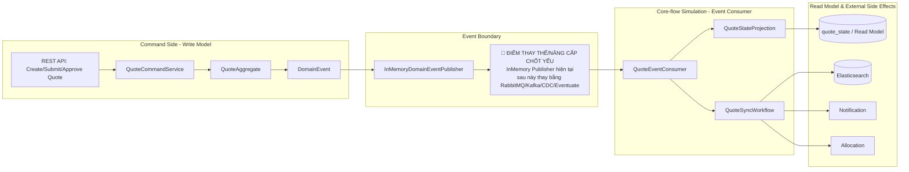

# Tech Note — Ngày 12: Workflow Skeleton cho Quote Flow

> **Chủ đề:** Tách `QuoteStateProjection` và `QuoteSyncWorkflow`, mô phỏng `core-flow` consume event để sync ES / notification / allocation.

---

## 1. DASHBOARD TIẾN ĐỘ

### Trạng thái tổng quan

```text
Phase hiện tại : Event Sourcing / CQRS demo
Ngày          : 12
Trạng thái    : DONE - đã tách Projection và Workflow skeleton
Mức độ        : Local simulation, chưa có broker thật
Mục tiêu ngày : Command side phát event, Flow side phản ứng event
```

### [⚡ ĐIỂM DỪNG HIỆN TẠI]

```text
Code đang dừng ở ranh giới:

Command side
  -> ghi/emit DomainEvent
  -> gọi EventPublisher giả lập

Core-flow simulation
  -> QuoteEventConsumer nhận event
  -> QuoteStateProjection cập nhật read model
  -> QuoteSyncWorkflow điều phối side effects
       - sync Elasticsearch: mock/skeleton
       - notification: mock/skeleton
       - allocation: mock/skeleton
```

**Điểm quan trọng nhất:** `Projection` không còn bị trộn với `Workflow`.  
`Projection` chỉ cập nhật read model. `Workflow` điều phối tác vụ phụ sau khi event xảy ra.

### [🎯 BƯỚC TIẾP THEO]

```text
Ngày 13:
  Thay EventPublisher giả lập bằng message broker mock/Rabbit/Kafka mindset.
  Mục tiêu: event không còn được gọi trực tiếp trong cùng process nữa.
```

---

## 2. MÔ PHỎNG CÂY THƯ MỤC

```text
src/main/java/com/example/quote
├── command/
│   └── QuoteCommandService.java              // phát command, tạo event, không xử lý read model trực tiếp
│
├── domain/
│   ├── QuoteAggregate.java                   // xử lý rule trạng thái Quote
│   └── event/
│       ├── QuoteCreatedEvent.java            // domain event: quote được tạo
│       ├── QuoteSubmittedEvent.java          // domain event: quote được submit
│       └── QuoteApprovedEvent.java           // domain event: quote được approve
│
├── eventbus/
│   ├── DomainEventPublisher.java             // abstraction publish event
│   └── InMemoryDomainEventPublisher.java     // [REFACTOR] publish giả lập trong cùng process
│
├── flow/                                     // [NEW] mô phỏng core-flow service boundary
│   ├── QuoteEventConsumer.java               // [NEW] nhận event, dispatch sang Projection + Workflow
│   ├── projection/
│   │   └── QuoteStateProjection.java         // [NEW] cập nhật quote_state/read model
│   └── workflow/
│       ├── QuoteSyncWorkflow.java            // [NEW] orchestration side effects sau event
│       ├── QuoteElasticSyncTask.java         // [NEW] skeleton sync Elasticsearch
│       ├── QuoteNotificationTask.java        // [NEW] skeleton gửi notification
│       └── QuoteAllocationTask.java          // [NEW] skeleton allocation/assignment
│
└── readmodel/
    ├── QuoteState.java                       // trạng thái đọc phục vụ query UI
    └── QuoteStateRepository.java             // nơi Projection ghi read model
```

---

## 3. SƠ ĐỒ LUỒNG DỮ LIỆU



---

## 4. CHI TIẾT SỰ DỊCH CHUYỂN LOGIC

### File bị tác động mạnh nhất: `QuoteEventConsumer.java`

#### TRƯỚC ĐÓ — consumer/projection bị trộn logic

```java
@Component
public class QuoteEventConsumer {

    private final QuoteStateRepository quoteStateRepository;

    public void handle(DomainEvent event) {
        if (event instanceof QuoteSubmittedEvent submitted) {
            QuoteState state = quoteStateRepository.findById(submitted.quoteId());
            state.setStatus("SUBMITTED");
            state.setSubmittedAt(submitted.submittedAt());
            quoteStateRepository.save(state);

            // side effects bị trộn trực tiếp ở đây
            syncToElasticsearch(state);
            sendNotification(state);
            allocateToUnderwriter(state);
        }
    }
}
```

#### BÂY GIỜ — consumer chỉ dispatch, Projection và Workflow tách riêng

```java
@Component
public class QuoteEventConsumer {

    private final QuoteStateProjection quoteStateProjection;
    private final QuoteSyncWorkflow quoteSyncWorkflow;

    public void handle(DomainEvent event) {
        quoteStateProjection.project(event);   // cập nhật read model
        quoteSyncWorkflow.handle(event);       // điều phối side effects
    }
}
```

### Vì sao kiến trúc đổi?

```text
Lý do 1: Separation of Concerns
  Projection chỉ lo read model.
  Workflow chỉ lo side effects / orchestration.

Lý do 2: Chuẩn bị tách service thật
  Sau này QuoteEventConsumer có thể nằm ở core-flow-service.
  Command service không cần biết ES/notification/allocation.

Lý do 3: Dễ thay transport
  InMemory publisher hiện tại chỉ là adapter tạm.
  Có thể thay bằng RabbitMQ/Kafka/CDC mà không sửa Projection/Workflow.

Lý do 4: Dễ test
  Test Projection riêng.
  Test Workflow riêng.
  Test Consumer dispatch riêng.
```

---

## 5. QUY LUẬT ĐỌC LẠI 30 GIÂY

```text
0s - 5s:
  Nhìn DASHBOARD TIẾN ĐỘ.
  Nắm ngay hôm nay đang dừng ở: Event -> Consumer -> Projection + Workflow.

5s - 12s:
  Nhìn SƠ ĐỒ LUỒNG DỮ LIỆU.
  Tập trung vào node đỏ: InMemory Publisher sẽ bị thay bằng broker/CDC.

12s - 20s:
  Nhìn cây thư mục.
  Ghi nhớ 3 file chính:
    - QuoteEventConsumer.java
    - QuoteStateProjection.java
    - QuoteSyncWorkflow.java

20s - 30s:
  Nhìn phần TRƯỚC ĐÓ / BÂY GIỜ.
  Khôi phục mental model:
    Consumer không làm tất cả nữa.
    Consumer chỉ dispatch.
    Projection và Workflow xử lý hai trách nhiệm riêng.
```

---

## Ghi nhớ cuối ngày

```text
Ngày 12 không phải ngày thêm business rule mới.
Ngày 12 là ngày đổi kiến trúc xử lý event:

Từ:
  Consumer xử lý tất cả

Sang:
  Consumer dispatch
  Projection cập nhật read model
  Workflow điều phối side effects
```
