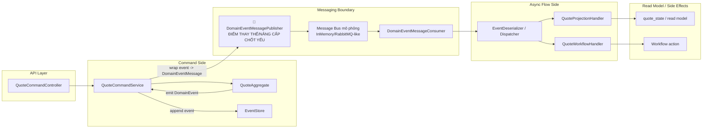

# Tech Note — Ngày 13: RabbitMQ mô phỏng cho async Workflow/Projection

> Chủ đề: Thay `InMemoryDomainEventPublisher` bằng Message Publisher + Consumer để Workflow/Projection chạy async hơn.  
> Kiến trúc: Event Sourcing / CQRS / Event-driven Architecture.

---

## 1. DASHBOARD TIẾN ĐỘ

| Mục | Trạng thái |
|---|---|
| Bài học | **Ngày 13 — RabbitMQ mô phỏng** |
| Trạng thái tổng quan | **Đã tách bước phát sinh event khỏi bước xử lý Projection/Workflow** |
| Kiến trúc hiện tại | `Command -> Aggregate -> EventStore -> Message Publisher -> Consumer -> Projection/Workflow` |
| Mức độ giống production | **Trung bình** — đã có async boundary, nhưng chưa có RabbitMQ thật/Kafka thật/CDC thật |
| Rủi ro còn lại | Message duplicate, retry, DLQ, idempotency chưa hoàn chỉnh |

### ⚡ ĐIỂM DỪNG HIỆN TẠI

Code đang dừng ở trạng thái:

```txt
SubmitQuoteCommand
  -> QuoteAggregate.process(command)
  -> SubmitQuoteEvent
  -> EventStore lưu event
  -> MessagePublisher publish message mô phỏng
  -> MessageConsumer nhận message
  -> Projection/Workflow chạy async-style
```

Điểm quan trọng:

```txt
Command side KHÔNG gọi trực tiếp Projection/Workflow nữa.
Projection/Workflow được kích hoạt thông qua message consumer.
```

### 🎯 BƯỚC TIẾP THEO

Ngày mai nên học:

```txt
Ngày 14 — Outbox Pattern / CDC mindset
Mục tiêu:
  - Không publish message trực tiếp ngay sau khi save event.
  - Ghi event + outbox trong cùng DB transaction.
  - Sau đó có publisher/CDC đọc outbox để publish message.
```

---

## 2. MÔ PHỎNG CÂY THƯ MỤC

```txt
src/main/java/com/example/quoteservice
├── quote
│   ├── controller
│   │   └── QuoteCommandController.java
│   │       # API nhận create/submit/approve quote
│   │
│   ├── application
│   │   └── QuoteCommandService.java
│   │       # [REFACTOR] Không gọi Projection/Workflow trực tiếp nữa
│   │       # Gọi aggregate -> save event -> publish message
│   │
│   ├── domain
│   │   ├── QuoteAggregate.java
│   │   │   # Aggregate xử lý command và sinh event
│   │   ├── command
│   │   │   └── SubmitQuoteCommand.java
│   │   │       # Input nghiệp vụ cho hành động Submit
│   │   └── event
│   │       ├── DomainEvent.java
│   │       │   # Marker/base interface cho domain event
│   │       └── SubmitQuoteEvent.java
│   │           # Event biểu diễn sự thật: Quote đã được submit
│   │
│   ├── infrastructure
│   │   ├── eventstore
│   │   │   ├── EventStore.java
│   │   │   │   # Lưu domain event
│   │   │   └── InMemoryEventStore.java
│   │   │       # EventStore mô phỏng bằng memory
│   │   │
│   │   └── messaging
│   │       ├── DomainEventMessage.java
│   │       │   # [NEW] Message wrapper để vận chuyển event qua message bus
│   │       ├── DomainEventMessagePublisher.java
│   │       │   # [NEW] Interface publish message
│   │       ├── InMemoryMessagePublisher.java
│   │       │   # [NEW] Mô phỏng RabbitMQ publisher
│   │       └── DomainEventMessageConsumer.java
│   │           # [NEW] Mô phỏng RabbitMQ consumer nhận message và dispatch handler
│   │
│   └── projection
│       ├── QuoteProjectionHandler.java
│       │   # Handler update read model khi nhận event
│       └── QuoteWorkflowHandler.java
│           # Handler chạy workflow sau khi event xảy ra
```

---

## 3. SƠ ĐỒ LUỒNG DỮ LIỆU



### 🔴 ĐIỂM THAY THẾ/NÂNG CẤP CHỐT YẾU

```txt
Trước:
  CommandService gọi handler trực tiếp.

Bây giờ:
  CommandService publish DomainEventMessage.
  Consumer nhận message rồi mới gọi Projection/Workflow.

Sau này:
  InMemoryMessagePublisher -> RabbitMQ thật / Kafka thật / CDC Outbox Publisher.
```

---

## 4. CHI TIẾT SỰ DỊCH CHUYỂN LOGIC

File bị tác động mạnh nhất:

```txt
QuoteCommandService.java
```

### TRƯỚC ĐÓ — InMemoryDomainEventPublisher gọi handler trực tiếp

```java
@Service
public class QuoteCommandService {

    private final EventStore eventStore;
    private final InMemoryDomainEventPublisher eventPublisher;

    public void submit(SubmitQuoteCommand command) {
        QuoteAggregate aggregate = loadAggregate(command.quoteId());

        SubmitQuoteEvent event = aggregate.process(command);

        eventStore.append(event);

        // Handler chạy gần như trực tiếp trong cùng process
        eventPublisher.publish(event);
    }
}
```

Vấn đề:

```txt
Command flow bị dính với handler flow.
Projection/Workflow chưa có async boundary rõ.
Khó nâng cấp sang message broker thật.
```

---

### BÂY GIỜ — Publish message rồi consumer xử lý async-style

```java
@Service
public class QuoteCommandService {

    private final EventStore eventStore;
    private final DomainEventMessagePublisher messagePublisher;

    public void submit(SubmitQuoteCommand command) {
        QuoteAggregate aggregate = loadAggregate(command.quoteId());

        SubmitQuoteEvent event = aggregate.process(command);

        eventStore.append(event);

        DomainEventMessage message = DomainEventMessage.from(event);

        // Không gọi Projection/Workflow trực tiếp
        messagePublisher.publish(message);
    }
}
```

Consumer:

```java
@Component
public class DomainEventMessageConsumer {

    private final EventDeserializer eventDeserializer;
    private final List<DomainEventHandler<?>> handlers;

    public void consume(DomainEventMessage message) {
        DomainEvent event = eventDeserializer.deserialize(message);

        for (DomainEventHandler<?> handler : handlers) {
            if (handler.supports(event)) {
                handler.handle(event);
            }
        }
    }
}
```

Lý do đổi kiến trúc:

```txt
Tách Command Side khỏi Async Flow Side.
Chuẩn bị cho RabbitMQ/Kafka thật.
Projection/Workflow trở thành phản ứng với event, không phải bước con của command.
Giảm coupling giữa write model và read model.
```

---

## 5. QUY LUẬT ĐỌC LẠI 30 GIÂY

Khi mở lại file này, đọc theo thứ tự:

```txt
1. Nhìn DASHBOARD TIẾN ĐỘ
   -> Biết bài đang ở ngày nào và trạng thái tổng quan.

2. Nhìn ⚡ ĐIỂM DỪNG HIỆN TẠI
   -> Khôi phục ngay code đang dừng ở flow nào.

3. Nhìn Mermaid FLOW
   -> Tìm vùng "Messaging Boundary".
   -> Nhớ điểm nâng cấp chính là Publisher/Consumer.

4. Nhìn cây thư mục
   -> Tập trung các file [NEW] và [REFACTOR].

5. Nhìn phần TRƯỚC ĐÓ / BÂY GIỜ
   -> Hiểu chính xác logic đã dịch chuyển từ direct call sang message boundary.
```

Câu ghi nhớ nhanh:

```txt
Ngày 13 = Tách handler khỏi command flow bằng message boundary mô phỏng.
Command chỉ sinh event và publish message.
Consumer mới là nơi kích hoạt Projection/Workflow.
```

---

## Ghi chú kiến trúc

```txt
Đây chưa phải RabbitMQ production.
Đây là bước trung gian để não quen với:
  Producer
  Message
  Consumer
  Async boundary
  Event-driven dispatch
```

Hướng nâng cấp:

```txt
Ngày 14:
  MessagePublisher trực tiếp -> Outbox Pattern

Sau này:
  InMemory/RabbitMQ mock -> Kafka thật
  Polling OutboxPublisher -> Debezium CDC
  Mini AggregateRepository -> Eventuate thật
```
