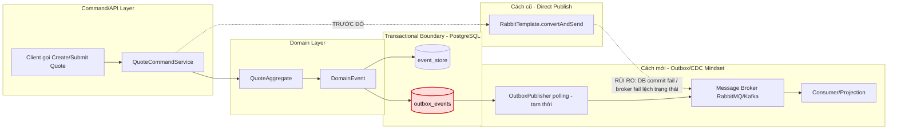

# Tech Note — Ngày 14: Outbox/CDC Mindset

> **Chủ đề:** Vì sao không publish RabbitMQ trực tiếp trong transaction, và cách mô phỏng `outbox_events` để an toàn hơn.  
> **Trạng thái:** Đã chuyển từ *Direct Publish* sang *Transactional Outbox Simulation*.

---

## 1. DASHBOARD TIẾN ĐỘ

### ✅ Trạng thái tổng quan

| Hạng mục | Trạng thái |
|---|---|
| Command/API | Đã có flow tạo / submit Quote |
| Domain Event | Đã sinh `QuoteCreatedEvent`, `QuoteSubmittedEvent` |
| Publish message | Đã ngừng tư duy publish trực tiếp trong transaction |
| Outbox mindset | Đã có `outbox_events` làm vùng đệm an toàn |
| CDC thật | Chưa có — hiện chỉ mô phỏng bằng polling publisher |
| Kafka/RabbitMQ thật | Chưa bắt buộc — tập trung kiến trúc trước |

---

### ⚡ ĐIỂM DỪNG HIỆN TẠI

Code đang dừng ở trạng thái:

```txt
CommandService xử lý command
  -> Aggregate sinh DomainEvent
  -> EventStore lưu event
  -> OutboxEventStore lưu thêm 1 record vào outbox_events
  -> CHƯA publish trực tiếp RabbitMQ trong transaction chính
```

Điểm quan trọng nhất hôm nay:

```txt
Transaction chính chỉ chịu trách nhiệm ghi DB:
  event_store
  outbox_events

Việc publish message được tách ra sau.
```

---

### 🎯 BƯỚC TIẾP THEO

Ngày mai nên làm:

```txt
Ngày 15 — Idempotency / Duplicate Message Handling

Mục tiêu:
  Consumer có thể nhận trùng message nhưng không xử lý sai.
  Thêm processed_messages để chống duplicate.
```

---

## 2. MÔ PHỎNG CÂY THƯ MỤC

```txt
src/main/java/com/example/quoteservice
├── quote
│   ├── application
│   │   ├── QuoteCommandService.java
│   │   │   // REFACTOR: không publish RabbitMQ trực tiếp nữa
│   │   │   // Chỉ gọi aggregate + lưu event/outbox
│   │   │
│   │   └── QuoteEventPublisher.java
│   │       // CÓ THỂ ĐÃ CÓ TRƯỚC: abstraction publish event
│   │       // Sau bài này không nên gọi trực tiếp trong transaction chính
│   │
│   ├── domain
│   │   ├── QuoteAggregate.java
│   │   │   // Sinh DomainEvent từ command
│   │   │
│   │   └── event
│   │       ├── QuoteCreatedEvent.java
│   │       │   // Domain event khi tạo quote
│   │       └── QuoteSubmittedEvent.java
│   │           // Domain event khi submit quote
│   │
│   └── infrastructure
│       ├── eventstore
│       │   ├── EventStore.java
│       │   │   // Lưu event chính vào event_store
│       │   └── JpaEventStore.java
│       │       // Implementation bằng JPA/PostgreSQL
│       │
│       └── outbox
│           ├── OutboxEventEntity.java
│           │   // NEW: mapping bảng outbox_events
│           │
│           ├── OutboxEventRepository.java
│           │   // NEW: repository thao tác outbox_events
│           │
│           ├── OutboxEventStore.java
│           │   // NEW: lưu DomainEvent vào outbox_events cùng transaction
│           │
│           └── OutboxPublisher.java
│               // NEW/TEMPORARY: mô phỏng CDC bằng polling
│               // Sau này sẽ được thay bằng Debezium/CDC thật
│
└── shared
    └── messaging
        └── DomainEventMessage.java
            // NEW/REFACTOR: message chuẩn để publish ra broker sau này
```

---

## 3. SƠ ĐỒ LUỒNG DỮ LIỆU



### 🔴 ĐIỂM THAY THẾ/NÂNG CẤP CHỐT YẾU

```txt
Thay:
  publish RabbitMQ trực tiếp trong transaction

Bằng:
  ghi outbox_events trong cùng transaction với event_store

Sau này nâng cấp:
  OutboxPublisher polling -> Debezium CDC thật
```

---

## 4. CHI TIẾT SỰ DỊCH CHUYỂN LOGIC

### File bị tác động mạnh nhất

```txt
QuoteCommandService.java
```

---

### TRƯỚC ĐÓ — Direct Publish trong transaction

```java
@Transactional
public void submitQuote(SubmitQuoteCommand command) {
    QuoteAggregate aggregate = quoteRepository.load(command.getQuoteId());

    DomainEvent event = aggregate.process(command);

    eventStore.append(event);

    // ❌ Rủi ro: publish message trực tiếp trong transaction
    rabbitTemplate.convertAndSend(
            "quote.exchange",
            "quote.submitted",
            event
    );
}
```

Rủi ro:

```txt
DB commit thành công nhưng Rabbit publish fail
Rabbit publish thành công nhưng DB rollback
Network timeout làm trạng thái không rõ ràng
Command transaction bị dính trách nhiệm integration
```

---

### BÂY GIỜ — Transactional Outbox Simulation

```java
@Transactional
public void submitQuote(SubmitQuoteCommand command) {
    QuoteAggregate aggregate = quoteRepository.load(command.getQuoteId());

    DomainEvent event = aggregate.process(command);

    // ✅ Sự thật nghiệp vụ
    eventStore.append(event);

    // ✅ Message cần publish sau này
    outboxEventStore.save(event);
}
```

Sau transaction:

```java
public void publishPendingOutboxEvents() {
    List<OutboxEventEntity> events = outboxRepository.findPendingEvents();

    for (OutboxEventEntity event : events) {
        messageBroker.publish(event.toMessage());
        event.markSent();
    }
}
```

---

### Vì sao kiến trúc đổi?

```txt
Mục tiêu Enterprise:
  Tách transaction nghiệp vụ khỏi integration side effect.

Command transaction:
  chỉ ghi DB an toàn.

Message publishing:
  xử lý sau bằng OutboxPublisher tạm thời,
  sau này thay bằng CDC/Debezium.
```

---

## 5. QUY LUẬT ĐỌC LẠI 30 GIÂY

Khi mở lại file này, đọc theo thứ tự:

```txt
1. Nhìn DASHBOARD TIẾN ĐỘ
   -> biết hôm nay đang ở trạng thái nào.

2. Nhìn ⚡ ĐIỂM DỪNG HIỆN TẠI
   -> biết code đang dừng ở đâu.

3. Nhìn 🔴 ĐIỂM THAY THẾ/NÂNG CẤP CHỐT YẾU
   -> nhớ bản chất kiến trúc đã đổi.

4. Nhìn SƠ ĐỒ FLOW Mermaid
   -> khôi phục luồng end-to-end.

5. Nhìn TRƯỚC ĐÓ vs BÂY GIỜ
   -> nhớ file nào bị refactor và vì sao.

6. Nhìn 🎯 BƯỚC TIẾP THEO
   -> biết ngày mai học tiếp gì.
```

---

## Ghi nhớ nhanh

```txt
Không publish broker trực tiếp trong transaction chính.

Hãy ghi:
  event_store
  outbox_events

Rồi để bước sau publish message.

OutboxPublisher hiện tại chỉ là mô phỏng.
Debezium/CDC sau này sẽ thay nó.
```
