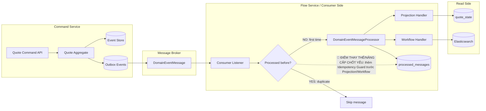

# Tech Note — Ngày 15: Idempotency & Duplicate Message

> **Chủ đề:** Xử lý consumer nhận trùng event, tránh Projection/Workflow chạy sai  
> **Kiểu note:** Kiến trúc động  
> **Trạng thái:** Đã hoàn thành bài học nền tảng cho Event-driven Consumer Reliability

---

## 1. DASHBOARD TIẾN ĐỘ

### Tổng quan

| Hạng mục | Trạng thái |
|---|---|
| Event Store mini | ✅ Đã có |
| Domain Event | ✅ Đã có |
| Outbox/Event Publisher mindset | ✅ Đã có |
| Consumer nhận event | ✅ Đã có |
| Projection update `quote_state` | ✅ Đã có |
| Idempotency chống duplicate | ✅ Hoàn thành hôm nay |
| Retry/DLQ | ⏭️ Chưa làm |
| Kafka thật / CDC thật | ⏭️ Chưa làm |

---

### ⚡ ĐIỂM DỪNG HIỆN TẠI

Consumer hiện đã có lớp bảo vệ **idempotency** trước khi chạy business side effect.

```txt
Event message đi vào consumer
  -> kiểm tra processed_messages
  -> nếu đã xử lý: skip
  -> nếu chưa xử lý: chạy Projection/Workflow
  -> xử lý thành công: ghi processed_messages
```

Điểm dừng code quan trọng:

```txt
Rabbit/Kafka Consumer
  -> DomainEventMessageProcessor
  -> ProcessedMessageRepository
  -> Projection Handler
  -> Workflow Handler
```

Ý nghĩa kiến trúc:

```txt
Consumer có thể nhận trùng event.
Nhưng Projection/Workflow không được chạy trùng.
```

---

### 🎯 BƯỚC TIẾP THEO

**Ngày 16 — Projection versioning**

Mục tiêu ngày mai:

```txt
Không chỉ chống duplicate theo messageId,
mà còn chống event cũ ghi đè state mới hơn.
```

Trọng tâm:

```txt
quote_state.last_projected_version
event.aggregate_version
```

Rule ngày mai:

```txt
Nếu event.version <= quote_state.last_projected_version
  -> skip
Nếu event.version == quote_state.last_projected_version + 1
  -> apply
```

---

## 2. MÔ PHỎNG CÂY THƯ MỤC

```txt
src/main/java/com/example/quoteservice
├── command
│   └── quote
│       └── infrastructure
│           └── outbox
│               ├── OutboxEventEntity.java              // đã có: lưu event chờ publish
│               └── OutboxMessagePublisher.java         // đã có: publish event message
│
├── flow
│   └── quote
│       ├── consumer
│       │   ├── DomainEventMessageProcessor.java        // [NEW] xử lý event message tập trung
│       │   └── RabbitMqDomainEventConsumer.java        // [REFACTOR] chỉ nhận message rồi gọi processor
│       │
│       ├── projection
│       │   ├── QuoteCreatedProjectionHandler.java      // side effect: tạo quote_state
│       │   ├── QuoteSubmittedProjectionHandler.java    // side effect: cập nhật SUBMITTED
│       │   └── QuoteApprovedProjectionHandler.java     // side effect: cập nhật APPROVED
│       │
│       └── workflow
│           └── QuoteSyncWorkflow.java                  // side effect: sync/search/notification workflow
│
├── shared
│   └── messaging
│       ├── DomainEventMessage.java                     // envelope message đi qua broker
│       └── dedup
│           ├── ProcessedMessageEntity.java             // [NEW] bảng ghi message đã xử lý
│           ├── ProcessedMessageRepository.java         // [NEW] kiểm tra duplicate messageId
│           └── MessageDedupService.java                // [NEW] idempotency guard
│
└── readmodel
    └── quote
        └── state
            ├── QuoteStateEntity.java                   // read model phục vụ Query API
            └── QuoteStateRepository.java               // repository update projection
```

---

## 3. SƠ ĐỒ LUỒNG DỮ LIỆU



---

## 4. CHI TIẾT SỰ DỊCH CHUYỂN LOGIC

### File bị tác động mạnh nhất

```txt
flow/quote/consumer/DomainEventMessageProcessor.java
```

---

### TRƯỚC ĐÓ — Consumer xử lý thẳng event

```java
@RabbitListener(queues = "quote-events")
@Transactional
public void consume(DomainEventMessage message) {
    DomainEvent event = eventDeserializer.deserialize(message);

    for (DomainEventHandler handler : handlers) {
        if (handler.supports(event)) {
            handler.handle(event);
        }
    }
}
```

Vấn đề:

```txt
Nếu broker redeliver cùng message:
  Projection chạy lại
  Workflow chạy lại
  Notification/ES sync có thể bị lặp
  quote_state có thể bị update sai
```

---

### BÂY GIỜ — Thêm Idempotency Guard

```java
@Transactional
public void process(DomainEventMessage message) {
    if (messageDedupService.isProcessed(message.getEventId())) {
        log.info(
            "[IDEMPOTENCY] Duplicate message skipped. messageId={}, eventType={}, aggregateId={}",
            message.getEventId(),
            message.getEventType(),
            message.getAggregateId()
        );
        return;
    }

    DomainEvent event = eventDeserializer.deserialize(message);

    dispatchToHandlers(event, message);

    messageDedupService.markProcessed(message);
}
```

Rule mới:

```txt
Chưa xử lý:
  run Projection/Workflow
  ghi processed_messages

Đã xử lý:
  skip toàn bộ side effect
```

---

### Vì sao kiến trúc đổi?

```txt
Consumer trong Event-driven Architecture phải chịu được at-least-once delivery.

Broker có thể gửi trùng message.
Consumer crash có thể đọc lại message.
Retry có thể làm message quay lại.

=> Side effect phải được bảo vệ bằng Idempotency.
```

Enterprise principle:

```txt
At-least-once delivery + Idempotent Consumer = Reliable Event Processing
```

---

## 5. QUY LUẬT ĐỌC LẠI 30 GIÂY

Khi mở lại note này, đọc theo thứ tự:

### Bước 1 — Nhìn Dashboard

Tập trung vào:

```txt
⚡ ĐIỂM DỪNG HIỆN TẠI
🎯 BƯỚC TIẾP THEO
```

Mục đích:

```txt
Biết hôm nay code dừng ở đâu.
Biết ngày mai phải nối tiếp chỗ nào.
```

---

### Bước 2 — Nhìn Flow Mermaid

Tìm ngay node:

```txt
Processed before?
```

và dòng:

```txt
🔴 ĐIỂM THAY THẾ/NÂNG CẤP CHỐT YẾU
```

Mục đích:

```txt
Khôi phục nhanh thay đổi kiến trúc trong đầu.
```

---

### Bước 3 — Nhìn cây thư mục

Tập trung các file có nhãn:

```txt
[NEW]
[REFACTOR]
```

Mục đích:

```txt
Biết file nào được thêm.
Biết file nào bị đổi vai trò.
```

---

### Bước 4 — Nhìn đoạn code "TRƯỚC ĐÓ" vs "BÂY GIỜ"

Chỉ cần nhớ một dòng:

```java
if (messageDedupService.isProcessed(message.getEventId())) return;
```

Đây là điểm khóa của ngày 15.

---

## 6. GHI NHỚ KIẾN TRÚC

```txt
Idempotency không làm event biến mất.
Idempotency làm side effect không chạy lặp.
```

```txt
processed_messages không phải read model nghiệp vụ.
Nó là technical table để bảo vệ consumer.
```

```txt
Không mark processed trước handler.
Chỉ mark processed sau khi Projection/Workflow xử lý thành công.
```

```txt
Ngày 15 bảo vệ duplicate message.
Ngày 16 sẽ bảo vệ stale/out-of-order event bằng aggregateVersion.
```
