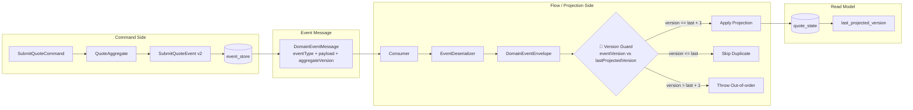

# Tech Note — Ngày 16: Projection Versioning Guard

> Chủ đề: Event Sourcing / CQRS nâng cao  
> Mục tiêu: Nâng Projection từ “nhận event là update ngay” sang “chỉ apply event đúng version tiếp theo”.

---

## 1. DASHBOARD TIẾN ĐỘ

### Trạng thái tổng quan

| Hạng mục | Trạng thái |
|---|---|
| Layer đang học | Flow / Projection / Read Model |
| Kiến trúc | CQRS + Event Sourcing |
| Nâng cấp chính | Projection kiểm tra `aggregateVersion` trước khi update `quote_state` |
| Vấn đề xử lý | Duplicate event, out-of-order event, rebuild read model an toàn |
| Mức độ hoàn thành | ✅ Hoàn thành nền tảng Projection Versioning |

### ⚡ ĐIỂM DỪNG HIỆN TẠI

Code đang dừng tại logic:

```txt
Kafka/Rabbit Consumer
  -> DomainEventMessage
  -> DomainEventEnvelope(event, aggregateVersion)
  -> Quote Projection Handler
  -> [🔴 Version Guard]
      - eventVersion == lastProjectedVersion + 1  => APPLY
      - eventVersion <= lastProjectedVersion      => DUPLICATE, SKIP
      - eventVersion > lastProjectedVersion + 1   => OUT_OF_ORDER, THROW/RETRY
  -> quote_state.last_projected_version updated
```

Trạng thái hiện tại của read model:

```txt
quote_state
  id
  status
  customer_name
  product_code
  premium
  last_projected_version   // NEW: version cuối đã apply thành công
```

### 🎯 BƯỚC TIẾP THEO

**Ngày 17 — DLQ/Retry cho Projection**

Mục tiêu ngày mai:

```txt
Nếu Projection gặp out-of-order event:
  -> throw exception
  -> retry có kiểm soát
  -> sau nhiều lần fail thì đưa vào DLQ/DLT để debug
```

---

## 2. MÔ PHỎNG CÂY THƯ MỤC

```txt
quote-service/
└── src/main/
    ├── java/com/example/quoteservice/
    │   ├── shared/
    │   │   └── eventbus/
    │   │       └── DomainEventEnvelope.java
    │   │           // REFACTOR: mang thêm aggregateVersion từ message/event_store sang handler
    │   │
    │   ├── flow/
    │   │   └── quote/
    │   │       └── projection/
    │   │           ├── QuoteProjectionHandler.java
    │   │           │   // REFACTOR: không update read model trực tiếp nữa; phải đi qua version guard
    │   │           │
    │   │           └── QuoteProjectionVersionGuard.java
    │   │               // NEW: kiểm tra duplicate / out-of-order / next expected version
    │   │
    │   └── readmodel/
    │       └── quote/
    │           └── state/
    │               ├── QuoteStateEntity.java
    │               │   // REFACTOR: thêm lastProjectedVersion để biết read model đang ở version nào
    │               │
    │               └── QuoteStateRepository.java
    │                   // EXISTING: đọc/ghi quote_state
    │
    └── resources/db/migration/
        └── V*_add_last_projected_version_to_quote_state.sql
            // NEW: thêm column last_projected_version default 0
```

---

## 3. SƠ ĐỒ LUỒNG DỮ LIỆU



**[🔴 ĐIỂM THAY THẾ/NÂNG CẤP CHỐT YẾU]**

```txt
Trước: Consumer nhận event -> Projection update ngay
Bây giờ: Consumer nhận event -> kiểm tra version -> chỉ apply nếu đúng version tiếp theo
```

---

## 4. CHI TIẾT SỰ DỊCH CHUYỂN LOGIC

File tác động mạnh nhất:

```txt
QuoteProjectionHandler.java
```

### TRƯỚC ĐÓ — Projection update ngay

```java
public void handle(DomainEventEnvelope<QuoteSubmittedEvent> envelope) {
    QuoteSubmittedEvent event = envelope.event();

    QuoteStateEntity state = quoteStateRepository.findById(event.quoteId())
            .orElseThrow();

    state.setStatus(QuoteStatus.SUBMITTED);
    state.setSubmittedBy(event.submittedBy());
    state.setSubmittedAt(event.submittedAt());

    quoteStateRepository.save(state);
}
```

Vấn đề:

```txt
Duplicate event:
  apply lại lần nữa, có thể sai side effect.

Out-of-order event:
  version 3 đến trước version 2, read model nhảy sai trạng thái.

Rebuild read model:
  khó biết event nào đã apply tới đâu.
```

### BÂY GIỜ — Projection chỉ apply đúng version tiếp theo

```java
public void handle(DomainEventEnvelope<QuoteSubmittedEvent> envelope) {
    QuoteSubmittedEvent event = envelope.event();
    long eventVersion = envelope.aggregateVersion();

    QuoteStateEntity state = quoteStateRepository.findById(event.quoteId())
            .orElseThrow();

    long lastVersion = state.getLastProjectedVersion();
    long expectedNextVersion = lastVersion + 1;

    if (eventVersion <= lastVersion) {
        return; // duplicate event, skip safely
    }

    if (eventVersion > expectedNextVersion) {
        throw new OutOfOrderProjectionException(
                event.quoteId(),
                lastVersion,
                eventVersion
        );
    }

    state.setStatus(QuoteStatus.SUBMITTED);
    state.setSubmittedBy(event.submittedBy());
    state.setSubmittedAt(event.submittedAt());
    state.setLastProjectedVersion(eventVersion);

    quoteStateRepository.save(state);
}
```

Lý do đổi kiến trúc:

```txt
Projection không còn là "blind update".
Projection trở thành "version-aware read model updater".

Mục tiêu Enterprise:
  - Idempotency
  - Ordering safety
  - Rebuild safety
  - Retry/DLQ readiness
  - Eventual consistency có kiểm soát
```

---

## 5. QUY LUẬT ĐỌC LẠI 30 GIÂY

Khi mở lại file này, đọc theo thứ tự:

```txt
1. Nhìn DASHBOARD trước
   -> biết hôm nay học tầng nào và code đang dừng ở đâu.

2. Nhìn [⚡ ĐIỂM DỪNG HIỆN TẠI]
   -> nhớ ngay rule version:
      eventVersion == last + 1 => APPLY
      eventVersion <= last     => SKIP
      eventVersion > last + 1  => OUT_OF_ORDER

3. Nhìn Mermaid Flow
   -> khôi phục bức tranh:
      event_store -> message -> consumer -> version guard -> quote_state

4. Nhìn code "TRƯỚC ĐÓ" vs "BÂY GIỜ"
   -> nhớ file bị đổi mạnh nhất là QuoteProjectionHandler.java

5. Nhìn [🎯 BƯỚC TIẾP THEO]
   -> biết ngày mai nối tiếp bằng Retry/DLQ cho out-of-order event.
```

---

## Ghi nhớ 1 câu

```txt
Projection an toàn không phải là cứ nhận event rồi update,
mà là chỉ update khi event đúng version tiếp theo của read model.
```

Vậy cần chỉnh từ các chỗ này:
1. Migration DB
   -> thêm event_store.aggregate_version
   -> thêm quote_state.last_projected_version

2. EventStoreEntity
   -> thêm field aggregateVersion

3. EventStoreRepository
   -> thêm query lấy max version theo aggregateId

4. JpaEventStore.append(...)
   -> tính nextVersion rồi lưu vào event_store

5. OutboxEventEntity / DomainEventMessage
   -> mang aggregateVersion theo message

6. Event publisher / Consumer deserializer
   -> copy aggregateVersion từ DB/message vào envelope

7. QuoteStateEntity
   -> thêm lastProjectedVersion

8. Projection Handler
   -> so eventVersion với lastProjectedVersion
Mô Phỏng Case Cụ Thể
Giả sử quote Q-001.
Ban đầu:
event_store: rỗng
quote_state: chưa có Q-001
Client gọi Create Quote.
Command Side xử lý:
CreateQuoteCommand
-> QuoteAggregate sinh QuoteCreatedEvent
-> EventStore thấy Q-001 chưa có event nào
-> lưu event với aggregate_version = 1
Trong event_store:
Q-001 | QuoteCreatedEvent | aggregate_version = 1
Message gửi sang Consumer:
eventType = QuoteCreatedEvent
aggregateId = Q-001
aggregateVersion = 1
Projection nhận message:
quote_state chưa có Q-001
lastProjectedVersion mặc định = 0
eventVersion = 1
expectedNextVersion = 0 + 1 = 1
Rule:
eventVersion == lastProjectedVersion + 1
1 == 0 + 1
=> APPLY
Projection tạo read model:
quote_state
  id = Q-001
  status = DRAFT
  last_projected_version = 1
Tiếp theo client Submit Quote.
Command Side:
SubmitQuoteCommand
-> load/replay Q-001 từ event_store
-> hiện tại aggregate đang ở version 1
-> sinh QuoteSubmittedEvent
-> lưu với aggregate_version = 2
Message:
eventType = QuoteSubmittedEvent
aggregateId = Q-001
aggregateVersion = 2
Projection nhận:
quote_state.last_projected_version = 1
eventVersion = 2
expectedNextVersion = 2
Rule:
2 == 1 + 1
=> APPLY
Read model thành:
quote_state
  id = Q-001
  status = SUBMITTED
  last_projected_version = 2
Case Duplicate
Rabbit/Kafka gửi lại QuoteSubmittedEvent version 2.
Projection nhận lại:
lastProjectedVersion = 2
eventVersion = 2
Rule:
eventVersion <= lastProjectedVersion
2 <= 2
=> DUPLICATE, SKIP
Không update lại.
Case Out-of-order
Giả sử do lỗi nào đó, QuoteApprovedEvent version 3 tới trước QuoteSubmittedEvent version 2.
Read model hiện tại:
quote_state.status = DRAFT
last_projected_version = 1
Projection nhận event version 3:
eventVersion = 3
lastProjectedVersion = 1
expectedNextVersion = 2
Rule:
eventVersion > lastProjectedVersion + 1
3 > 2
=> OUT_OF_ORDER
=> throw exception / retry / đưa DLQ sau này
Vì sao không apply version 3 luôn?
Vì read model đang thiếu version 2. Nếu apply version 3 ngay, quote_state có thể nhảy từ DRAFT sang APPROVED, bỏ qua SUBMITTED. Version Guard bắt hệ thống xử lý đúng thứ tự:
version 1 -> version 2 -> version 3
Câu cần nhớ là:
eventVersion không nằm sẵn trong business event.
Nó là metadata do Event Store gán khi append event,
sau đó được truyền qua message để Projection biết event này là bước thứ mấy của Aggregate.