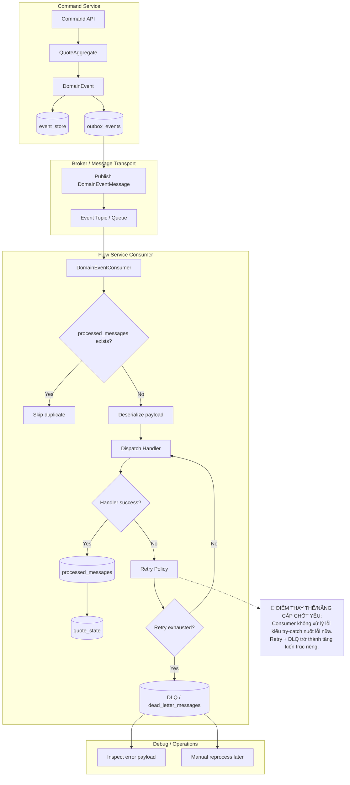

# Tech Note — Ngày 17: Dead Letter Queue / Retry Strategy

> **Chủ đề:** Xử lý consumer lỗi, out-of-order event, poison message và đưa vào DLQ để debug  
> **Kiến trúc:** Event Sourcing / CQRS / Event-driven / Projection Pipeline  
> **Trạng thái:** ✅ Hoàn thành bài học nền tảng retry + DLQ ở mức demo architecture

---

## 1. DASHBOARD TIẾN ĐỘ

### Trạng thái tổng quan

| Hạng mục | Trạng thái | Ghi chú |
|---|---:|---|
| Event Store | ✅ Done | Event đã được append và replay |
| Outbox / Publisher mindset | ✅ Done | Đã hiểu message được publish ra broker |
| Consumer xử lý event | ✅ Done | Consumer nhận event và dispatch handler |
| Retry Strategy | ✅ Done | Consumer lỗi thì retry có kiểm soát |
| Dead Letter Queue | ✅ Done | Message lỗi nặng được đưa vào DLQ |
| Idempotency | ✅ Done | `processed_messages` tránh xử lý trùng |
| Out-of-order Event | ✅ Done | Phát hiện version không đúng thứ tự |
| Poison Message | ✅ Done | Message gây lỗi lặp lại được cô lập |
| Elasticsearch Projection | ⏭️ Next | Ngày 18 bắt đầu sync read model sang ES |

---

### ⚡ ĐIỂM DỪNG HIỆN TẠI

```txt
Code đang dừng tại pipeline consumer lỗi:

DomainEventMessage
  -> Consumer nhận message
  -> kiểm tra processed_messages
  -> deserialize payload thành DomainEvent
  -> dispatch ProjectionHandler / WorkflowHandler
  -> nếu lỗi:
       retry theo retry policy
       nếu vẫn lỗi:
          đưa message vào DLQ
          ghi log để debug
  -> nếu thành công:
       mark processed
```

**Điểm quan trọng hiện tại:**

```txt
Consumer không được nuốt exception.
Nếu xử lý lỗi, phải throw ra để retry/DLQ mechanism hoạt động.
```

---

### 🎯 BƯỚC TIẾP THEO

```txt
Ngày 18 — Elasticsearch Projection

Mục tiêu:
  Event đã consume thành công
    -> update quote_state
    -> sync QuoteDocument sang Elasticsearch
    -> hỗ trợ Query Service search/list nhanh hơn
```

---

## 2. MÔ PHỎNG CÂY THƯ MỤC

```txt
src/main/java/com/example/quoteservice
├── domain
│   └── quote
│       ├── event
│       │   ├── QuoteCreatedEvent.java              // domain event: báo Quote đã được tạo
│       │   ├── QuoteSubmittedEvent.java            // domain event: báo Quote đã submit
│       │   └── QuoteApprovedEvent.java             // domain event: báo Quote đã approve
│       └── aggregate
│           └── QuoteAggregate.java                  // aggregate sinh event, không xử lý retry/DLQ
│
├── shared
│   ├── messaging
│   │   ├── DomainEventMessage.java                 // envelope message đi qua broker
│   │   ├── dedup
│   │   │   ├── ProcessedMessageEntity.java         // [NEW] lưu message đã xử lý
│   │   │   ├── ProcessedMessageRepository.java     // [NEW] query processed_messages
│   │   │   └── MessageDedupService.java            // [NEW] chống duplicate consumer
│   │   └── dlq
│   │       ├── DeadLetterMessageEntity.java         // [NEW] lưu message lỗi không xử lý được
│   │       ├── DeadLetterMessageRepository.java     // [NEW] query DLQ để debug
│   │       └── DeadLetterPublisher.java             // [NEW] đưa poison message vào DLQ
│   │
│   └── eventstore
│       └── EventDeserializer.java                  // deserialize payload -> DomainEvent
│
├── flow
│   └── quote
│       ├── consumer
│       │   ├── DomainEventConsumer.java             // [REFACTOR] consumer chính, không xử lý trùng/lỗi trực tiếp
│       │   ├── DomainEventMessageProcessor.java     // [NEW] xử lý pipeline: dedup -> deserialize -> dispatch -> mark processed
│       │   └── RetryableDomainEventConsumer.java    // [NEW] retry wrapper / retry strategy
│       │
│       ├── projection
│       │   ├── QuoteCreatedProjectionHandler.java   // update quote_state khi Created
│       │   ├── QuoteSubmittedProjectionHandler.java // update quote_state khi Submitted
│       │   └── QuoteApprovedProjectionHandler.java  // update quote_state khi Approved
│       │
│       └── workflow
│           └── QuoteSyncWorkflow.java               // side-effect workflow sau khi event được consume
│
└── infrastructure
    └── db
        └── migration
            ├── V3__create_processed_messages.sql   // [NEW] bảng idempotency
            └── V4__create_dead_letter_messages.sql // [NEW] bảng DLQ/debug
```

---

## 3. SƠ ĐỒ LUỒNG DỮ LIỆU



---

## 4. CHI TIẾT SỰ DỊCH CHUYỂN LOGIC

### File tác động mạnh nhất

```txt
flow/quote/consumer/DomainEventConsumer.java
```

---

### TRƯỚC ĐÓ — Consumer xử lý đơn giản, dễ mất lỗi

```java
public void consume(DomainEventMessage message) {
    try {
        DomainEvent event = eventDeserializer.deserialize(message);
        dispatcher.dispatch(event);

        processedMessageService.markProcessed(message.getEventId());
    } catch (Exception ex) {
        log.error("Consume event failed", ex);

        // Vấn đề:
        // 1. Có thể nuốt lỗi
        // 2. Broker tưởng xử lý thành công
        // 3. Message không retry
        // 4. Không có DLQ để debug
    }
}
```

---

### BÂY GIỜ — Consumer có retry, DLQ, idempotency

```java
public void consume(DomainEventMessage message) {
    if (messageDedupService.isProcessed(message.getEventId())) {
        log.info("Duplicate message skipped: {}", message.getEventId());
        return;
    }

    try {
        DomainEvent event = eventDeserializer.deserialize(message);

        domainEventDispatcher.dispatch(event);

        messageDedupService.markProcessed(message);
    } catch (Exception ex) {
        log.error(
            "Consumer failed. eventId={}, eventType={}, aggregateId={}, version={}",
            message.getEventId(),
            message.getEventType(),
            message.getAggregateId(),
            message.getAggregateVersion(),
            ex
        );

        // Quan trọng:
        // throw lại để retry strategy hoặc DLQ handler xử lý.
        throw ex;
    }
}
```

---

### Vì sao kiến trúc đổi?

```txt
TRƯỚC:
  Consumer tự try-catch lỗi.
  Lỗi dễ bị nuốt.
  Không có retry chuẩn.
  Không có nơi lưu poison message.

BÂY GIỜ:
  Consumer chỉ xử lý business pipeline.
  Retry strategy quyết định thử lại.
  DLQ lưu message lỗi sau khi retry thất bại.
  processed_messages đảm bảo idempotency.
```

**Enterprise rule:**

```txt
Consumer phải fail rõ ràng.
Retry/DLQ phải là policy có chủ đích.
Không được để lỗi message biến mất âm thầm.
```

---

## 5. QUY LUẬT ĐỌC LẠI 30 GIÂY

Khi mở lại file này, đọc theo thứ tự:

```txt
1. Nhìn DASHBOARD TIẾN ĐỘ
   -> biết bài này đã hoàn thành phần retry/DLQ, ngày sau sang ES Projection.

2. Nhìn ⚡ ĐIỂM DỪNG HIỆN TẠI
   -> nhớ code đang dừng ở consumer pipeline:
      receive -> dedup -> deserialize -> dispatch -> retry/DLQ.

3. Nhìn SƠ ĐỒ Mermaid
   -> nắm lại toàn bộ flow Command -> Broker -> Consumer -> Retry -> DLQ.

4. Nhìn 🔴 ĐIỂM THAY THẾ/NÂNG CẤP CHỐT YẾU
   -> nhớ kiến trúc đã đổi từ try-catch đơn giản sang retry/DLQ policy.

5. Nhìn code TRƯỚC ĐÓ / BÂY GIỜ
   -> khôi phục nhanh file nào bị tác động mạnh nhất:
      DomainEventConsumer.java.

6. Nhìn CÂY THƯ MỤC
   -> biết file nào mới xuất hiện:
      processed_messages, DeadLetterPublisher, DomainEventMessageProcessor.
```

---

## Tóm tắt 1 câu

```txt
Ngày 17 biến consumer từ chỗ “nhận event rồi cố xử lý” thành một pipeline production-ready:
idempotent, retryable, observable và có DLQ để cô lập poison message.
```
