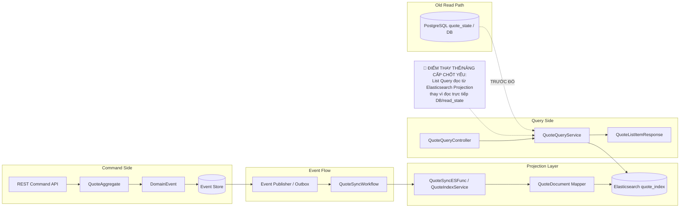

# TECH NOTE — Ngày 18: Elasticsearch Projection cho Quote List

> **Kiến trúc động:** chuyển `List Quote` từ đọc trực tiếp DB/read model sang đọc từ **Elasticsearch Projection**.  
> **Mục tiêu:** `QuoteSyncWorkflow` nhận event → sync `QuoteDocument` vào ES → Query/List đọc từ ES.

---

## 1. DASHBOARD TIẾN ĐỘ

| Hạng mục | Trạng thái |
|---|---|
| Event Store / Domain Event | ✅ Đã có |
| Projection DB `quote_state` | ✅ Đã có từ bài trước |
| Elasticsearch Projection | ✅ Hoàn thành ngày 18 |
| `QuoteDocument` | ✅ Mới thêm |
| `QuoteSearchRepository` | ✅ Mới thêm |
| `QuoteSyncWorkflow` gọi sync ES | ✅ Đã nối vào event flow |
| List Quote đọc từ ES | ✅ Đã chuyển hướng đọc |
| Advanced search/filter/sort | ⏳ Ngày tiếp theo |

### ⚡ ĐIỂM DỪNG HIỆN TẠI

```txt
Command API
  -> Aggregate
  -> DomainEvent
  -> Event Store
  -> Outbox/Event Publisher
  -> QuoteSyncWorkflow
  -> QuoteSyncESFunc / QuoteIndexService
  -> Elasticsearch: quote_index
  -> Query API List đọc từ Elasticsearch
```

**Code đang dừng ở điểm:**

```txt
QuoteSyncWorkflow đã trở thành trigger sync ES.
QuoteDocument đã đại diện cho read model tối ưu cho search/list.
Quote List không còn phụ thuộc trực tiếp vào bảng transactional/read_state đơn giản.
```

### 🎯 BƯỚC TIẾP THEO

```txt
Ngày 19 — Advanced Search bằng ElasticsearchOperations:
  - filter theo status/productCode/customerName/date range
  - sort/pagination
  - keyword search
  - query DSL rõ ràng thay vì repository method đơn giản
```

---

## 2. MÔ PHỎNG CÂY THƯ MỤC

```txt
src/main/java/com/example/quoteservice/

├── domain/
│   └── quote/
│       ├── aggregate/
│       │   └── QuoteAggregate.java                  // Aggregate xử lý command, emit event
│       ├── event/
│       │   ├── QuoteCreatedEvent.java               // Event nguồn tạo Quote
│       │   ├── QuoteSubmittedEvent.java             // Event nguồn submit Quote
│       │   └── QuoteApprovedEvent.java              // Event nguồn approve Quote
│       └── command/
│           ├── CreateQuoteCommand.java              // Command tạo Quote
│           ├── SubmitQuoteCommand.java              // Command submit Quote
│           └── ApproveQuoteCommand.java             // Command approve Quote
│
├── flow/
│   └── quote/
│       ├── workflow/
│       │   └── QuoteSyncWorkflow.java               // [REFACTOR] Event handler gọi sync ES sau khi event xảy ra
│       └── search/
│           ├── QuoteSyncESFunc.java                 // [NEW] Load dữ liệu Quote và đẩy sang ES
│           └── QuoteIndexService.java               // [NEW] Application service bọc logic index/update document
│
├── query/
│   └── quote/
│       ├── controller/
│       │   └── QuoteQueryController.java            // API List/Detail phía Query side
│       ├── service/
│       │   └── QuoteQueryService.java               // [REFACTOR] List đọc từ ES thay vì DB/read_state
│       └── dto/
│           └── QuoteListItemResponse.java           // DTO trả về cho màn hình list
│
└── infrastructure/
    └── elasticsearch/
        └── quote/
            ├── QuoteDocument.java                   // [NEW] ES document optimized cho search/list
            ├── QuoteSearchRepository.java           // [NEW] ElasticsearchRepository cho CRUD/search cơ bản
            └── QuoteDocumentMapper.java             // [NEW] Map Quote/read model -> QuoteDocument
```

**File mới quan trọng nhất:**

```txt
QuoteDocument.java
  -> đại diện dữ liệu đọc/search trong Elasticsearch.

QuoteSearchRepository.java
  -> cổng truy cập Elasticsearch.

QuoteSyncESFunc.java / QuoteIndexService.java
  -> nơi đồng bộ Quote sang ES khi event xảy ra.
```

**File bị tác động mạnh nhất:**

```txt
QuoteQueryService.java
  -> List Quote đổi nguồn đọc: DB/read_state -> Elasticsearch.
```

---

## 3. SƠ ĐỒ LUỒNG DỮ LIỆU



**Điểm nâng cấp chốt yếu:**

```txt
Read side bắt đầu tách khỏi transactional/read_state DB.
Elasticsearch trở thành read model chuyên dụng cho List/Search.
```

---

## 4. CHI TIẾT SỰ DỊCH CHUYỂN LOGIC

### File bị tác động mạnh: `QuoteQueryService.java`

#### TRƯỚC ĐÓ — List đọc từ DB/read model

```java
@Service
public class QuoteQueryService {

    private final QuoteStateRepository quoteStateRepository;

    public Page<QuoteListItemResponse> list(QuoteListQuery query, Pageable pageable) {
        Page<QuoteStateEntity> page = quoteStateRepository.findByStatus(
                query.getStatus(),
                pageable
        );

        return page.map(this::toListItemResponse);
    }
}
```

**Tính chất kiến trúc cũ:**

```txt
Query List phụ thuộc DB schema.
Search/filter bị giới hạn bởi query JPA.
Khó mở rộng keyword search, scoring, nhiều điều kiện động.
```

#### BÂY GIỜ — List đọc từ Elasticsearch Projection

```java
@Service
public class QuoteQueryService {

    private final QuoteSearchRepository quoteSearchRepository;

    public Page<QuoteListItemResponse> list(QuoteListQuery query, Pageable pageable) {
        Page<QuoteDocument> page = quoteSearchRepository.findByStatus(
                query.getStatus(),
                pageable
        );

        return page.map(this::toListItemResponse);
    }
}
```

**Tính chất kiến trúc mới:**

```txt
Query List đọc từ search index.
Elasticsearch tối ưu cho list/search/filter/sort.
DB transactional không bị kéo vào use case search nặng.
Read model có thể rebuild lại từ event/read_state khi cần.
```

### Logic sync ES từ event

```java
@Component
public class QuoteSyncWorkflow {

    @EventHandlerMethod
    @Retryable
    public void submitQuote(DispatchedEvent<SubmitQuoteEvent> event) {
        String quoteId = event.getEntityId();

        applicationContext
                .getBean(QuoteSyncESFunc.class)
                .exec(quoteId);
    }
}
```

**Lý do kiến trúc đổi:**

```txt
Command side không trực tiếp update ES.
ES sync là side effect sau khi DomainEvent đã xảy ra.
Điều này giữ đúng CQRS/Event-driven boundary:
  Command -> Event -> Projection -> Query
```

---

## 5. QUY LUẬT ĐỌC LẠI 30 GIÂY

Khi mở lại note này, đọc theo thứ tự sau:

```txt
Bước 1 — Nhìn DASHBOARD TIẾN ĐỘ
  -> biết hôm nay đang ở trạng thái nào.

Bước 2 — Nhìn ⚡ ĐIỂM DỪNG HIỆN TẠI
  -> khôi phục flow cuối cùng đang dừng ở đâu.

Bước 3 — Nhìn Mermaid Flow
  -> nhớ ranh giới Command / Event Flow / Projection / Query.

Bước 4 — Nhìn 🔴 ĐIỂM THAY THẾ/NÂNG CẤP CHỐT YẾU
  -> nhớ bản chất nâng cấp: List đọc từ ES.

Bước 5 — Nhìn code TRƯỚC ĐÓ vs BÂY GIỜ
  -> nhớ file bị đổi logic chính là QuoteQueryService.

Bước 6 — Nhìn 🎯 BƯỚC TIẾP THEO
  -> tiếp tục Ngày 19 không bị mất context.
```

---

## 6. TÓM TẮT 1 DÒNG

```txt
Ngày 18 biến Elasticsearch thành Read Model chuyên dụng cho Quote List/Search, được đồng bộ từ Event Flow qua QuoteSyncWorkflow thay vì để Query API đọc trực tiếp DB.
```
