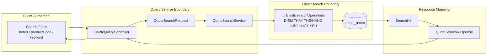

# Tech Note — Ngày 19: Search Query nâng cao bằng `ElasticsearchOperations`

> **Chủ đề:** Filter `status` / `productCode` / `keyword` bằng Elasticsearch query thật, thay vì `findAll()` rồi filter bằng Java.  
> **Track:** Event Sourcing / CQRS / Read Model / Elasticsearch Query Service  
> **Vai trò kiến trúc:** Query-side optimization + Enterprise search pattern

---

## 1. DASHBOARD TIẾN ĐỘ

| Mục | Trạng thái |
|---|---|
| Giai đoạn | CQRS Query Side — Elasticsearch Search Layer |
| Bài học | Ngày 19 — Advanced Search Query |
| Trạng thái | ✅ Hoàn thành bản nâng cấp search query |
| Tầng tác động chính | `query-service` / `read model search` |
| Logic cũ | `findAll()` rồi filter bằng Java memory |
| Logic mới | Build query động bằng `ElasticsearchOperations` |
| Mục tiêu kiến trúc | Đẩy filter/search xuống Elasticsearch engine |

### ⚡ ĐIỂM DỪNG HIỆN TẠI

Code đang dừng ở trạng thái:

```text
QuoteSearchService
  -> nhận search request: status / productCode / keyword
  -> build Elasticsearch Criteria/Query động
  -> gọi ElasticsearchOperations.search(...)
  -> map SearchHit<QuoteDocument> về QuoteSearchResponse
```

Điểm quan trọng đã đạt:

```text
Không còn tư duy:
  lấy toàn bộ document -> filter bằng Java

Chuyển sang tư duy:
  query-service gửi điều kiện xuống Elasticsearch -> Elasticsearch trả đúng tập kết quả cần tìm
```

### 🎯 BƯỚC TIẾP THEO

Ngày mai nên làm:

```text
Ngày 20 — Rebuild Read Model / Reindex Elasticsearch

Mục tiêu:
  Khi quote_state hoặc event history đã có sẵn,
  có thể build lại Elasticsearch index từ read model/database.
```

---

## 2. MÔ PHỎNG CÂY THƯ MỤC

```text
src/main/java/com/example/quoteservice
│
├── domain/
│   └── quote/
│       ├── aggregate/
│       │   └── QuoteAggregate.java              # Aggregate xử lý command/event, không biết Elasticsearch
│       ├── command/
│       │   ├── CreateQuoteCommand.java          # Command ghi dữ liệu
│       │   └── SubmitQuoteCommand.java          # Command submit quote
│       └── event/
│           ├── QuoteCreatedEvent.java           # Event nguồn cho projection/search document
│           └── QuoteSubmittedEvent.java         # Event thay đổi trạng thái quote
│
├── flow/
│   └── quote/
│       └── projection/
│           └── QuoteProjectionHandler.java      # Cập nhật read model / search document khi event xảy ra
│
├── query/
│   └── quote/
│       ├── controller/
│       │   └── QuoteQueryController.java        # GET API: list/search/detail quote
│       ├── dto/
│       │   ├── QuoteSearchRequest.java          # [NEW] Input filter: status/productCode/keyword/page/size
│       │   └── QuoteSearchResponse.java         # Response item cho màn hình search/list
│       └── service/
│           └── QuoteSearchService.java          # [REFACTOR] Dùng ElasticsearchOperations thay findAll()
│
└── infrastructure/
    └── elasticsearch/
        └── quote/
            ├── QuoteDocument.java               # Elasticsearch document: quoteId/status/productCode/customerName/...
            └── QuoteSearchRepository.java       # Repository cơ bản; không còn là nơi xử lý search nâng cao
```

Ghi nhớ nhanh:

```text
[REFACTOR] QuoteSearchService.java
  Đây là file bị tác động mạnh nhất.
  Trách nhiệm mới: build query động và gọi ElasticsearchOperations.

[NEW] QuoteSearchRequest.java
  Gom điều kiện filter/search từ API thành object rõ nghĩa.
```

---

## 3. SƠ ĐỒ LUỒNG DỮ LIỆU — FLOW



Điểm thay thế chốt yếu:

```text
TRƯỚC:
  QuoteSearchRepository.findAll()
  -> Java filter in memory

BÂY GIỜ:
  ElasticsearchOperations.search(query, QuoteDocument.class)
  -> Elasticsearch filter/search thật
```

---

## 4. CHI TIẾT SỰ DỊCH CHUYỂN LOGIC

### File tác động mạnh nhất

```text
query/quote/service/QuoteSearchService.java
```

### TRƯỚC ĐÓ — Query sai hướng Enterprise

```java
public List<QuoteSearchResponse> search(String status, String productCode, String keyword) {
    Iterable<QuoteDocument> allDocuments = quoteSearchRepository.findAll();

    return StreamSupport.stream(allDocuments.spliterator(), false)
            .filter(doc -> status == null || status.equals(doc.getStatus()))
            .filter(doc -> productCode == null || productCode.equals(doc.getProductCode()))
            .filter(doc -> keyword == null
                    || doc.getCustomerName().contains(keyword)
                    || doc.getQuoteNo().contains(keyword))
            .map(this::toResponse)
            .toList();
}
```

Vấn đề kiến trúc:

```text
- Query-service kéo quá nhiều data về application memory.
- Không tận dụng search engine.
- Không scale khi index lớn.
- Pagination/sort/filter dễ sai hoặc chậm.
- Repository bị dùng như database dump thay vì search gateway.
```

### BÂY GIỜ — Query đúng hướng Enterprise

```java
public List<QuoteSearchResponse> search(QuoteSearchRequest request) {
    Criteria criteria = new Criteria();

    if (request.getStatus() != null) {
        criteria = criteria.and("status").is(request.getStatus());
    }

    if (request.getProductCode() != null) {
        criteria = criteria.and("productCode").is(request.getProductCode());
    }

    if (request.getKeyword() != null && !request.getKeyword().isBlank()) {
        Criteria keywordCriteria = new Criteria("customerName").contains(request.getKeyword())
                .or("quoteNo").contains(request.getKeyword());

        criteria = criteria.and(keywordCriteria);
    }

    Query query = new CriteriaQuery(criteria)
            .setPageable(PageRequest.of(request.getPage(), request.getSize()));

    SearchHits<QuoteDocument> hits = elasticsearchOperations.search(
            query,
            QuoteDocument.class
    );

    return hits.stream()
            .map(SearchHit::getContent)
            .map(this::toResponse)
            .toList();
}
```

Lý do đổi kiến trúc:

```text
- Query condition phải được push down xuống Elasticsearch.
- Application service chỉ orchestration query, không tự scan/filter data lớn.
- Elasticsearch chịu trách nhiệm search/filter/pagination.
- Query-side tách biệt rõ với Command-side trong CQRS.
- Sẵn sàng nâng cấp sang bool query, match query, fuzzy search, sort, paging.
```

---

## 5. KIẾN TRÚC ĐỘNG — TRẠNG THÁI SAU NGÀY 19

```text
Command Side:
  Command -> Aggregate -> Event -> Projection

Query Side:
  Search API -> QuoteSearchService -> ElasticsearchOperations -> quote_index

Read Model:
  QuoteDocument là search read model.
  quote_index là nơi phục vụ list/search/filter.
```

Ranh giới trách nhiệm:

| Thành phần | Trách nhiệm |
|---|---|
| `QuoteAggregate` | Business rule, state transition, emit event |
| `QuoteProjectionHandler` | Nhận event và cập nhật read model/search document |
| `QuoteDocument` | Dạng dữ liệu phục vụ search |
| `QuoteSearchService` | Build query động, gọi search engine |
| `ElasticsearchOperations` | Search gateway linh hoạt hơn repository method |
| `QuoteSearchRepository` | CRUD/search đơn giản, không gánh advanced query |

---

## 6. QUY LUẬT ĐỌC LẠI 30 GIÂY

Khi mở lại file này, đọc theo thứ tự sau:

```text
1. Nhìn DASHBOARD TIẾN ĐỘ
   -> biết hôm nay đang ở Query Side / Elasticsearch Search Layer.

2. Nhìn ⚡ ĐIỂM DỪNG HIỆN TẠI
   -> nhớ code đang dừng tại QuoteSearchService dùng ElasticsearchOperations.

3. Nhìn FLOW Mermaid
   -> thấy ranh giới Client -> Query Service -> Elasticsearch.

4. Nhìn mục TRƯỚC ĐÓ / BÂY GIỜ
   -> nhớ chính xác logic đã dịch chuyển từ Java filter sang Elasticsearch query.

5. Nhìn 🎯 BƯỚC TIẾP THEO
   -> biết ngày mai chuyển sang Rebuild Read Model / Reindex Elasticsearch.
```

Câu nhớ nhanh:

```text
Ngày 19 = bỏ findAll() + Java filter,
chuyển sang ElasticsearchOperations để query/filter ngay trong Elasticsearch.
```

---

## 7. TÓM TẮT 1 DÒNG

```text
Search nâng cao trong CQRS Query Side phải push filter/search xuống Elasticsearch, không kéo toàn bộ read model về Java để lọc thủ công.
```
