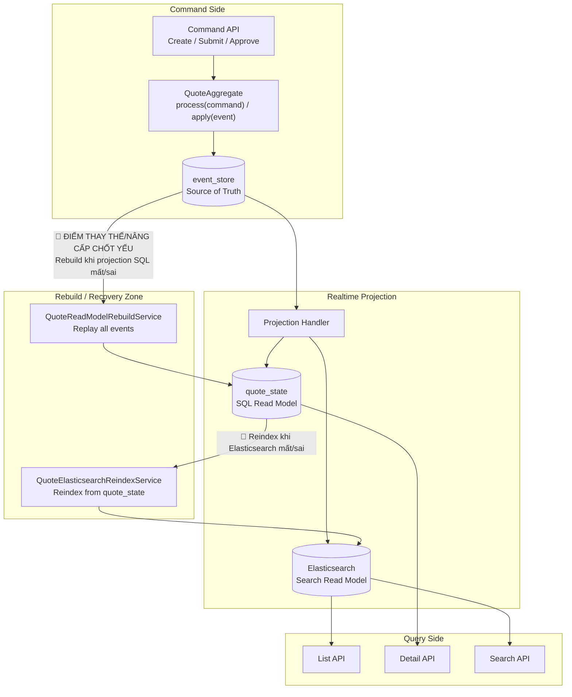

# Tech Note — Ngày 20: Rebuild toàn bộ Read Model

> Chủ đề: **Event Sourcing / CQRS — Rebuild Projection & Elasticsearch Index**  
> Mục tiêu: Khi `quote_state` hoặc Elasticsearch bị mất/sai, có thể rebuild lại từ **source of truth = event_store**.

---

## 1. DASHBOARD TIẾN ĐỘ

| Hạng mục | Trạng thái |
|---|---|
| Event Store | ✅ Đã có `event_store` lưu chuỗi domain events |
| Projection SQL | ✅ Đã có `quote_state` làm read model |
| Elasticsearch | ✅ Đã có `QuoteDocument` + search index |
| Rebuild Read Model | ✅ Đã có service rebuild từ `event_store` |
| Reindex ES | ✅ Đã mô phỏng sync lại ES từ `quote_state` |
| CDC/Kafka thật | ⏳ Chưa có — sẽ học sau |
| Eventuate thật | ⏳ Chưa có — hiện đang dùng mini Event Store |

### [⚡ ĐIỂM DỪNG HIỆN TẠI]

```text
Code đang dừng tại trạng thái:

event_store là source of truth.
quote_state và Elasticsearch chỉ là read model có thể rebuild.

Nếu quote_state bị mất:
  event_store -> replay events -> rebuild quote_state

Nếu Elasticsearch bị mất:
  quote_state -> reindex -> Elasticsearch

Nếu cả quote_state và Elasticsearch bị mất:
  event_store -> rebuild quote_state -> reindex Elasticsearch
```

Trọng tâm ngày hôm nay:

```text
Không còn coi read model là dữ liệu gốc.
Read model là dữ liệu phái sinh.
Sai thì xóa và dựng lại từ event_store.
```

### [🎯 BƯỚC TIẾP THEO]

```text
Ngày 21 — Tổng kết Phase 1:
Ghép lại toàn bộ flow Create / Submit / Approve / Projection / ES / Rebuild,
sau đó chuẩn bị nâng kiến trúc sang hướng giống project thật hơn.
```

---

## 2. MÔ PHỎNG CÂY THƯ MỤC

```text
src/main/java/com/example/quoteservice
├── domain
│   └── quote
│       ├── aggregate
│       │   └── QuoteAggregate.java                 // Aggregate xử lý command + apply event
│       ├── command
│       │   ├── CreateQuoteCommand.java
│       │   ├── SubmitQuoteCommand.java
│       │   └── ApproveQuoteCommand.java
│       └── event
│           ├── QuoteCreatedEvent.java
│           ├── QuoteSubmittedEvent.java
│           └── QuoteApprovedEvent.java
│
├── infrastructure
│   ├── eventstore
│   │   ├── EventStore.java                         // Port đọc/ghi events
│   │   ├── JpaEventStore.java                      // Adapter lưu events vào DB
│   │   ├── EventStoreEntity.java                   // Entity bảng event_store
│   │   └── EventDeserializer.java                  // Deserialize payload -> DomainEvent
│   │
│   └── search
│       ├── QuoteDocument.java                      // ES document
│       └── QuoteSearchRepository.java              // ES repository
│
├── projection
│   └── quote
│       ├── QuoteProjectionHandler.java             // Update quote_state khi có event
│       ├── QuoteStateEntity.java                   // Entity bảng quote_state
│       └── QuoteStateRepository.java               // Repository cho read model SQL
│
├── rebuild
│   └── quote
│       ├── QuoteReadModelRebuildService.java       // [NEW] Rebuild quote_state từ event_store
│       ├── QuoteElasticsearchReindexService.java   // [NEW] Reindex ES từ quote_state
│       └── QuoteRebuildController.java             // [NEW] API debug kích hoạt rebuild/reindex
│
└── query
    └── quote
        ├── QuoteQueryController.java               // API list/detail đọc read model
        └── QuoteQueryService.java                  // Đọc quote_state / ES, không đọc aggregate
```

Ghi nhớ nhanh:

```text
[NEW] Rebuild Service:
  Không tạo nghiệp vụ mới.
  Chỉ tái tạo read model từ event_store.

[REFINED] Projection:
  Projection không còn là logic chỉ chạy realtime.
  Projection phải có khả năng chạy lại từ đầu.
```

---

## 3. SƠ ĐỒ LUỒNG DỮ LIỆU



Điểm chốt:

```text
event_store không bị rebuild từ quote_state.
quote_state được rebuild từ event_store.
Elasticsearch được reindex từ quote_state.
```

---

## 4. CHI TIẾT SỰ DỊCH CHUYỂN LOGIC

File bị tác động mạnh nhất:

```text
QuoteReadModelRebuildService.java
```

### TRƯỚC ĐÓ — Chỉ projection realtime

```java
@Component
public class QuoteProjectionHandler {

    public void handle(QuoteCreatedEvent event) {
        QuoteStateEntity state = new QuoteStateEntity();

        state.setId(event.getQuoteId());
        state.setCustomerName(event.getCustomerName());
        state.setProductCode(event.getProductCode());
        state.setStatus(QuoteStatus.DRAFT);
        state.setLastProjectedVersion(event.getVersion());

        quoteStateRepository.save(state);
    }

    public void handle(QuoteSubmittedEvent event) {
        QuoteStateEntity state = quoteStateRepository.findById(event.getQuoteId())
                .orElseThrow();

        state.setStatus(QuoteStatus.SUBMITTED);
        state.setLastProjectedVersion(event.getVersion());

        quoteStateRepository.save(state);
    }
}
```

Vấn đề:

```text
Projection chỉ chạy khi event mới phát sinh.
Nếu quote_state bị xóa hoặc sai, hệ thống không có cơ chế dựng lại.
```

### BÂY GIỜ — Có rebuild từ event_store

```java
@Service
public class QuoteReadModelRebuildService {

    private final EventStore eventStore;
    private final QuoteProjectionHandler projectionHandler;
    private final QuoteStateRepository quoteStateRepository;

    @Transactional
    public void rebuildAll() {
        quoteStateRepository.deleteAll();

        List<EventStoreRecord> records = eventStore.findAllOrderByVersionAsc();

        for (EventStoreRecord record : records) {
            DomainEvent event = eventDeserializer.deserialize(record);

            projectionHandler.project(
                    event,
                    record.getAggregateVersion()
            );
        }
    }
}
```

Lý do kiến trúc đổi:

```text
Enterprise system không được phụ thuộc vào read model luôn đúng.
Read model là cache/projection phục vụ query.
Khi read model sai, phải có recovery path từ source of truth.
```

---

## 5. QUY LUẬT ĐỌC LẠI 30 GIÂY

Khi mở lại file này, đọc theo thứ tự:

```text
1. Nhìn DASHBOARD TIẾN ĐỘ
   -> biết hôm nay đã hoàn thành phần nào.

2. Nhìn [⚡ ĐIỂM DỪNG HIỆN TẠI]
   -> nhớ code đang dừng ở trạng thái nào.

3. Nhìn sơ đồ Mermaid
   -> khôi phục flow event_store -> quote_state -> Elasticsearch.

4. Nhìn [🔴 ĐIỂM THAY THẾ/NÂNG CẤP CHỐT YẾU]
   -> nhớ lý do có Rebuild/Reindex.

5. Nhìn mục TRƯỚC ĐÓ / BÂY GIỜ
   -> nhớ logic đã dịch chuyển từ realtime-only projection sang rebuildable projection.

6. Nhìn [🎯 BƯỚC TIẾP THEO]
   -> biết ngày mai tiếp tục ở đâu.
```

Câu cần nhớ trong 5 giây:

```text
event_store là sự thật.
quote_state và Elasticsearch là read model.
Read model sai thì rebuild/reindex, không sửa tay.
```

---

## 6. TỪ KHÓA ENTERPRISE CẦN NHỚ

```text
Source of Truth
Projection
Read Model
Replay Events
Rebuild Read Model
Reindex Elasticsearch
Eventual Consistency
Recovery Path
Operational Debugging
CQRS
Event Sourcing
```
