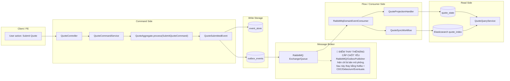

# Tech Note — Ngày 21: Tổng kết 20 ngày Quote Event Sourcing / CQRS

> **Kiểu note:** Kiến trúc động  
> **Mục tiêu đọc lại:** Khôi phục context trong 30 giây  
> **Feature:** Quote  
> **Flow hiện tại:** Command → Aggregate → Event Store → Outbox → RabbitMQ → Projection → Elasticsearch

---

## 1. DASHBOARD TIẾN ĐỘ

### ✅ Trạng thái tổng quan

```text
LEVEL HIỆN TẠI: MINI EVENT SOURCING / CQRS DEMO

ĐÃ LÀM ĐƯỢC:
- Command API cho Quote: Create / Submit / Approve
- QuoteAggregate xử lý business rule theo state
- Domain Event: QuoteCreatedEvent / QuoteSubmittedEvent / QuoteApprovedEvent
- Event Store mini: append event + replay aggregate
- Projection read model: quote_state
- Outbox pattern mini: lưu event cần publish
- RabbitMQ mock/real-ish message flow
- Consumer xử lý event → update Projection
- Elasticsearch Projection/Search
- Rebuild read model từ Event Store

CHƯA GIỐNG PROJECT THẬT:
- Chưa có Eventuate thật
- Chưa có Kafka thật
- Chưa có CDC/Debezium thật
- Chưa split module production-style
- Chưa có optimistic locking chuẩn expectedVersion
- Chưa có retry/DLQ/idempotency production-grade
```

### ⚡ ĐIỂM DỪNG HIỆN TẠI

```text
Code đang dừng ở trạng thái:

POST /quotes/{id}/submit
  -> SubmitQuoteCommand
  -> QuoteAggregate.process(command)
  -> QuoteSubmittedEvent
  -> EventStore append event
  -> Outbox lưu message cần publish
  -> RabbitMQ publish event
  -> Consumer nhận event
  -> Projection update quote_state
  -> Elasticsearch sync/search

Điểm quan trọng:
- Aggregate là nơi quyết định command có hợp lệ không.
- Event Store là source of truth.
- Projection / Elasticsearch chỉ là read model, có thể rebuild.
- Outbox đang là cầu nối giữa DB transaction và message broker.
```

### 🎯 BƯỚC TIẾP THEO

```text
Ngày 22 — Thiết kế AggregateRepository abstraction

Mục tiêu:
- Ẩn logic load events / replay aggregate / process command / append event
- Đưa code gần với style Eventuate hơn
- CommandService không tự xử lý Event Store thủ công nữa

Target tư duy:
quoteAggregateRepository.update(id, command)
  -> load events
  -> replay aggregate
  -> aggregate.process(command)
  -> append new event
  -> save outbox
```

---

## 2. MÔ PHỎNG CÂY THƯ MỤC

```text
src/main/java/com/example/quote/

├── api/
│   └── QuoteController.java
│       // REST entrypoint: Create / Submit / Approve / Detail / Search

├── application/
│   ├── QuoteCommandService.java
│   │   // [REFACTORED] Điều phối command -> aggregate -> event store -> outbox
│   │
│   ├── QuoteQueryService.java
│   │   // Query read model / Elasticsearch, không xử lý command
│   │
│   └── mapper/
│       └── QuoteCommandMapper.java
│           // Convert request DTO -> Command

├── domain/
│   ├── aggregate/
│   │   └── QuoteAggregate.java
│   │       // [CORE] Business rule + state transition bằng event
│   │
│   ├── command/
│   │   ├── CreateQuoteCommand.java
│   │   ├── SubmitQuoteCommand.java
│   │   └── ApproveQuoteCommand.java
│   │       // Input nghiệp vụ vào Aggregate
│   │
│   ├── event/
│   │   ├── DomainEvent.java
│   │   ├── QuoteCreatedEvent.java
│   │   ├── QuoteSubmittedEvent.java
│   │   └── QuoteApprovedEvent.java
│   │       // [NEW] Sự thật nghiệp vụ đã xảy ra
│   │
│   └── model/
│       └── QuoteStatus.java
│           // DRAFT / SUBMITTED / APPROVED

├── infrastructure/
│   ├── eventstore/
│   │   ├── EventStore.java
│   │   │   // Interface append/load event
│   │   ├── JpaEventStore.java
│   │   │   // [NEW] Lưu event xuống PostgreSQL
│   │   ├── EventStoreEntity.java
│   │   │   // Table event_store
│   │   └── EventDeserializer.java
│   │       // Deserialize JSON payload -> DomainEvent
│   │
│   ├── outbox/
│   │   ├── OutboxEventEntity.java
│   │   │   // [NEW] Table outbox_events
│   │   ├── OutboxEventRepository.java
│   │   └── OutboxPublisher.java
│   │       // [NEW] Publish event sang RabbitMQ
│   │
│   ├── messaging/
│   │   ├── RabbitMqConfig.java
│   │   └── RabbitMqDomainEventConsumer.java
│   │       // Consumer nhận event từ RabbitMQ rồi gọi Projection/Workflow
│   │
│   └── elasticsearch/
│       ├── QuoteDocument.java
│       │   // Elasticsearch document cho search
│       └── QuoteSearchRepository.java
│           // Search by status/product/customer
│
├── projection/
│   ├── QuoteStateEntity.java
│   │   // [NEW] Read model table quote_state
│   ├── QuoteProjectionHandler.java
│   │   // Apply DomainEvent vào quote_state
│   └── QuoteProjectionRebuilder.java
│       // [NEW] Rebuild read model từ event_store
│
└── shared/
    ├── exception/
    │   ├── BusinessException.java
    │   └── GlobalExceptionHandler.java
    │       // Chuẩn hóa lỗi business/API
    │
    └── messaging/
        └── DomainEventMessage.java
            // Envelope message gửi qua broker
```

---

## 3. SƠ ĐỒ LUỒNG DỮ LIỆU



---

## 4. CHI TIẾT SỰ DỊCH CHUYỂN LOGIC

### File bị tác động mạnh nhất

```text
QuoteCommandService.java
```

### TRƯỚC ĐÓ — CRUD/state trực tiếp

```java
public Quote submit(String quoteId) {
    Quote quote = quoteRepository.findById(quoteId)
            .orElseThrow(() -> new NotFoundException("Quote not found"));

    if (quote.getStatus() != QuoteStatus.DRAFT) {
        throw new BusinessException("Only DRAFT quote can be submitted");
    }

    quote.setStatus(QuoteStatus.SUBMITTED);

    return quoteRepository.save(quote);
}
```

### BÂY GIỜ — Command → Aggregate → Event → Outbox

```java
public void submit(SubmitQuoteCommand command) {
    QuoteAggregate aggregate = eventStore.load(
            QuoteAggregate.class,
            command.quoteId()
    );

    DomainEvent event = aggregate.process(command);

    eventStore.append(
            command.quoteId(),
            event
    );

    outboxStore.save(
            DomainEventMessage.from(event)
    );
}
```

### Vì sao kiến trúc đổi?

```text
TRƯỚC:
- Service tự check rule
- Service tự đổi state
- DB state là source of truth
- Khó biết lịch sử nghiệp vụ đã xảy ra

BÂY GIỜ:
- Aggregate giữ business rule
- Event là sự thật nghiệp vụ
- Event Store là source of truth
- Projection/Elasticsearch có thể rebuild
- Outbox giúp publish event sau DB transaction an toàn hơn
```

---

## 5. QUY LUẬT ĐỌC LẠI 30 GIÂY

```text
Khi mở lại file này, đọc theo thứ tự:

1. Nhìn DASHBOARD TIẾN ĐỘ
   -> Biết đang ở level mini Event Sourcing/CQRS, chưa phải project thật.

2. Nhìn ⚡ ĐIỂM DỪNG HIỆN TẠI
   -> Biết code đang dừng ở flow Submit Quote qua Event Store + Outbox + RabbitMQ.

3. Nhìn 🎯 BƯỚC TIẾP THEO
   -> Biết ngày mai phải làm AggregateRepository abstraction.

4. Nhìn Mermaid FLOW
   -> Nhớ lại toàn bộ pipeline từ Command đến Read Model.

5. Nhìn 🔴 ĐIỂM THAY THẾ/NÂNG CẤP CHỐT YẾU
   -> Nhớ phần đang mô phỏng: RabbitMQ/OutboxPublisher.
   -> Sau này thay bằng Kafka + CDC/Debezium/Eventuate.

6. Nhìn phần TRƯỚC ĐÓ / BÂY GIỜ
   -> Nhớ sự dịch chuyển lớn nhất:
      Service mutate state trực tiếp
      thành
      Aggregate emit event + Event Store + Outbox.
```

---

## GHI NHỚ KIẾN TRÚC

```text
Command không tạo read model trực tiếp.
Aggregate không gọi RabbitMQ/Elasticsearch.
Event Store là source of truth.
Outbox là bridge giữa DB transaction và broker.
Projection/Elasticsearch là read side, có thể rebuild.
RabbitMQ hiện tại chỉ là bản mô phỏng broker.
```
