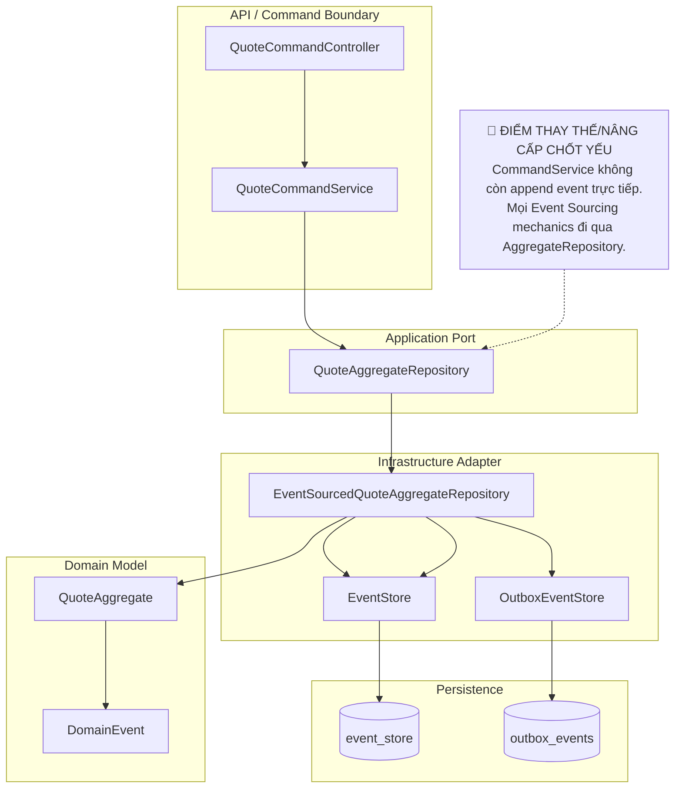

# Tech Note — Ngày 22: AggregateRepository Abstraction

> **Chủ đề:** Tạo lớp `AggregateRepository` abstraction để demo giống Eventuate hơn  
> **Mục tiêu kiến trúc:** Ẩn chi tiết `load events -> replay aggregate -> process command -> append event -> save outbox` phía sau một API giống Enterprise/Eventuate.

---

## 1. DASHBOARD TIẾN ĐỘ

| Hạng mục | Trạng thái |
|---|---|
| Event Sourcing core | ✅ Đã có `event_store` + replay |
| Aggregate business rule | ✅ Đã có `QuoteAggregate.process(...)` |
| Outbox | ✅ Đã có `outbox_events` |
| Projection / Flow | ✅ Đã có consumer/handler mô phỏng |
| Eventuate-like abstraction | 🟡 **Mới bắt đầu ở Ngày 22** |
| Eventuate thật | 🔴 Chưa có |
| Kafka thật | 🔴 Chưa có |
| CDC thật | 🔴 Chưa có |

### ⚡ ĐIỂM DỪNG HIỆN TẠI

Code đang dừng ở bước:

```text
QuoteCommandService
  -> quoteAggregateRepository.create(command)
  -> quoteAggregateRepository.update(quoteId, command)
```

Phần quan trọng đã được **đẩy xuống infrastructure layer**:

```text
EventSourcedQuoteAggregateRepository
  -> load event history
  -> replay QuoteAggregate
  -> aggregate.process(command)
  -> append new event
  -> save outbox event
  -> return AggregateCommandResult
```

Ý nghĩa:

```text
CommandService không còn tự biết EventStore append thế nào.
CommandService chỉ điều phối use case.
AggregateRepository chịu trách nhiệm persistence + event sourcing mechanics.
```

### 🎯 BƯỚC TIẾP THEO

**Ngày 23 — Chuẩn hóa convention `process(command)` / `apply(event)` trong Aggregate**

Mục tiêu ngày mai:

```text
QuoteAggregate
  process(CreateQuoteCommand) -> QuoteCreatedEvent
  process(SubmitQuoteCommand) -> QuoteSubmittedEvent
  process(ApproveQuoteCommand) -> QuoteApprovedEvent

  apply(DomainEvent) -> mutate state
```

---

## 2. MÔ PHỎNG CÂY THƯ MỤC

```text
src/main/java/com/example/quoteservice
├── domain
│   └── quote
│       ├── aggregate
│       │   └── QuoteAggregate.java
│       │       # Aggregate chứa state + business rules
│       ├── command
│       │   ├── CreateQuoteCommand.java
│       │   ├── SubmitQuoteCommand.java
│       │   └── ApproveQuoteCommand.java
│       │       # Command đại diện cho ý định thay đổi state
│       └── event
│           ├── QuoteCreatedEvent.java
│           ├── QuoteSubmittedEvent.java
│           └── QuoteApprovedEvent.java
│               # Domain Event là sự thật đã xảy ra
│
├── command
│   └── quote
│       ├── application
│       │   ├── QuoteCommandService.java
│       │   │   # [REFACTOR] Không append event trực tiếp nữa
│       │   └── repository
│       │       └── QuoteAggregateRepository.java
│       │           # [NEW] Port/abstraction giống Eventuate AggregateRepository
│       │
│       └── infrastructure
│           └── eventsource
│               └── EventSourcedQuoteAggregateRepository.java
│                   # [NEW] Adapter triển khai Event Sourcing mechanics
│
├── shared
│   └── eventsource
│       └── AggregateCommandResult.java
│           # [NEW] Result trả về sau khi command sinh event thành công
│
└── infrastructure
    ├── eventstore
    │   └── EventStore.java
    │       # Lưu event vào event_store
    └── outbox
        └── OutboxEventStore.java
            # Lưu outbox event để publish async
```

---

## 3. SƠ ĐỒ LUỒNG DỮ LIỆU



---

## 4. CHI TIẾT SỰ DỊCH CHUYỂN LOGIC

### TRƯỚC ĐÓ — `QuoteCommandService` biết quá nhiều

```java
public QuoteCommandResponse submit(String quoteId, SubmitQuoteRequest request) {
    List<EventStoreRecord> history = eventStore.findByAggregateId(quoteId);

    QuoteAggregate aggregate = new QuoteAggregate();
    for (EventStoreRecord record : history) {
        DomainEvent oldEvent = eventDeserializer.deserialize(record);
        aggregate.apply(oldEvent);
    }

    SubmitQuoteCommand command = new SubmitQuoteCommand(quoteId, request.userId());

    DomainEvent newEvent = aggregate.process(command);

    eventStore.append("Quote", quoteId, newEvent);

    outboxEventStore.save(newEvent);

    return QuoteCommandResponse.from(newEvent);
}
```

**Vấn đề:**

```text
QuoteCommandService đang làm cả use case + replay + append + outbox.
Code khó giống Eventuate.
Nếu Create/Submit/Approve đều làm vậy thì bị lặp logic.
```

---

### BÂY GIỜ — `QuoteCommandService` gọi AggregateRepository

```java
public QuoteCommandResponse submit(String quoteId, SubmitQuoteRequest request) {
    SubmitQuoteCommand command = new SubmitQuoteCommand(
            quoteId,
            request.userId()
    );

    AggregateCommandResult<QuoteAggregate> result =
            quoteAggregateRepository.update(quoteId, command);

    return QuoteCommandResponse.from(result);
}
```

Logic Event Sourcing được gom vào adapter:

```java
public AggregateCommandResult<QuoteAggregate> update(
        String aggregateId,
        Object command
) {
    List<EventStoreRecord> history =
            eventStore.findByAggregateId(aggregateId);

    QuoteAggregate aggregate = replay(history);

    DomainEvent newEvent = aggregate.process(command);

    EventStoreRecord savedRecord =
            eventStore.append("Quote", aggregateId, newEvent);

    outboxEventStore.save(savedRecord);

    aggregate.apply(newEvent);

    return AggregateCommandResult.of(
            aggregateId,
            aggregate,
            List.of(newEvent)
    );
}
```

**Lý do đổi kiến trúc:**

```text
1. Tách Application Service khỏi Event Sourcing mechanics.
2. Tạo port giống Eventuate AggregateRepository.
3. Chuẩn hóa Create/Update flow cho mọi command.
4. Chuẩn bị cho expectedVersion, optimistic locking, Eventuate thật.
5. Giảm duplicate logic giữa create/submit/approve.
```

---

## 5. QUY LUẬT ĐỌC LẠI 30 GIÂY

Khi mở lại note này, đọc theo thứ tự:

```text
Bước 1 — Nhìn DASHBOARD
  -> Biết hôm nay đang ở mức Eventuate-like, chưa Eventuate thật.

Bước 2 — Nhìn [⚡ ĐIỂM DỪNG HIỆN TẠI]
  -> Nhớ code đang dừng tại quoteAggregateRepository.create/update.

Bước 3 — Nhìn Mermaid Flow
  -> Tập trung vào điểm đỏ:
     CommandService không append event trực tiếp nữa.

Bước 4 — Nhìn cây thư mục
  -> Nhớ 3 file chính:
     QuoteAggregateRepository.java
     EventSourcedQuoteAggregateRepository.java
     AggregateCommandResult.java

Bước 5 — Nhìn TRƯỚC ĐÓ / BÂY GIỜ
  -> Nhớ sự dịch chuyển:
     logic replay/append/outbox rời khỏi QuoteCommandService.
```

### Câu chốt cần nhớ

```text
Ngày 22 không thêm business rule mới.
Ngày 22 là ngày đổi kiến trúc:
CommandService mỏng hơn,
AggregateRepository trở thành cửa ngõ Event Sourcing giống Eventuate.
```
