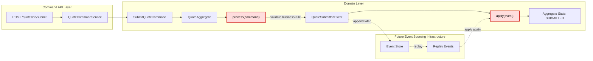

# Tech Note — Ngày 23: QuoteAggregate theo convention `process(command)` / `apply(event)`

> **Chủ đề:** Event Sourcing / CQRS nâng cao  
> **Vai trò kiến trúc:** đưa `QuoteAggregate` tiến gần style Eventuate thực tế  
> **Trạng thái:** Hoàn thành refactor cấp Aggregate convention

---

## 1. DASHBOARD TIẾN ĐỘ

### ✅ Trạng thái tổng quan

| Hạng mục | Trạng thái |
|---|---|
| Aggregate xử lý command | ✅ Đã đổi sang `process(command)` |
| Aggregate thay đổi state | ✅ Đã đổi sang `apply(event)` |
| Domain Event | ✅ Giữ vai trò là “sự thật đã xảy ra” |
| Event replay | ✅ Dùng lại `apply(event)` để rebuild state |
| Kiến trúc Eventuate-like | ✅ Tiến gần hơn |
| Persistence/EventStore thật | ⏭️ Chưa nâng cấp trong ngày này |

---

### ⚡ ĐIỂM DỪNG HIỆN TẠI

Code đang dừng tại tầng **Domain Aggregate**:

```txt
Command API / Service
  -> QuoteAggregate.process(command)
      -> validate business rule
      -> sinh DomainEvent
  -> QuoteAggregate.apply(event)
      -> mutate in-memory state
```

File trọng tâm hôm nay:

```txt
QuoteAggregate.java
```

Nội dung đã refactor:

```txt
process(CreateQuoteCommand)   -> QuoteCreatedEvent
process(SubmitQuoteCommand)   -> QuoteSubmittedEvent
process(ApproveQuoteCommand)  -> QuoteApprovedEvent

apply(QuoteCreatedEvent)      -> status = DRAFT
apply(QuoteSubmittedEvent)    -> status = SUBMITTED
apply(QuoteApprovedEvent)     -> status = APPROVED
```

---

### 🎯 BƯỚC TIẾP THEO

**Ngày 24 — Thêm `expectedVersion` / Optimistic Locking**

Mục tiêu ngày mai:

```txt
Khi append event mới:
  kiểm tra version hiện tại của aggregate
  nếu version không khớp expectedVersion
  -> throw ConcurrencyException
```

Lý do:

```txt
Bảo vệ Aggregate trước tình huống 2 request cùng update 1 Quote tại cùng thời điểm.
```

---

## 2. MÔ PHỎNG CÂY THƯ MỤC

```txt
src/main/java/com/example/quoteservice/

├── domain/
│   └── quote/
│       ├── aggregate/
│       │   └── QuoteAggregate.java              // [REFACTORED] trung tâm ngày 23: process(command) / apply(event)
│       │
│       ├── command/
│       │   ├── CreateQuoteCommand.java          // command yêu cầu tạo Quote
│       │   ├── SubmitQuoteCommand.java          // command yêu cầu submit Quote
│       │   └── ApproveQuoteCommand.java         // command yêu cầu approve Quote
│       │
│       ├── event/
│       │   ├── DomainEvent.java                 // marker/base interface cho domain event
│       │   ├── QuoteCreatedEvent.java           // event: Quote đã được tạo
│       │   ├── QuoteSubmittedEvent.java         // event: Quote đã được submit
│       │   └── QuoteApprovedEvent.java          // event: Quote đã được approve
│       │
│       └── model/
│           └── QuoteStatus.java                 // enum trạng thái: DRAFT / SUBMITTED / APPROVED
│
└── command/
    └── quote/
        └── application/
            └── QuoteCommandService.java         // gọi aggregate, nhận event, chuyển sang tầng lưu event ở bài sau
```

Ghi chú nhanh:

```txt
[REFACTORED] QuoteAggregate.java
  Trước: method nghiệp vụ có thể vừa validate, vừa đổi state trực tiếp.
  Bây giờ: process(command) sinh event, apply(event) mới đổi state.
```

---

## 3. SƠ ĐỒ LUỒNG DỮ LIỆU — FLOW



### 🔴 ĐIỂM THAY THẾ/NÂNG CẤP CHỐT YẾU

```txt
TRƯỚC:
  Command làm Aggregate đổi state trực tiếp.

BÂY GIỜ:
  Command -> process(command) -> Event -> apply(event) -> State
```

Điểm nâng cấp:

```txt
State không còn là kết quả trực tiếp của command.
State là kết quả của event đã được apply.
```

---

## 4. CHI TIẾT SỰ DỊCH CHUYỂN LOGIC

File bị tác động mạnh nhất:

```txt
QuoteAggregate.java
```

---

### TRƯỚC ĐÓ — Aggregate đổi state trực tiếp theo command

```java
public class QuoteAggregate {

    private String id;
    private QuoteStatus status;

    public void submit(String submittedBy) {
        if (this.status != QuoteStatus.DRAFT) {
            throw new BusinessException("Only DRAFT quote can be submitted");
        }

        // Logic cũ: command làm state đổi trực tiếp
        this.status = QuoteStatus.SUBMITTED;
        this.submittedBy = submittedBy;
        this.submittedAt = LocalDateTime.now();
    }
}
```

Vấn đề kiến trúc:

```txt
Command đang làm 2 việc:
  1. kiểm tra business rule
  2. mutate state trực tiếp

Không tách rõ:
  - ý định muốn làm gì
  - sự kiện đã xảy ra
  - cách state được rebuild từ event
```

---

### BÂY GIỜ — `process(command)` sinh event, `apply(event)` đổi state

```java
public class QuoteAggregate {

    private String id;
    private QuoteStatus status;
    private String submittedBy;
    private LocalDateTime submittedAt;

    public QuoteSubmittedEvent process(SubmitQuoteCommand command) {
        if (this.status != QuoteStatus.DRAFT) {
            throw new BusinessException("Only DRAFT quote can be submitted");
        }

        return new QuoteSubmittedEvent(
                command.quoteId(),
                command.submittedBy(),
                command.submittedAt()
        );
    }

    public void apply(QuoteSubmittedEvent event) {
        this.id = event.quoteId();
        this.status = QuoteStatus.SUBMITTED;
        this.submittedBy = event.submittedBy();
        this.submittedAt = event.submittedAt();
    }
}
```

---

### Vì sao kiến trúc đổi như vậy?

```txt
process(command):
  đại diện cho quyết định nghiệp vụ.
  Có quyền validate business rule.
  Output là DomainEvent.

apply(event):
  đại diện cho việc cập nhật state từ sự thật đã xảy ra.
  Không nên chứa business rule.
  Được dùng cả khi xử lý command mới và khi replay event history.
```

Enterprise rule:

```txt
Command có thể bị reject.
Event đã xảy ra thì chỉ được apply.
```

---

## 5. QUY LUẬT ĐỌC LẠI 30 GIÂY

Khi mở lại note này, đọc theo thứ tự:

### Bước 1 — Nhìn Dashboard trước

```txt
Mục cần nhìn:
  ⚡ ĐIỂM DỪNG HIỆN TẠI
  🎯 BƯỚC TIẾP THEO
```

Mục tiêu:

```txt
Biết hôm nay code đang dừng ở tầng Aggregate convention.
Biết ngày mai chuyển sang expectedVersion / optimistic locking.
```

---

### Bước 2 — Nhìn Flow Mermaid

Tập trung vào chuỗi:

```txt
Command -> process(command) -> Event -> apply(event) -> State
```

Đây là xương sống ngày 23.

---

### Bước 3 — Nhìn phần TRƯỚC ĐÓ / BÂY GIỜ

Chỉ cần nhớ:

```txt
Trước:
  command đổi state trực tiếp

Bây giờ:
  command sinh event
  event đổi state
```

---

### Bước 4 — Nhìn cây thư mục cuối cùng

Tập trung vào:

```txt
QuoteAggregate.java
DomainEvent.java
QuoteCreatedEvent.java
QuoteSubmittedEvent.java
QuoteApprovedEvent.java
```

Nếu quên bối cảnh, mở ngay:

```txt
QuoteAggregate.java
```

và tìm 2 cụm method:

```txt
process(...)
apply(...)
```

---

## 6. GHI NHỚ KIẾN TRÚC

```txt
Ngày 23 không phải là ngày thêm nhiều file.
Ngày 23 là ngày đổi convention lõi của Aggregate.
```

Câu cần nhớ:

```txt
Trong Event Sourcing, Aggregate không lưu state bằng cách command mutate trực tiếp.
Aggregate quyết định bằng process(command), sinh event, rồi apply(event) để tạo state.
```
