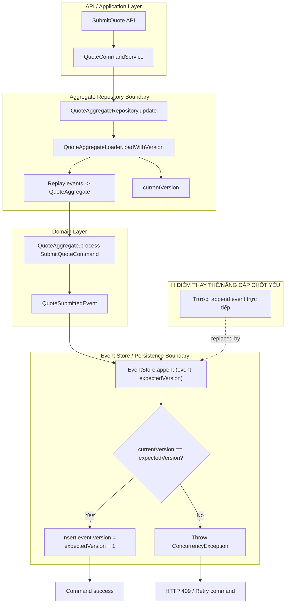

# Tech Note — Ngày 24: expectedVersion / Optimistic Locking

> **Chủ đề:** Event Sourcing / CQRS — chống concurrent command ghi sai version  
> **Trạng thái:** Đã nâng cấp `AggregateRepository.update()` từ “append event đơn giản” sang “append event có kiểm tra version”.

---

## 1. DASHBOARD TIẾN ĐỘ

| Hạng mục | Trạng thái |
|---|---|
| Layer đang học | Command Side / Event Store |
| Pattern chính | Event Sourcing + Optimistic Locking |
| Mục tiêu ngày 24 | Chặn 2 command cùng ghi lên cùng aggregate version |
| Kết quả | `EventStore.append(..., expectedVersion)` kiểm tra version trước khi insert event |
| Mức độ gần Enterprise | Cao hơn: có concurrency guard ở Event Store boundary |

### ⚡ ĐIỂM DỪNG HIỆN TẠI

```text
Code đang dừng ở tầng EventStore append.

Flow hiện tại:
CommandService
  -> QuoteAggregateRepository.update(id, command)
  -> QuoteAggregateLoader.loadWithVersion(id)
  -> Aggregate.process(command)
  -> EventStore.append(event, expectedVersion)
  -> nếu currentVersion != expectedVersion => throw ConcurrencyException
```

**Điểm chốt:**  
`expectedVersion` được lấy từ version mới nhất khi load aggregate. Khi append event, DB/EventStore phải xác nhận aggregate vẫn đang ở đúng version đó.

### 🎯 BƯỚC TIẾP THEO

```text
Ngày 25 — Chuẩn hóa CommandResult / EventAppendResult

Mục tiêu:
- Trả về oldVersion / newVersion rõ ràng sau mỗi command
- Gói kết quả append event thành object có metadata
- Làm nền cho log/debug/event timeline sau này
```

---

## 2. MÔ PHỎNG CÂY THƯ MỤC

```text
src/main/java/com/example/quoteservice/

├── shared/
│   ├── exception/
│   │   └── ConcurrencyException.java              // [NEW] Lỗi khi expectedVersion != currentVersion
│   │
│   └── eventsource/
│       └── LoadedAggregate.java                   // [NEW] Gói aggregate + currentVersion sau khi replay
│
├── domain/
│   └── quote/
│       └── aggregate/
│           └── QuoteAggregate.java                // [UNCHANGED] process/apply command-event như cũ
│
├── command/
│   └── quote/
│       ├── application/
│       │   └── repository/
│       │       └── QuoteAggregateRepository.java  // [REFACTOR] update/create dùng version-aware append
│       │
│       └── infrastructure/
│           ├── eventsource/
│           │   ├── QuoteAggregateLoader.java      // [REFACTOR] loadWithVersion(id)
│           │   └── EventSourcedQuoteAggregateRepository.java
│           │                                      // [REFACTOR] load -> process -> append(expectedVersion)
│           │
│           └── eventstore/
│               ├── EventStore.java               // [REFACTOR] append(..., expectedVersion)
│               ├── JpaEventStore.java            // [REFACTOR] kiểm tra currentVersion trước insert
│               └── EventStoreEntity.java         // [UNCHANGED/OPTIONAL] version vẫn là cột quan trọng
│
└── resources/
    └── db/migration/
        └── V1__create_event_store.sql            // [IMPORTANT] unique(aggregate_id, version)
```

---

## 3. SƠ ĐỒ LUỒNG DỮ LIỆU



---

## 4. CHI TIẾT SỰ DỊCH CHUYỂN LOGIC

### File bị tác động mạnh nhất

```text
JpaEventStore.java
```

### TRƯỚC ĐÓ — Append event chưa chống concurrent write

```java
public EventStoreEntity append(String aggregateType, DomainEvent event) {
    long nextVersion = eventStoreRepository
            .findMaxVersionByAggregateId(event.aggregateId())
            .orElse(0L) + 1;

    EventStoreEntity entity = new EventStoreEntity(
            event.eventId(),
            event.aggregateId(),
            aggregateType,
            event.getClass().getName(),
            serialize(event),
            nextVersion
    );

    return eventStoreRepository.save(entity);
}
```

**Vấn đề:**  
2 command cùng đọc version `1`, cả hai đều tính `nextVersion = 2`. Nếu không có guard, có thể ghi sai thứ tự hoặc phát sinh lỗi DB khó kiểm soát.

---

### BÂY GIỜ — Append event có expectedVersion

```java
public EventStoreEntity append(
        String aggregateType,
        DomainEvent event,
        long expectedVersion
) {
    long currentVersion = eventStoreRepository
            .findMaxVersionByAggregateId(event.aggregateId())
            .orElse(0L);

    if (currentVersion != expectedVersion) {
        throw new ConcurrencyException(
                "Aggregate version conflict. aggregateId="
                        + event.aggregateId()
                        + ", expectedVersion=" + expectedVersion
                        + ", currentVersion=" + currentVersion
        );
    }

    long newVersion = expectedVersion + 1;

    EventStoreEntity entity = new EventStoreEntity(
            event.eventId(),
            event.aggregateId(),
            aggregateType,
            event.getClass().getName(),
            serialize(event),
            newVersion
    );

    return eventStoreRepository.save(entity);
}
```

**Lý do kiến trúc đổi:**  

```text
Trước:
  EventStore chỉ là nơi lưu event.

Bây giờ:
  EventStore là concurrency boundary.
  Nó chịu trách nhiệm đảm bảo event mới chỉ được append nếu aggregate chưa bị command khác thay đổi.
```

### Ý nghĩa Enterprise

| Thành phần | Vai trò mới |
|---|---|
| `expectedVersion` | Version mà command tin rằng aggregate đang có |
| `currentVersion` | Version thật trong Event Store tại thời điểm append |
| `ConcurrencyException` | Báo conflict, thường map HTTP 409 |
| `unique(aggregate_id, version)` | Hàng rào DB cuối cùng chống duplicate version |
| `AggregateRepository` | Không còn chỉ save event; nó điều phối load-version-process-append |

---

## 5. QUY LUẬT ĐỌC LẠI 30 GIÂY

Khi mở lại file này, đọc theo thứ tự:

```text
1. Nhìn DASHBOARD
   -> biết hôm nay học tầng nào, trạng thái đang dừng ở đâu.

2. Nhìn [⚡ ĐIỂM DỪNG HIỆN TẠI]
   -> nhớ flow code: loadWithVersion -> process -> append(expectedVersion).

3. Nhìn Mermaid sơ đồ
   -> tìm ngay node đỏ:
      🔴 EventStore.append(event, expectedVersion)

4. Nhìn cây thư mục
   -> mở đúng 4 file:
      ConcurrencyException.java
      LoadedAggregate.java
      QuoteAggregateLoader.java
      JpaEventStore.java

5. Nhìn phần TRƯỚC ĐÓ / BÂY GIỜ
   -> nhớ chính xác logic đã dịch chuyển:
      append trực tiếp
      -> append có kiểm tra expectedVersion

6. Nhìn [🎯 BƯỚC TIẾP THEO]
   -> tiếp tục Ngày 25: CommandResult / EventAppendResult.
```

---

## TÓM TẮT 1 DÒNG

```text
Ngày 24 biến EventStore từ “nơi lưu event” thành “concurrency boundary” bằng expectedVersion + optimistic locking.
```
