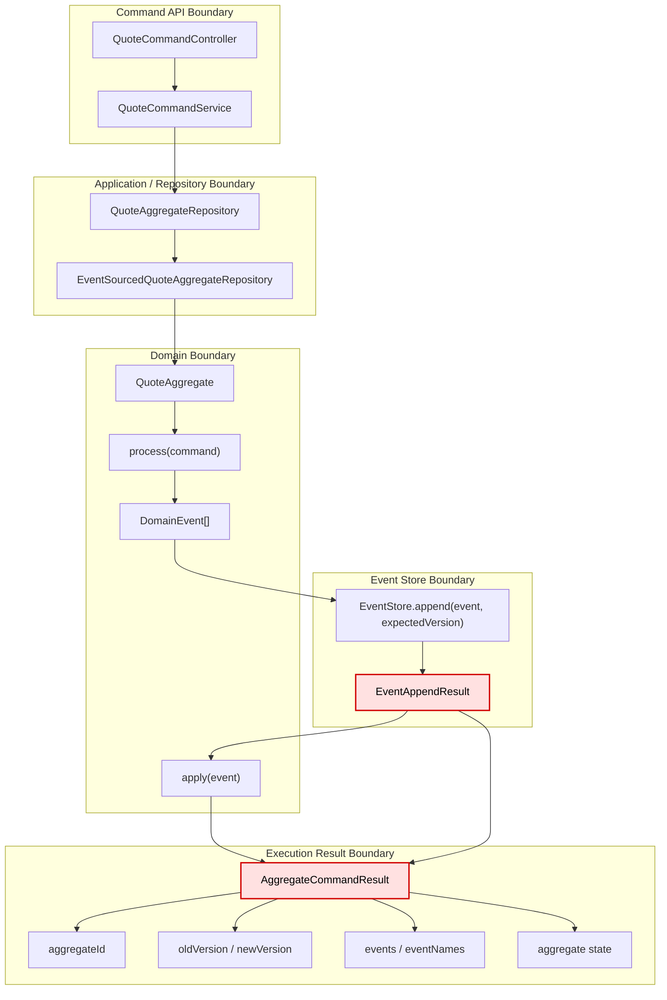

# Tech Note — Ngày 25: Chuẩn hóa `CommandResult` / `EventAppendResult`

> **Chủ đề:** Event Sourcing / CQRS — chuẩn hóa output sau khi command chạy xong.  
> **Mục tiêu:** Nhìn lại trong 30 giây là biết command đã tạo event gì, version thay đổi ra sao, aggregate state hiện tại thế nào.

---

## 1. DASHBOARD TIẾN ĐỘ

### Trạng thái tổng quan

| Hạng mục | Trạng thái |
|---|---|
| Aggregate command flow | ✅ Đã có |
| `process(command)` / `apply(event)` | ✅ Đã có từ ngày trước |
| Optimistic locking `expectedVersion` | ✅ Đã có |
| Event append result rõ ràng | ✅ **Mới chuẩn hóa hôm nay** |
| Command output đủ metadata | ✅ **Mới chuẩn hóa hôm nay** |
| Query / Flow service split | ⏭️ Chưa làm — ngày sau |
| Kafka / CDC / Eventuate thật | ⏭️ Chưa làm — giai đoạn sau |

---

### ⚡ ĐIỂM DỪNG HIỆN TẠI

Code hiện đang dừng ở trạng thái:

```txt
QuoteCommandService
  -> gọi QuoteAggregateRepository.create/update(...)
  -> nhận AggregateCommandResult<QuoteAggregate>
  -> result chứa:
       aggregateId
       oldVersion
       newVersion
       aggregate state hiện tại
       list domain events
       list EventAppendResult
       list eventNames
```

Điểm chốt hôm nay:

```txt
Command không còn chỉ trả về "thành công/thất bại".
Command trả về một execution summary đủ để trace version + events + aggregate state.
```

---

### 🎯 BƯỚC TIẾP THEO

**Ngày 26 — Split modules / package boundary**

Mục tiêu ngày mai:

```txt
Tách rõ boundary:
  command-service
  flow-service
  query-service
  data-domain
  shared
```

Trọng tâm:

```txt
Không để Command API, Projection, Query API, EventStore, Workflow nằm lẫn lộn.
```

---

## 2. MÔ PHỎNG CÂY THƯ MỤC

```txt
src/main/java/com/example/quoteservice
├── shared
│   └── eventsource
│       ├── AggregateCommandResult.java        // [NEW/REFACTOR] Output tổng hợp sau khi command chạy xong
│       └── EventAppendResult.java             // [NEW] Kết quả append từng event: oldVersion/newVersion/event
│
├── domain
│   └── quote
│       ├── aggregate
│       │   └── QuoteAggregate.java            // Aggregate xử lý command, apply event, giữ state
│       ├── command
│       │   ├── CreateQuoteCommand.java
│       │   ├── SubmitQuoteCommand.java
│       │   └── ApproveQuoteCommand.java
│       └── event
│           ├── QuoteCreatedEvent.java
│           ├── QuoteSubmittedEvent.java
│           └── QuoteApprovedEvent.java
│
├── command
│   └── quote
│       ├── application
│       │   ├── QuoteCommandService.java       // [REFACTOR] Nhận AggregateCommandResult, log version/events
│       │   └── repository
│       │       └── QuoteAggregateRepository.java // Contract create/update trả về AggregateCommandResult
│       │
│       └── infrastructure
│           └── eventsource
│               └── EventSourcedQuoteAggregateRepository.java
│                   // [REFACTOR MẠNH] Load -> process -> append -> apply -> trả result rõ ràng
│
└── infrastructure
    └── eventstore
        ├── EventStore.java                    // Append event với expectedVersion
        └── JpaEventStore.java                 // Trả EventAppendResult sau khi persist event
```

---

## 3. SƠ ĐỒ LUỒNG DỮ LIỆU — FLOW



**🔴 ĐIỂM THAY THẾ/NÂNG CẤP CHỐT YẾU**

```txt
Trước:
  Repository chỉ trả aggregate/events ở mức thô.

Bây giờ:
  Repository trả AggregateCommandResult chuẩn hóa,
  bên trong có EventAppendResult cho từng event append.
```

Ý nghĩa Enterprise:

```txt
Command execution trở thành traceable unit:
  biết command sinh event nào
  biết version trước/sau
  biết aggregate state sau khi apply
  biết event store record tương ứng
```

---

## 4. CHI TIẾT SỰ DỊCH CHUYỂN LOGIC

### File tác động mạnh nhất

```txt
EventSourcedQuoteAggregateRepository.java
```

---

### TRƯỚC ĐÓ

```java
public QuoteAggregate update(String aggregateId, QuoteCommand command) {
    QuoteAggregate aggregate = aggregateLoader.load(aggregateId);

    DomainEvent event = aggregate.process(command);

    eventStore.append(
        "Quote",
        aggregateId,
        event
    );

    aggregate.apply(event);

    return aggregate;
}
```

Vấn đề:

```txt
Không thấy rõ oldVersion.
Không thấy rõ newVersion.
Không biết append event nào thành công.
Không có output chuẩn cho logging/debug.
CommandService khó trace command execution.
```

---

### BÂY GIỜ

```java
public AggregateCommandResult<QuoteAggregate> update(
        String aggregateId,
        QuoteCommand command
) {
    LoadedAggregate<QuoteAggregate> loaded =
            aggregateLoader.loadWithVersion(aggregateId);

    QuoteAggregate aggregate = loaded.getAggregate();
    long oldVersion = loaded.getVersion();

    List<DomainEvent> events = aggregate.process(command);

    List<EventAppendResult> appendResults = new ArrayList<>();

    long expectedVersion = oldVersion;

    for (DomainEvent event : events) {
        EventAppendResult appendResult = eventStore.append(
                "Quote",
                aggregateId,
                event,
                expectedVersion
        );

        appendResults.add(appendResult);

        aggregate.apply(event);

        expectedVersion = appendResult.getNewVersion();
    }

    return new AggregateCommandResult<>(
            aggregateId,
            oldVersion,
            expectedVersion,
            aggregate,
            events,
            appendResults
    );
}
```

Điểm đổi chính:

```txt
expectedVersion không còn là chi tiết mơ hồ.
Mỗi event append có kết quả riêng.
Command result gom toàn bộ execution context.
```

---

### Vì sao kiến trúc đổi như vậy?

```txt
1. Command execution cần observable.
2. Event Sourcing cần version rõ ràng để debug concurrency.
3. Một command có thể sinh nhiều events.
4. Service layer không nên tự suy đoán version mới.
5. Output chuẩn giúp logging, testing, API response, debug endpoint dễ hơn.
```

---

## 5. QUY LUẬT ĐỌC LẠI 30 GIÂY

Khi mở lại file này, đọc theo thứ tự:

```txt
1. Nhìn DASHBOARD trước
   -> biết hôm nay học cái gì, đã xong gì, còn thiếu gì.

2. Nhìn [⚡ ĐIỂM DỪNG HIỆN TẠI]
   -> khôi phục ngay code đang dừng ở trạng thái nào.

3. Nhìn FLOW Mermaid
   -> nhớ luồng Command -> Aggregate -> EventStore -> Result.

4. Nhìn [🔴 ĐIỂM THAY THẾ/NÂNG CẤP CHỐT YẾU]
   -> hiểu hôm nay refactor chỗ nào.

5. Nhìn code TRƯỚC ĐÓ / BÂY GIỜ
   -> nhớ chính xác logic đã dịch chuyển ra sao.

6. Nhìn [🎯 BƯỚC TIẾP THEO]
   -> biết ngày mai bắt đầu từ đâu.
```

---

## 6. TÓM TẮT 1 DÒNG

```txt
Ngày 25 biến command execution từ “chạy xong trả aggregate” thành “execution result có version, events, append results và aggregate state rõ ràng”.
```
