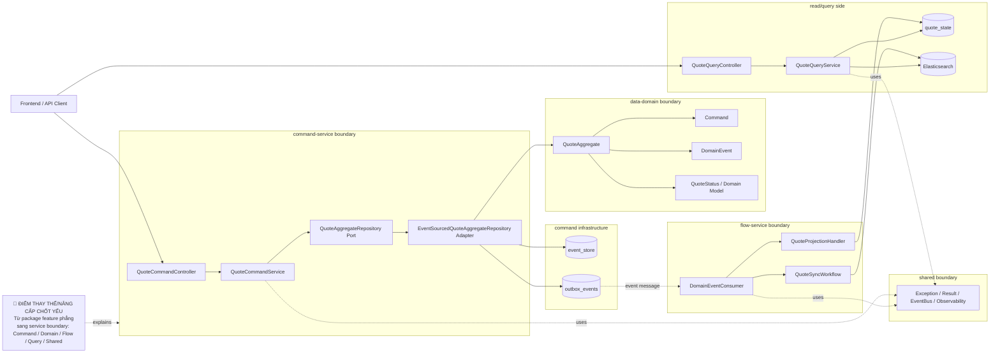

# Tech Note — Ngày 26: Tách Package / Module Boundary

> Chủ đề: Refactor demo Quote theo ranh giới Enterprise: `command-service`, `flow-service`, `query-service`, `data-domain`, `shared`.

---

## 1. DASHBOARD TIẾN ĐỘ

### Trạng thái tổng quan

```txt
Status: ✅ Hoàn thành refactor boundary mức package
Scope : Quote demo vẫn là 1 codebase / 1 Spring Boot app
Level : Logical modularization, chưa phải physical multi-module Gradle / multi-service deploy
Goal  : Làm code demo giống workspace thật hơn trước khi đọc project core-insurance
```

### ⚡ ĐIỂM DỪNG HIỆN TẠI

```txt
Code đang dừng tại trạng thái:

Command side:
  QuoteCommandService không còn nên chứa quá nhiều chi tiết infra.
  Command package đại diện cho command-service boundary.

Domain side:
  QuoteAggregate, Command, Event, Model được gom về domain/quote.
  Domain không phụ thuộc Controller / JPA / Kafka / Workflow.

Flow side:
  Consumer, Projection, Workflow được đặt về flow/quote.
  Flow chỉ phản ứng với DomainEvent đã xảy ra.

Query side:
  Query boundary đã được chuẩn bị.
  Ngày sau sẽ tách rõ Command API và Query API.

Shared:
  Exception, event bus abstraction, common result, security/observability dùng chung.
```

### 🎯 BƯỚC TIẾP THEO

```txt
Ngày 27 — Tách Command API vs Query API

Mục tiêu:
  POST /api/quotes, /submit, /approve  -> Command API
  GET  /api/quotes, /{id}              -> Query API

Tư duy:
  Command trả command result tối thiểu.
  Query đọc read model / Elasticsearch.
  Không dùng Command API để trả full Detail từ read model.
```

---

## 2. MÔ PHỎNG CÂY THƯ MỤC

```txt
src/main/java/com/example/quoteservice
├── shared/                                      # [NEW/REFACTORED] Cross-cutting layer dùng chung
│   ├── exception/                               # BusinessException, NotFoundException, GlobalExceptionHandler
│   ├── eventsource/                             # AggregateCommandResult, EventAppendResult
│   ├── eventbus/                                # DomainEventHandler, DomainEventEnvelope
│   ├── messaging/                               # DomainEventMessage, dedup/processed message
│   └── observability/                           # correlationId, MDC constants
│
├── domain/quote/                                # [NEW BOUNDARY] data-domain / domain model thuần
│   ├── aggregate/
│   │   └── QuoteAggregate.java                  # Aggregate xử lý process(command) / apply(event)
│   ├── command/
│   │   ├── CreateQuoteCommand.java              # Domain command
│   │   ├── SubmitQuoteCommand.java              # Domain command
│   │   └── ApproveQuoteCommand.java             # Domain command
│   ├── event/
│   │   ├── QuoteCreatedEvent.java               # Domain event
│   │   ├── QuoteSubmittedEvent.java             # Domain event
│   │   └── QuoteApprovedEvent.java              # Domain event
│   └── model/
│       └── QuoteStatus.java                     # Enum trạng thái nghiệp vụ
│
├── command/quote/                               # [NEW BOUNDARY] command-service logical boundary
│   ├── api/
│   │   └── QuoteCommandController.java          # REST command endpoints: create/submit/approve
│   ├── application/
│   │   └── QuoteCommandService.java             # Use case orchestration cho command side
│   ├── application/repository/
│   │   └── QuoteAggregateRepository.java        # Port/interface che giấu event sourcing infra
│   └── infrastructure/
│       ├── eventsource/
│       │   └── EventSourcedQuoteAggregateRepository.java # Adapter load/replay/process/append/outbox
│       ├── eventstore/
│       │   └── JpaEventStore.java               # Ghi event_store
│       └── outbox/
│           ├── OutboxEventEntity.java           # Outbox record
│           └── OutboxEventStore.java            # Ghi outbox_events cùng transaction
│
├── flow/quote/                                  # [NEW BOUNDARY] flow-service logical boundary
│   ├── consumer/
│   │   └── DomainEventConsumer.java             # Nhận event từ broker / internal publisher
│   ├── projection/
│   │   └── QuoteProjectionHandler.java          # Update quote_state read model
│   └── workflow/
│       └── QuoteSyncWorkflow.java               # Orchestrate sync ES / notification / side effects
│
└── query/quote/                                 # [PREPARED BOUNDARY] query-service logical boundary
    ├── api/
    │   └── QuoteQueryController.java            # [NEXT DAY] GET list/detail
    ├── application/
    │   └── QuoteQueryService.java               # [NEXT DAY] Read model / ES query use case
    └── dto/
        ├── QuoteListItemResponse.java           # [NEXT DAY] DTO cho list
        └── QuoteDetailResponse.java             # [NEXT DAY] DTO cho detail
```

Mapping sang workspace thật:

```txt
shared/        -> core-shared
command/quote/ -> 1-core-command-service
domain/quote/  -> 4-core-data-domain
flow/quote/    -> 2-core-flow-service
query/quote/   -> 3-core-query-service
```

---

## 3. SƠ ĐỒ LUỒNG DỮ LIỆU



---

## 4. CHI TIẾT SỰ DỊCH CHUYỂN LOGIC

File bị tác động mạnh nhất về kiến trúc: `QuoteCommandService.java`.

### TRƯỚC ĐÓ — Service dễ bị phình, biết quá nhiều infra

```java
package com.example.quoteservice.quote;

@Service
public class QuoteCommandService {

    private final QuoteAggregateLoader aggregateLoader;
    private final JpaEventStore eventStore;
    private final OutboxEventStore outboxEventStore;

    public CommandResult submit(SubmitQuoteCommand command) {
        QuoteAggregate aggregate = aggregateLoader.load(command.quoteId());

        DomainEvent event = aggregate.process(command);

        EventStoreRecord record = eventStore.append(
            "Quote",
            command.quoteId(),
            event
        );

        outboxEventStore.save(record);

        return CommandResult.from(record);
    }
}
```

Vấn đề:

```txt
QuoteCommandService biết quá nhiều:
  load aggregate
  replay event
  append event_store
  save outbox
  versioning infra

=> Use case bị lẫn infrastructure.
```

### BÂY GIỜ — Service gọi qua boundary/port

```java
package com.example.quoteservice.command.quote.application;

@Service
public class QuoteCommandService {

    private final QuoteAggregateRepository quoteAggregateRepository;

    public CommandResult submit(SubmitQuoteCommand command) {
        AggregateCommandResult<QuoteAggregate> result =
            quoteAggregateRepository.update(
                command.quoteId(),
                command
            );

        return CommandResult.from(result);
    }
}
```

Logic thật được đẩy xuống adapter:

```java
package com.example.quoteservice.command.quote.infrastructure.eventsource;

@Component
public class EventSourcedQuoteAggregateRepository implements QuoteAggregateRepository {

    public AggregateCommandResult<QuoteAggregate> update(
        String aggregateId,
        QuoteCommand command
    ) {
        // load events
        // replay aggregate
        // process command
        // append event_store
        // save outbox_events
        // return command result
    }
}
```

Lý do đổi kiến trúc:

```txt
1. QuoteCommandService chỉ điều phối use case, không ôm event sourcing infra.
2. Domain vẫn thuần: Aggregate xử lý nghiệp vụ, không biết DB/Kafka/Controller.
3. Infrastructure được gom vào adapter, dễ thay bằng Eventuate thật sau này.
4. Package boundary phản ánh đúng service boundary enterprise.
```

---

## 5. QUY LUẬT ĐỌC LẠI 30 GIÂY

```txt
0s - 5s:
  Nhìn DASHBOARD TIẾN ĐỘ.
  Mục cần nhớ nhất: ⚡ ĐIỂM DỪNG HIỆN TẠI.

5s - 12s:
  Nhìn MÔ PHỎNG CÂY THƯ MỤC.
  Tập trung 5 boundary: shared / domain / command / flow / query.

12s - 20s:
  Nhìn Mermaid FLOW.
  Tìm node 🔴 ĐIỂM THAY THẾ/NÂNG CẤP CHỐT YẾU.

20s - 27s:
  Nhìn code TRƯỚC ĐÓ vs BÂY GIỜ.
  Ghi nhớ: QuoteCommandService không còn ôm event sourcing infra.

27s - 30s:
  Nhìn 🎯 BƯỚC TIẾP THEO.
  Ngày 27 = tách Command API vs Query API.
```

---

## One-line Summary

```txt
Ngày 26 không đổi business logic; ngày này đổi ownership của code để demo Quote chuyển từ feature package phẳng sang enterprise service boundary: Command / Domain / Flow / Query / Shared.
```
