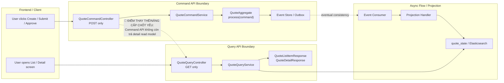

# Tech Note — Ngày 27: Tách Command API và Query API rõ hơn

> **Chủ đề:** CQRS API Boundary  
> **Mục tiêu:** `command-service` chỉ xử lý lệnh ghi dữ liệu; `query-service` chỉ xử lý đọc dữ liệu từ read model / Elasticsearch.  
> **Trạng thái:** ✅ Hoàn thành refactor mức API boundary.

---

## 1. DASHBOARD TIẾN ĐỘ

### Trạng thái tổng quan

| Hạng mục | Trạng thái |
|---|---|
| Command API chỉ POST | ✅ Đã tách |
| Query API chỉ GET | ✅ Đã tách |
| DTO command riêng | ✅ Đã chuẩn hóa |
| DTO query riêng | ✅ Đã chuẩn hóa |
| Command không trả detail read model | ✅ Đã áp dụng |
| Query đọc từ `quote_state` / ES | ✅ Đúng hướng CQRS |
| Eventual Consistency awareness | ✅ Đã nhận diện |

### [⚡ ĐIỂM DỪNG HIỆN TẠI]

Code đang dừng ở trạng thái:

```txt
Command side:
  POST /api/quotes
  POST /api/quotes/{id}/submit
  POST /api/quotes/{id}/approve

  -> nhận request DTO
  -> map sang command
  -> gọi QuoteCommandService
  -> Aggregate xử lý command
  -> append event
  -> trả QuoteCommandResponse ngắn gọn

Query side:
  GET /api/quotes
  GET /api/quotes/{id}

  -> đọc từ read model / Elasticsearch
  -> trả DTO phục vụ màn hình
```

Điểm chốt:

```txt
Command API không còn chịu trách nhiệm dựng dữ liệu detail cho UI.
Query API mới là nơi phục vụ màn hình list/detail.
```

### [🎯 BƯỚC TIẾP THEO]

**Ngày 28 — Tách Flow Consumer khỏi Command Service**

Mục tiêu ngày mai:

```txt
Command Service:
  chỉ ghi event_store + outbox

Flow Service:
  consume event
  update projection
  run workflow
  sync Elasticsearch
```

---

## 2. MÔ PHỎNG CÂY THƯ MỤC

```txt
src/main/java/com/example/quoteservice/

├── command/
│   └── quote/
│       ├── api/
│       │   └── QuoteCommandController.java        // [REFACTOR] Chỉ nhận POST command: create/submit/approve
│       │
│       ├── application/
│       │   └── QuoteCommandService.java           // [REFACTOR] Xử lý command, không query detail
│       │
│       ├── dto/
│       │   ├── QuoteCreateRequest.java            // [NEW] Request DTO riêng cho create command
│       │   ├── QuoteSubmitRequest.java            // [NEW] Request DTO riêng cho submit command nếu cần
│       │   ├── QuoteApproveRequest.java           // [NEW] Request DTO riêng cho approve command nếu cần
│       │   └── QuoteCommandResponse.java          // [NEW] Response ngắn gọn: id, status, version, message
│       │
│       └── mapper/
│           └── QuoteCommandMapper.java            // [NEW/REFACTOR] Map request DTO -> Command object
│
├── query/
│   └── quote/
│       ├── api/
│       │   └── QuoteQueryController.java          // [NEW] Chỉ nhận GET list/detail
│       │
│       ├── application/
│       │   └── QuoteQueryService.java             // [NEW] Đọc quote_state / Elasticsearch
│       │
│       ├── dto/
│       │   ├── QuoteListItemResponse.java         // [NEW] DTO phục vụ màn hình danh sách
│       │   └── QuoteDetailResponse.java           // [NEW] DTO phục vụ màn hình chi tiết
│       │
│       └── mapper/
│           └── QuoteQueryMapper.java              // [NEW] Map read model / ES document -> query DTO
│
├── domain/
│   └── quote/
│       ├── aggregate/
│       │   └── QuoteAggregate.java                // [UNCHANGED] Business rule thuộc domain
│       │
│       ├── command/
│       │   ├── CreateQuoteCommand.java            // [UNCHANGED] Command object
│       │   ├── SubmitQuoteCommand.java            // [UNCHANGED] Command object
│       │   └── ApproveQuoteCommand.java           // [UNCHANGED] Command object
│       │
│       └── event/
│           ├── QuoteCreatedEvent.java             // [UNCHANGED] Domain event
│           ├── QuoteSubmittedEvent.java           // [UNCHANGED] Domain event
│           └── QuoteApprovedEvent.java            // [UNCHANGED] Domain event
│
└── readmodel/
    └── quote/
        ├── state/
        │   ├── QuoteStateEntity.java              // [UNCHANGED/USED BY QUERY] Projection table entity
        │   └── QuoteStateRepository.java          // [USED BY QUERY] Read model repository
        │
        └── search/
            ├── QuoteDocument.java                 // [USED BY QUERY] Elasticsearch document
            └── QuoteSearchRepository.java         // [USED BY QUERY] Search repository
```

---

## 3. SƠ ĐỒ LUỒNG DỮ LIỆU — FLOW



### [🔴 ĐIỂM THAY THẾ/NÂNG CẤP CHỐT YẾU]

```txt
Trước:
  Một controller/service có xu hướng vừa xử lý POST vừa trả dữ liệu detail/list.

Bây giờ:
  Command API = ghi intent, trả response ngắn.
  Query API = đọc read model, trả dữ liệu màn hình.
```

---

## 4. CHI TIẾT SỰ DỊCH CHUYỂN LOGIC

### File bị tác động mạnh nhất

```txt
QuoteController.java
```

Đã tách thành:

```txt
QuoteCommandController.java
QuoteQueryController.java
```

---

### TRƯỚC ĐÓ — API bị trộn trách nhiệm

```java
@RestController
@RequestMapping("/api/quotes")
public class QuoteController {

    private final QuoteCommandService commandService;
    private final QuoteQueryService queryService;

    @PostMapping
    public QuoteDetailResponse create(@RequestBody QuoteCreateRequest request) {
        String quoteId = commandService.create(request);

        // Vấn đề:
        // Command vừa ghi xong đã cố đọc detail để trả UI.
        return queryService.getDetail(quoteId);
    }

    @PostMapping("/{id}/submit")
    public QuoteDetailResponse submit(@PathVariable String id) {
        commandService.submit(id);

        // Vấn đề:
        // Read model có thể chưa kịp update do eventual consistency.
        return queryService.getDetail(id);
    }

    @GetMapping("/{id}")
    public QuoteDetailResponse getDetail(@PathVariable String id) {
        return queryService.getDetail(id);
    }
}
```

### BÂY GIỜ — Command và Query tách boundary

```java
@RestController
@RequestMapping("/api/quotes")
public class QuoteCommandController {

    private final QuoteCommandService commandService;
    private final QuoteCommandMapper mapper;

    @PostMapping
    public QuoteCommandResponse create(@RequestBody QuoteCreateRequest request) {
        CreateQuoteCommand command = mapper.toCreateCommand(request);

        return commandService.create(command);
    }

    @PostMapping("/{id}/submit")
    public QuoteCommandResponse submit(@PathVariable String id) {
        SubmitQuoteCommand command = mapper.toSubmitCommand(id);

        return commandService.submit(command);
    }

    @PostMapping("/{id}/approve")
    public QuoteCommandResponse approve(@PathVariable String id) {
        ApproveQuoteCommand command = mapper.toApproveCommand(id);

        return commandService.approve(command);
    }
}
```

```java
@RestController
@RequestMapping("/api/quotes")
public class QuoteQueryController {

    private final QuoteQueryService queryService;

    @GetMapping
    public List<QuoteListItemResponse> search(QuoteSearchRequest request) {
        return queryService.search(request);
    }

    @GetMapping("/{id}")
    public QuoteDetailResponse getDetail(@PathVariable String id) {
        return queryService.getDetail(id);
    }
}
```

### Vì sao kiến trúc đổi?

```txt
1. CQRS boundary rõ hơn:
   Command = thay đổi trạng thái.
   Query = đọc dữ liệu phục vụ UI.

2. Tránh ảo tưởng consistency:
   POST thành công không có nghĩa read model đã update ngay.

3. DTO không bị dùng sai mục đích:
   Command DTO tối giản theo intent.
   Query DTO tối ưu theo màn hình.

4. Dễ tách service vật lý sau này:
   command-service và query-service có thể deploy độc lập.
```

---

## 5. QUY LUẬT ĐỌC LẠI 30 GIÂY

Khi mở lại note này, đọc theo thứ tự:

```txt
00s - 05s:
  Nhìn DASHBOARD TIẾN ĐỘ
  -> Biết ngày 27 đang hoàn thành boundary nào.

05s - 10s:
  Nhìn [⚡ ĐIỂM DỪNG HIỆN TẠI]
  -> Nhớ code đang dừng ở trạng thái command POST / query GET.

10s - 18s:
  Nhìn Mermaid Flow
  -> Thấy command đi vào Aggregate/Event Store, query đi vào Read Model.

18s - 25s:
  Nhìn [🔴 ĐIỂM THAY THẾ/NÂNG CẤP CHỐT YẾU]
  -> Nhớ thay đổi chính: không trả detail từ command API.

25s - 30s:
  Nhìn [🎯 BƯỚC TIẾP THEO]
  -> Biết ngày 28 sẽ tách Flow Consumer khỏi Command Service.
```

---

## Kết luận 30 giây

```txt
Ngày 27 = tách API boundary theo CQRS.

Command API:
  chỉ POST, nhận intent, trả response ngắn.

Query API:
  chỉ GET, đọc read model / Elasticsearch, trả DTO cho UI.

Điểm nâng cấp:
  không còn để command side cố trả detail read model ngay sau khi ghi.

Ngày kế tiếp:
  tách Flow Consumer khỏi Command Service.
```
