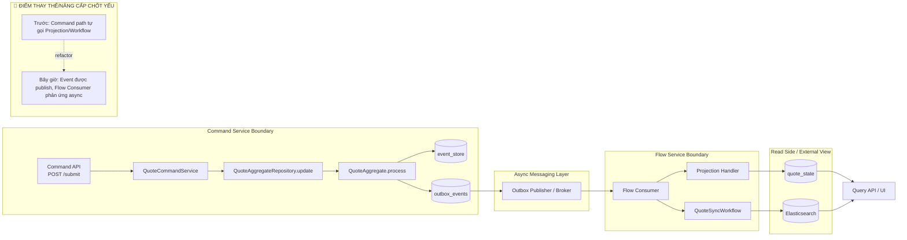

# Tech Note — Ngày 28: Tách Flow Consumer khỏi Command Service

> **Chủ đề:** Event Sourcing / CQRS nâng cao  
> **Mô hình:** Command Service ghi sự thật; Flow Service phản ứng với sự thật  
> **Trạng thái:** Hoàn thành tách boundary Command ↔ Flow ở mức demo architecture

---

## 1. DASHBOARD TIẾN ĐỘ

### Trạng thái tổng quan

| Hạng mục | Trạng thái | Ghi chú nhanh |
|---|---:|---|
| Command Service | ✅ Đã tách | Chỉ xử lý command, ghi `event_store` + `outbox_events` |
| Flow Consumer | ✅ Đã tách | Chỉ consume event, update projection, chạy workflow |
| Projection | ✅ Đã chuyển về Flow | Không còn nằm trong command path |
| Workflow / ES Sync | ✅ Đã chuyển về Flow | `QuoteSyncWorkflow` phản ứng sau event |
| Eventual Consistency | ✅ Bắt đầu rõ | API command thành công trước, read model cập nhật sau |

### ⚡ ĐIỂM DỪNG HIỆN TẠI

```text
POST /api/quotes/{id}/submit
  -> QuoteCommandService
  -> QuoteAggregateRepository.update(...)
  -> QuoteAggregate.process(command)
  -> append event_store
  -> insert outbox_events
  -> RETURN command result

Sau đó, async side:
  outbox/broker
  -> Flow Consumer
  -> Projection Handler
  -> QuoteSyncWorkflow
  -> quote_state / Elasticsearch
```

**Code đang dừng ở điểm:**  
Command side đã không trực tiếp update projection/workflow nữa. Event reaction đã được đẩy sang `flow/quote/consumer`.

### 🎯 BƯỚC TIẾP THEO

```text
Ngày 29 — Tách Query Service rõ hơn khỏi Flow Service

Mục tiêu:
  - Flow Service chỉ build/update read model
  - Query Service chỉ đọc quote_state / Elasticsearch
  - Không để Query Service chứa projection handler, workflow hoặc consumer logic
```

---

## 2. MÔ PHỎNG CÂY THƯ MỤC

```text
src/main/java/com/example/quoteservice/

├── command/
│   └── quote/
│       ├── api/
│       │   └── QuoteCommandController.java              // Command API: create/submit/approve
│       ├── application/
│       │   └── QuoteCommandService.java                 // REFACTORED: chỉ gọi AggregateRepository, không chạy projection/workflow
│       └── infrastructure/
│           ├── eventsource/
│           │   └── EventSourcedQuoteAggregateRepository.java // append event_store + outbox_events
│           └── outbox/
│               ├── OutboxEventEntity.java               // Outbox row chờ publish
│               └── OutboxMessagePublisher.java          // TEMP: publish event ra broker/queue
│
├── flow/
│   └── quote/
│       ├── consumer/
│       │   └── RabbitMqDomainEventConsumer.java         // NEW/MOVED: consume event từ broker, không nằm trong command-service nữa
│       ├── projection/
│       │   └── handler/
│       │       ├── QuoteCreatedProjectionHandler.java   // MOVED: update quote_state khi QuoteCreatedEvent
│       │       ├── QuoteSubmittedProjectionHandler.java // MOVED: update quote_state khi QuoteSubmittedEvent
│       │       └── QuoteApprovedProjectionHandler.java  // MOVED: update quote_state khi QuoteApprovedEvent
│       └── workflow/
│           └── QuoteSyncWorkflow.java                   // MOVED: sync ES / chạy side effects sau event
│
├── domain/
│   └── quote/
│       ├── aggregate/
│       │   └── QuoteAggregate.java                      // Domain rule: process command -> event, apply event -> state
│       ├── command/
│       │   ├── SubmitQuoteCommand.java
│       │   └── ApproveQuoteCommand.java
│       └── event/
│           ├── QuoteSubmittedEvent.java
│           └── QuoteApprovedEvent.java
│
└── readmodel/
    └── quote/
        └── state/
            ├── QuoteStateEntity.java                    // Read model table
            └── QuoteStateRepository.java                // Projection ghi, Query đọc
```

---

## 3. SƠ ĐỒ LUỒNG DỮ LIỆU



---

## 4. CHI TIẾT SỰ DỊCH CHUYỂN LOGIC

### File tác động mạnh nhất: `QuoteCommandService.java`

#### TRƯỚC ĐÓ — Command path còn biết quá nhiều side effect

```java
@Service
public class QuoteCommandService {

    public QuoteCommandResponse submit(SubmitQuoteCommand command) {
        AggregateCommandResult<QuoteAggregate> result =
                quoteAggregateRepository.update(command.getQuoteId(), command);

        // ❌ Command Service bị kéo sang Flow concern
        projectionHandler.handle(result.getEvents());
        quoteSyncWorkflow.submitQuote(command.getQuoteId());
        quoteIndexService.sync(command.getQuoteId());

        return QuoteCommandResponse.from(result);
    }
}
```

#### BÂY GIỜ — Command path chỉ ghi sự thật

```java
@Service
public class QuoteCommandService {

    public QuoteCommandResponse submit(SubmitQuoteCommand command) {
        AggregateCommandResult<QuoteAggregate> result =
                quoteAggregateRepository.update(command.getQuoteId(), command);

        // ✅ Chỉ trả kết quả command
        // event_store + outbox_events đã được ghi trong AggregateRepository
        // Projection/Workflow sẽ chạy async ở Flow Consumer
        return QuoteCommandResponse.from(result);
    }
}
```

### Logic mới nằm ở Flow Consumer

```java
@Component
public class RabbitMqDomainEventConsumer {

    @RabbitListener(queues = "quote-events")
    @Transactional
    public void consume(DomainEventMessage message) {
        if (processedMessageService.isProcessed(message.getEventId())) {
            return;
        }

        DomainEvent event = eventDeserializer.deserialize(message);

        projectionDispatcher.dispatch(event);
        workflowDispatcher.dispatch(event);

        processedMessageService.markProcessed(message.getEventId());
    }
}
```

### Vì sao đổi?

```text
Enterprise rule:
  Command Service quyết định command có hợp lệ không và ghi event.
  Flow Service phản ứng với event đã xảy ra.
  Query/Read side chỉ đọc projection đã được build.

Lợi ích:
  - Separation of Concerns rõ hơn
  - Command latency thấp hơn
  - Dễ scale Flow Consumer riêng
  - Dễ retry/DLQ cho side effect
  - Chuẩn bị cho Kafka/CDC/Eventuate thật
  - Chấp nhận Eventual Consistency đúng nghĩa
```

---

## 5. QUY LUẬT ĐỌC LẠI 30 GIÂY

Khi mở lại file này, đọc theo thứ tự:

```text
1. Nhìn DASHBOARD TIẾN ĐỘ
   -> Biết hôm nay đã tách Command và Flow tới đâu.

2. Nhìn [⚡ ĐIỂM DỪNG HIỆN TẠI]
   -> Khôi phục ngay flow runtime đang dừng ở đâu.

3. Nhìn Mermaid Flow
   -> Thấy boundary Command / Broker / Flow / Read Side.

4. Nhìn [🔴 ĐIỂM THAY THẾ/NÂNG CẤP CHỐT YẾU]
   -> Nhớ thay đổi kiến trúc chính: Command không gọi Projection/Workflow nữa.

5. Nhìn code TRƯỚC ĐÓ vs BÂY GIỜ
   -> Nhớ file bị refactor mạnh nhất và lý do đổi.

6. Nhìn [🎯 BƯỚC TIẾP THEO]
   -> Tiếp tục Ngày 29: tách Query Service khỏi Flow Service.
```

---

## One-line Memory Hook

```text
Ngày 28 = Command ghi event + outbox; Flow consume event + projection/workflow; không trộn hai boundary.
```
