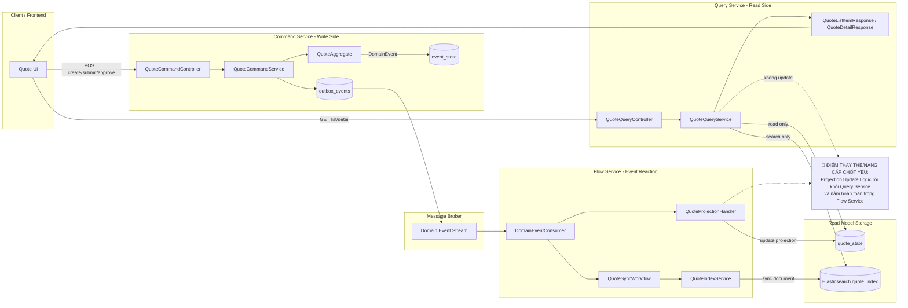

# Tech Note — Ngày 29: Tách Query Service khỏi Flow

> **Chủ đề:** Query Service chỉ đọc Read Model / Elasticsearch, không chứa Projection Update Logic  
> **Kiến trúc:** Event Sourcing / CQRS / Event-driven Architecture  
> **Mục tiêu 30 giây:** Nhớ ranh giới trách nhiệm giữa `flow-service` và `query-service`.

---

## 1. DASHBOARD TIẾN ĐỘ

### Trạng thái tổng quan

| Hạng mục | Trạng thái | Ghi chú |
|---|---:|---|
| Command Side | ✅ Ổn định | Command sinh Event, ghi `event_store` + `outbox_events` |
| Flow Side | ✅ Đã rõ trách nhiệm | Consume Event, Projection, Workflow, Sync ES |
| Query Side | ✅ Đã tách | Chỉ đọc `quote_state` / Elasticsearch |
| Coupling giữa Query và Flow | ✅ Đã giảm | Query không update projection nữa |
| CQRS Boundary | ✅ Rõ hơn | Write path và Read path tách biệt |

### ⚡ ĐIỂM DỪNG HIỆN TẠI

```text
Code đang dừng ở trạng thái:

Command Service
  -> sinh DomainEvent
  -> ghi event_store / outbox_events

Flow Service
  -> consume DomainEvent
  -> update quote_state
  -> sync Elasticsearch

Query Service
  -> GET /quotes
  -> GET /quotes/{id}
  -> chỉ đọc quote_state / Elasticsearch
  -> KHÔNG chứa projection handler
  -> KHÔNG update quote_state
  -> KHÔNG consume event
```

**File bị tác động mạnh nhất:**

```text
QuoteQueryService.java
```

Vai trò hiện tại:

```text
QueryService = Read API Application Service
Không phải Event Consumer
Không phải Projection Updater
Không phải Workflow Executor
```

### 🎯 BƯỚC TIẾP THEO

```text
Ngày 30 — Thêm CurrentUserContext / SecurityContext

Mục tiêu:
  - Command API không hardcode userId nữa
  - Lấy user/tenant/role từ request context
  - Command/Event có actor/context rõ ràng
  - Chuẩn bị cho permission policy ở ngày sau
```

---

## 2. MÔ PHỎNG CÂY THƯ MỤC

```text
src/main/java/com/example/quoteservice
|
+-- command/quote
|   +-- api
|   |   +-- QuoteCommandController.java        // POST create/submit/approve; không query list/detail
|   +-- application
|   |   +-- QuoteCommandService.java           // xử lý command, gọi AggregateRepository
|   +-- infrastructure
|       +-- eventstore
|       |   +-- JpaEventStore.java             // append event_store
|       +-- outbox
|           +-- OutboxEventStore.java          // ghi outbox_events
|
+-- flow/quote
|   +-- consumer
|   |   +-- RabbitMqDomainEventConsumer.java   // consume DomainEvent từ broker
|   +-- projection
|   |   +-- QuoteProjectionHandler.java        // [REFACTOR] update quote_state nằm ở Flow, không nằm ở Query
|   +-- workflow
|   |   +-- QuoteSyncWorkflow.java             // xử lý side effect: sync ES, notification, allocation...
|   +-- search
|       +-- QuoteIndexService.java             // [REFACTOR] ghi/update Elasticsearch document
|
+-- readmodel/quote
|   +-- state
|   |   +-- QuoteStateEntity.java              // [MỚI/REFACTOR] bảng read model cho Query đọc
|   |   +-- QuoteStateRepository.java          // [MỚI/REFACTOR] repository chung cho read model
|   +-- search
|       +-- QuoteDocument.java                 // Elasticsearch document
|       +-- QuoteSearchRepository.java         // Elasticsearch read repository
|
+-- query/quote
    +-- api
    |   +-- QuoteQueryController.java          // [MỚI] GET list/detail
    +-- application
    |   +-- QuoteQueryService.java             // [REFACTOR] chỉ đọc readmodel/ES
    +-- dto
        +-- QuoteDetailResponse.java           // [MỚI] DTO cho detail
        +-- QuoteListItemResponse.java         // [MỚI] DTO cho list
```

**Quy tắc thư mục sau ngày 29:**

```text
flow/  = build read model + side effect
query/ = serve read API từ read model
```

---

## 3. SƠ ĐỒ LUỒNG DỮ LIỆU



---

## 4. CHI TIẾT SỰ DỊCH CHUYỂN LOGIC

### File bị tác động mạnh nhất

```text
QuoteQueryService.java
```

### TRƯỚC ĐÓ — Query Service bị lẫn Projection Logic

```java
// TRƯỚC ĐÓ - Sai boundary CQRS
@Service
public class QuoteQueryService {

    private final QuoteStateRepository quoteStateRepository;
    private final QuoteSearchRepository quoteSearchRepository;

    public QuoteDetailResponse getDetail(String quoteId) {
        QuoteStateEntity state = quoteStateRepository.findById(quoteId)
                .orElseThrow(() -> new NotFoundException("Quote not found"));

        return QuoteDetailResponse.from(state);
    }

    // ❌ Logic này không nên nằm trong Query Service
    public void updateProjectionFromEvent(QuoteSubmittedEvent event) {
        QuoteStateEntity state = quoteStateRepository.findById(event.quoteId())
                .orElseThrow();

        state.setStatus(QuoteStatus.SUBMITTED);
        state.setSubmittedBy(event.submittedBy());
        state.setLastProjectedVersion(event.aggregateVersion());

        quoteStateRepository.save(state);
    }

    // ❌ Query Service không nên sync Elasticsearch
    public void syncToElasticsearch(QuoteStateEntity state) {
        QuoteDocument document = QuoteDocument.from(state);
        quoteSearchRepository.save(document);
    }
}
```

### BÂY GIỜ — Query Service chỉ đọc Read Model / Elasticsearch

```java
// BÂY GIỜ - Đúng CQRS boundary
@Service
public class QuoteQueryService {

    private final QuoteStateRepository quoteStateRepository;
    private final QuoteSearchRepository quoteSearchRepository;

    public QuoteDetailResponse getDetail(String quoteId) {
        QuoteStateEntity state = quoteStateRepository.findById(quoteId)
                .orElseThrow(() -> new NotFoundException("Quote not found"));

        return QuoteDetailResponse.from(state);
    }

    public Page<QuoteListItemResponse> search(QuoteSearchCriteria criteria, Pageable pageable) {
        Page<QuoteDocument> result = quoteSearchRepository.search(criteria, pageable);

        return result.map(QuoteListItemResponse::from);
    }
}
```

### Logic update chuyển sang Flow Service

```java
// Flow Service - nơi đúng để update read model
@Component
public class QuoteProjectionHandler implements DomainEventHandler<QuoteSubmittedEvent> {

    private final QuoteStateRepository quoteStateRepository;

    @Override
    public Class<QuoteSubmittedEvent> eventType() {
        return QuoteSubmittedEvent.class;
    }

    @Override
    public void handle(DomainEventEnvelope<QuoteSubmittedEvent> envelope) {
        QuoteSubmittedEvent event = envelope.event();

        QuoteStateEntity state = quoteStateRepository.findById(event.quoteId())
                .orElseThrow();

        state.setStatus(QuoteStatus.SUBMITTED);
        state.setSubmittedBy(event.submittedBy());
        state.setSubmittedByName(event.submittedByName());
        state.setLastProjectedVersion(envelope.aggregateVersion());

        quoteStateRepository.save(state);
    }
}
```

### Vì sao kiến trúc đổi?

```text
1. CQRS boundary rõ hơn:
   Command sinh event, Flow phản ứng event, Query chỉ đọc kết quả.

2. Query Service không có side effect:
   GET API không được mutate quote_state hoặc Elasticsearch.

3. Dễ scale độc lập:
   Query Service scale theo lượng đọc, Flow Service scale theo event throughput.

4. Dễ debug eventual consistency:
   Nếu UI chưa thấy data mới, kiểm tra Flow/Projection chứ không đổ lỗi cho Query.

5. Gần kiến trúc production:
   core-flow-service build read model, core-query-service serve read API.
```

---

## 5. QUY LUẬT ĐỌC LẠI 30 GIÂY

Khi mở lại file này, đọc theo thứ tự:

```text
Bước 1 — Nhìn DASHBOARD TIẾN ĐỘ
  -> Biết hôm nay tách Query khỏi Flow.

Bước 2 — Nhìn mục ⚡ ĐIỂM DỪNG HIỆN TẠI
  -> Nhớ code đang dừng ở trạng thái Query chỉ đọc.

Bước 3 — Nhìn cây thư mục
  -> Xác định projection nằm trong flow/quote/projection.
  -> Query API nằm trong query/quote.
  -> Read model nằm trong readmodel/quote.

Bước 4 — Nhìn Mermaid Flow
  -> Nhớ đường POST đi qua Command.
  -> Nhớ đường Event đi qua Flow.
  -> Nhớ đường GET đi qua Query.

Bước 5 — Nhìn phần TRƯỚC ĐÓ / BÂY GIỜ
  -> Khôi phục nhanh thay đổi chính:
     QueryService không còn updateProjectionFromEvent().
```

**Câu cần nhớ trong 5 giây:**

```text
Query Service không tạo sự thật mới.
Query Service chỉ đọc sự thật đã được Flow Service project ra read model.
```

---

## Mini Checklist Sau Ngày 29

```text
[ ] QueryController chỉ có GET
[ ] QueryService chỉ đọc quote_state / Elasticsearch
[ ] QueryService không inject EventStore
[ ] QueryService không inject Outbox
[ ] QueryService không có handler event
[ ] ProjectionHandler nằm trong flow-service
[ ] Workflow/Sync ES nằm trong flow-service
[ ] Read model repository có thể dùng chung, nhưng logic update chỉ nằm ở Flow
```
