# Tech Note — Ngày 30: CurrentUserContext / SecurityContext

> **Chủ đề:** Bỏ hardcode `demo-user`, đưa `userId / roles / tenantId / organizationId` vào `Command` giống project thật.  
> **Kiểu note:** Kiến trúc động — đọc lại trong 30 giây để khôi phục context.

---

## 1. DASHBOARD TIẾN ĐỘ

### Trạng thái tổng quan

| Hạng mục | Trạng thái |
|---|---|
| Command API | Đã bỏ hardcode actor |
| Security Context | Đã có `CurrentUserContext` |
| User metadata | Đã truyền vào Command |
| Tenant / Organization | Đã có trong Command/Event |
| Permission Policy | Chưa làm ở ngày 30 |
| Mục tiêu kiến trúc | Command không tự bịa user, lấy user từ request/security layer |

### ⚡ ĐIỂM DỪNG HIỆN TẠI

```txt
FE/API Client gửi request
  -> FakeAuthenticationFilter đọc header
  -> tạo CurrentUser
  -> gắn vào request attribute
  -> CurrentUserContext lấy CurrentUser
  -> QuoteCommandController truyền CurrentUser vào Command
  -> QuoteCommandService xử lý Command
  -> Aggregate sinh Event có actor/context
```

**Code đang dừng ở:**  
`QuoteCommandController` không còn truyền `"demo-user"` trực tiếp nữa.  
Thay vào đó, controller lấy user hiện tại qua:

```java
CurrentUser currentUser = currentUserContext.getCurrentUser();
```

Sau đó map vào:

```java
createdBy / submittedBy / approvedBy
tenantId
organizationId
roles
```

### 🎯 BƯỚC TIẾP THEO

**Ngày 31 — Permission / Capability Policy**

```txt
CurrentUser đã có roles.
Bước tiếp theo: dùng roles để quyết định user có được Create / Submit / Approve Quote hay không.
```

Target ngày 31:

```txt
QUOTE_CREATOR   -> được Create Quote
QUOTE_SUBMITTER -> được Submit Quote
QUOTE_APPROVER  -> được Approve Quote
QUOTE_ADMIN     -> full quyền
```

---

## 2. MÔ PHỎNG CÂY THƯ MỤC

```txt
src/main/java/com/example/quoteservice
│
├── shared/
│   └── security/
│       ├── CurrentUser.java                         // [NEW] Value object chứa userId, username, tenantId, organizationId, roles
│       ├── CurrentUserContext.java                  // [NEW] Interface lấy user hiện tại
│       ├── RequestHeaderCurrentUserContext.java     // [NEW] Implementation đọc CurrentUser từ request attribute
│       └── FakeAuthenticationFilter.java            // [NEW] Local/dev filter đọc X-User-* headers và tạo CurrentUser
│
├── command/
│   └── quote/
│       ├── api/
│       │   └── QuoteCommandController.java          // [REFACTOR] Bỏ "demo-user", lấy CurrentUser từ CurrentUserContext
│       │
│       └── application/
│           └── QuoteCommandService.java             // [REFACTOR] Nhận Command đã có actor/context
│
├── domain/
│   └── quote/
│       ├── command/
│       │   ├── CreateQuoteCommand.java              // [REFACTOR] Thêm createdBy, tenantId, organizationId
│       │   ├── SubmitQuoteCommand.java              // [REFACTOR] Thêm submittedBy, tenantId, organizationId
│       │   └── ApproveQuoteCommand.java             // [REFACTOR] Thêm approvedBy, tenantId, organizationId
│       │
│       └── event/
│           ├── QuoteCreatedEvent.java               // [REFACTOR] Event mang actor/context để projection/audit dùng lại
│           ├── QuoteSubmittedEvent.java             // [REFACTOR] Có submittedBy/submittedByName
│           └── QuoteApprovedEvent.java              // [REFACTOR] Có approvedBy/approvedByName
│
└── readmodel/
    └── quote/
        └── state/
            ├── QuoteStateEntity.java                // [REFACTOR] Lưu audit/context vào quote_state
            └── QuoteStateProjectionHandler.java     // [REFACTOR] Map actor/context từ Event sang read model
```

---

## 3. SƠ ĐỒ LUỒNG DỮ LIỆU

```mermaid
graph LR
    subgraph Client["Client / API Caller"]
        A["HTTP Request"]
        A1["Headers:<br/>X-User-Id<br/>X-Username<br/>X-Tenant-Id<br/>X-Organization-Id<br/>X-Roles"]
    end

    subgraph Security["Security Boundary"]
        B["FakeAuthenticationFilter"]
        C["CurrentUser"]
        D["CurrentUserContext"]
    end

    subgraph CommandAPI["Command API Boundary"]
        E["QuoteCommandController"]
        F["Create / Submit / Approve Command"]
    end

    subgraph Domain["Domain Boundary"]
        G["QuoteAggregate.process(command)"]
        H["Domain Event<br/>QuoteCreated / Submitted / Approved"]
    end

    subgraph Persistence["Persistence / Read Model"]
        I["event_store"]
        J["outbox_events"]
        K["quote_state projection"]
    end

    A --> A1
    A1 --> B
    B --> C
    C --> D
    D --> E
    E --> F
    F --> G
    G --> H
    H --> I
    H --> J
    H --> K

    X["🔴 ĐIỂM THAY THẾ/NÂNG CẤP CHỐT YẾU:<br/>Controller không hardcode demo-user nữa.<br/>Actor/context đi từ Security Boundary vào Command."]
    D --> X
    X --> E
```



---

## 4. CHI TIẾT SỰ DỊCH CHUYỂN LOGIC

### File tác động mạnh nhất

```txt
QuoteCommandController.java
```

### TRƯỚC ĐÓ — hardcode actor trong Controller

```java
@PostMapping
public QuoteCommandResponse createQuote(@RequestBody QuoteCreateRequest request) {
    CreateQuoteCommand command = new CreateQuoteCommand(
            request.customerName(),
            request.productCode(),
            request.premium(),
            "demo-user",        // hardcode actor
            "Demo User",        // hardcode name
            "tenant-demo",      // hardcode tenant
            "org-demo"          // hardcode organization
    );

    var result = quoteCommandService.create(command);

    return QuoteCommandResponse.from(result);
}
```

Vấn đề:

```txt
Controller tự bịa user.
Không giống project thật.
Không audit đúng ai tạo / submit / approve.
Không có tenant boundary rõ.
Không thể làm permission theo roles.
```

### BÂY GIỜ — lấy actor/context từ CurrentUserContext

```java
@PostMapping
public QuoteCommandResponse createQuote(@RequestBody QuoteCreateRequest request) {
    CurrentUser currentUser = currentUserContext.getCurrentUser();

    CreateQuoteCommand command = new CreateQuoteCommand(
            request.customerName(),
            request.productCode(),
            request.premium(),
            currentUser.userId(),
            currentUser.username(),
            currentUser.tenantId(),
            currentUser.organizationId()
    );

    var result = quoteCommandService.create(command);

    return QuoteCommandResponse.from(result);
}
```

Ý nghĩa kiến trúc:

```txt
Security Boundary chịu trách nhiệm xác định user.
Command API chỉ map request + current user thành Command.
Domain xử lý business rule.
Event lưu lại actor/context để audit, projection, workflow dùng lại.
```

---

## 5. QUY LUẬT ĐỌC LẠI 30 GIÂY

Khi mở lại file này, đọc theo thứ tự:

```txt
1. Nhìn DASHBOARD trước
   -> biết hôm nay đang làm tới đâu.

2. Nhìn mục ⚡ ĐIỂM DỪNG HIỆN TẠI
   -> khôi phục flow code hiện tại.

3. Nhìn Mermaid flow
   -> thấy ranh giới Security / Command / Domain / Persistence.

4. Nhìn phần TRƯỚC ĐÓ vs BÂY GIỜ
   -> nhớ chính xác refactor nằm ở đâu.

5. Nhìn 🎯 BƯỚC TIẾP THEO
   -> biết ngày mai học tiếp Permission Policy.
```

Từ khóa cần nhớ:

```txt
CurrentUserContext
Security Boundary
Actor Context
Tenant Boundary
Command Metadata
Audit Trail
Permission-ready Command
```

---

## Kết luận 30 giây

```txt
Ngày 30 biến demo Quote từ "hardcode user" sang "security-context aware command".

Trước:
  Controller tự truyền demo-user.

Bây giờ:
  Request Header -> Filter -> CurrentUser -> CurrentUserContext -> Command -> Event.

Ý nghĩa:
  Đây là bước nền để ngày 31 làm Permission / Capability Policy.
```
