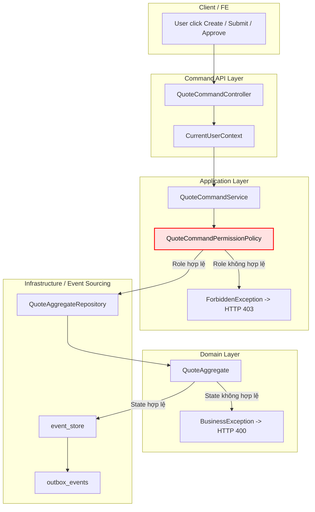

# Tech Note — Day 31: Permission / Capability Policy

> **Chủ đề:** User có role nào thì được `create / submit / approve` Quote.  
> **Kiến trúc:** Tách **Application Permission Policy** khỏi **Aggregate Business Rule**.  
> **Mục tiêu đọc lại:** Nắm context trong **30 giây**.

---

## 1. DASHBOARD TIẾN ĐỘ

### ✅ Trạng thái tổng quan

```text
Day 31 Status: COMPLETED
Architecture Layer: Application Layer / Authorization Policy
Main Shift: Hardcode quyền trong Service/Controller -> tách thành Permission Policy riêng
Impact: CommandService sạch hơn, Aggregate chỉ giữ business rule trạng thái
```

### ⚡ ĐIỂM DỪNG HIỆN TẠI

```text
Code đang dừng tại:

QuoteCommandService
  -> nhận CurrentUser từ Controller
  -> gọi QuoteCommandPermissionPolicy.checkCanCreate / checkCanSubmit / checkCanApprove
  -> nếu user không có role phù hợp: throw ForbiddenException
  -> nếu qua permission: gọi QuoteAggregateRepository.create/update
  -> Aggregate tiếp tục check state rule: DRAFT/SUBMITTED/APPROVED
```

**Trạng thái logic hiện tại:**

| Concern | Nơi xử lý hiện tại |
|---|---|
| User là ai? | `CurrentUserContext` |
| User có role gì? | `CurrentUser.roles` |
| User được làm action nào? | `QuoteCommandPermissionPolicy` |
| Quote status có cho phép action không? | `QuoteAggregate.process(command)` |
| Không đủ quyền | `ForbiddenException` → HTTP `403` |
| Sai trạng thái nghiệp vụ | `BusinessException` → HTTP `400` |

### 🎯 BƯỚC TIẾP THEO

```text
Ngày 32 — Flyway migration:
  - bỏ ddl-auto:update
  - tạo migration cho event_store
  - tạo migration cho outbox_events
  - tạo migration cho processed_messages
  - tạo migration cho quote_state
  - chuyển DB schema sang quản lý version rõ ràng
```

---

## 2. MÔ PHỎNG CÂY THƯ MỤC

```text
src/main/java/com/example/quoteservice
│
├── shared
│   ├── security
│   │   ├── CurrentUser.java                         // Đã có từ Day 30: thông tin user hiện tại
│   │   ├── CurrentUserContext.java                  // Đã có từ Day 30: abstraction lấy user hiện tại
│   │   └── RequestHeaderCurrentUserContext.java     // Đã có từ Day 30: đọc user từ request/header
│   │
│   └── exception
│       ├── BusinessException.java                   // Lỗi rule nghiệp vụ: sai trạng thái quote
│       ├── ForbiddenException.java                  // [NEW] Lỗi authorization: user không đủ quyền
│       └── GlobalExceptionHandler.java              // [REFACTORED] map ForbiddenException -> HTTP 403
│
├── domain
│   └── quote
│       └── aggregate
│           └── QuoteAggregate.java                  // Không check role; chỉ check business state rule
│
├── command
│   └── quote
│       ├── api
│       │   └── QuoteCommandController.java          // [REFACTORED] lấy CurrentUser, truyền xuống service
│       │
│       ├── application
│       │   ├── QuoteCommandService.java             // [REFACTORED] gọi PermissionPolicy trước AggregateRepository
│       │   └── policy
│       │       ├── RoleConstants.java               // [NEW] chuẩn hóa role: CREATOR/SUBMITTER/APPROVER/ADMIN
│       │       └── QuoteCommandPermissionPolicy.java // [NEW] application authorization policy
│       │
│       └── infrastructure
│           └── eventsource
│               └── EventSourcedQuoteAggregateRepository.java // không đổi: load/replay/process/append
│
└── query
    └── quote
        └── application
            └── QuoteActionPolicy.java               // [OPTIONAL] gợi ý available actions cho UI, không thay thế BE guard
```

**File tác động mạnh nhất:**

```text
QuoteCommandService.java
```

Vì đây là nơi nối giữa:

```text
CurrentUser -> PermissionPolicy -> AggregateRepository -> EventStore
```

---

## 3. SƠ ĐỒ LUỒNG DỮ LIỆU



### 🔴 ĐIỂM THAY THẾ/NÂNG CẤP CHỐT YẾU

```text
TRƯỚC:
  Service/Controller có thể tự if role hoặc hardcode quyền rải rác.

BÂY GIỜ:
  QuoteCommandPermissionPolicy là điểm tập trung authorization rule.
```

**Ý nghĩa kiến trúc:**

```text
Application Policy quyết định: user có được gọi action này không?
Aggregate Rule quyết định: trạng thái quote có cho phép action này không?
```

---

## 4. CHI TIẾT SỰ DỊCH CHUYỂN LOGIC

### TRƯỚC ĐÓ — Permission dễ bị lẫn trong Service

```java
public QuoteCommandResponse submitQuote(String quoteId, SubmitQuoteRequest request) {
    CurrentUser user = currentUserContext.getCurrentUser();

    // Permission check có nguy cơ bị hardcode/rải rác
    if (!user.hasRole("QUOTE_SUBMITTER")) {
        throw new RuntimeException("No permission");
    }

    SubmitQuoteCommand command = new SubmitQuoteCommand(
            quoteId,
            user.getUserId(),
            user.getUsername(),
            user.getTenantId(),
            user.getOrganizationId()
    );

    var result = quoteAggregateRepository.update(quoteId, command);

    return QuoteCommandResponse.from(result);
}
```

**Vấn đề:**

```text
- Service bị phình logic authorization
- Mỗi action có thể check quyền một kiểu
- Khó test permission riêng
- Dễ nhầm permission rule với business state rule
```

---

### BÂY GIỜ — Permission Policy tập trung

```java
public QuoteCommandResponse submitQuote(String quoteId, SubmitQuoteRequest request) {
    CurrentUser user = currentUserContext.getCurrentUser();

    // Application authorization rule
    permissionPolicy.checkCanSubmit(user);

    SubmitQuoteCommand command = new SubmitQuoteCommand(
            quoteId,
            user.getUserId(),
            user.getUsername(),
            user.getTenantId(),
            user.getOrganizationId()
    );

    var result = quoteAggregateRepository.update(quoteId, command);

    return QuoteCommandResponse.from(result);
}
```

```java
public class QuoteCommandPermissionPolicy {

    public void checkCanCreate(CurrentUser user) {
        if (!hasAnyRole(user, RoleConstants.QUOTE_CREATOR, RoleConstants.QUOTE_ADMIN)) {
            throw new ForbiddenException("User cannot create quote");
        }
    }

    public void checkCanSubmit(CurrentUser user) {
        if (!hasAnyRole(user, RoleConstants.QUOTE_SUBMITTER, RoleConstants.QUOTE_ADMIN)) {
            throw new ForbiddenException("User cannot submit quote");
        }
    }

    public void checkCanApprove(CurrentUser user) {
        if (!hasAnyRole(user, RoleConstants.QUOTE_APPROVER, RoleConstants.QUOTE_ADMIN)) {
            throw new ForbiddenException("User cannot approve quote");
        }
    }

    private boolean hasAnyRole(CurrentUser user, String... roles) {
        return Arrays.stream(roles).anyMatch(user::hasRole);
    }
}
```

**Lý do đổi kiến trúc:**

```text
- Authorization là Application Concern, không phải Domain Concern
- Aggregate không nên biết user role
- Service orchestration rõ hơn: check permission -> tạo command -> gọi aggregate repository
- Dễ unit test policy riêng
- Dễ mở rộng capability sau này: theo product, tenant, organization, branch, hierarchy
```

---

## 5. PHÂN TÁCH RULE CHUẨN ENTERPRISE

```text
Application Permission Policy
  Câu hỏi: User này có được phép thực hiện action không?
  Ví dụ: role QUOTE_SUBMITTER mới được submit.
  Exception: ForbiddenException / HTTP 403.

Domain Aggregate Rule
  Câu hỏi: Trạng thái nghiệp vụ hiện tại có cho phép action không?
  Ví dụ: chỉ quote DRAFT mới submit được.
  Exception: BusinessException / HTTP 400.
```

Ví dụ đúng:

```text
User thiếu role submit
  -> ForbiddenException
  -> 403

User có role submit nhưng Quote đã APPROVED
  -> BusinessException
  -> 400
```

---

## 6. QUY LUẬT ĐỌC LẠI 30 GIÂY

Khi mở lại file này, đọc theo thứ tự:

```text
1. Nhìn DASHBOARD TIẾN ĐỘ
   -> biết đang ở Day 31, đã hoàn thành Permission Policy.

2. Nhìn mục ⚡ ĐIỂM DỪNG HIỆN TẠI
   -> khôi phục nhanh code đang dừng ở QuoteCommandService.

3. Nhìn cây thư mục
   -> nhớ file mới: ForbiddenException, RoleConstants, QuoteCommandPermissionPolicy.

4. Nhìn Mermaid flow
   -> thấy ranh giới Client / API / Application / Domain / Infrastructure.

5. Nhìn 🔴 ĐIỂM THAY THẾ/NÂNG CẤP CHỐT YẾU
   -> nhớ logic đã chuyển từ hardcode permission sang policy tập trung.

6. Nhìn phần TRƯỚC ĐÓ / BÂY GIỜ
   -> nhớ chính xác code thay đổi tại QuoteCommandService.

7. Nhìn 🎯 BƯỚC TIẾP THEO
   -> chuyển sang Day 32: Flyway migration.
```

**Câu nhớ nhanh:**

```text
Day 31 = tách quyền ra khỏi service/aggregate.
Permission Policy check user role.
Aggregate check business state.
Forbidden = 403.
BusinessException = 400.
```
