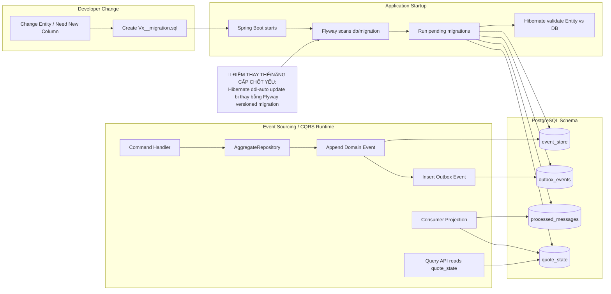

# Tech Note — Ngày 32: Thay `ddl-auto` bằng Flyway Migration

> **Context:** Event Sourcing / CQRS nâng cao — đưa schema DB từ kiểu tự sinh bởi Hibernate sang kiểu **versioned migration** giống production.

---

## 1. DASHBOARD TIẾN ĐỘ

| Hạng mục | Trạng thái |
|---|---|
| Bài học | **Ngày 32 — Flyway Migration** |
| Mục tiêu | Thay `spring.jpa.hibernate.ddl-auto=update` bằng `validate` + Flyway SQL migrations |
| Trạng thái tổng quan | ✅ Đã nâng cấp tư duy schema: **Hibernate không còn tự sửa DB** |
| Production-readiness | ⬆️ Tăng mạnh: schema có version, review được, rollback/debug dễ hơn |
| Risk còn lại | Entity và SQL migration có thể lệch nhau → app fail khi start với `ddl-auto=validate` |

### ⚡ ĐIỂM DỪNG HIỆN TẠI

```text
Code đang dừng ở lớp Database Schema Ownership:

application.yml
  -> ddl-auto: validate
  -> flyway.enabled: true

src/main/resources/db/migration/
  -> V1__create_event_store.sql
  -> V2__create_outbox_events.sql
  -> V3__create_processed_messages.sql
  -> V4__create_quote_state.sql

Runtime hiện tại:
  App start
    -> Flyway chạy migration trước
    -> Hibernate chỉ validate Entity khớp DB
    -> Nếu lệch schema: fail fast khi start app
```

### 🎯 BƯỚC TIẾP THEO

```text
Ngày 33 — Elasticsearch alias v1/v2 + reindex strategy

Mục tiêu ngày mai:
  - Không dùng deleteAll() trên index live
  - Tách alias quote_index khỏi physical index quote_index_v1 / quote_index_v2
  - Chuẩn bị chiến lược rebuild read model/search index an toàn hơn
```

---

## 2. MÔ PHỎNG CÂY THƯ MỤC

```text
src/main/resources/
├── application.yml                              # REFACTORED: ddl-auto update -> validate; bật Flyway
└── db/
    └── migration/                               # NEW: nguồn sự thật của database schema
        ├── V1__create_event_store.sql           # NEW: lưu domain events append-only theo aggregate/version
        ├── V2__create_outbox_events.sql         # NEW: transactional outbox để publish event sau commit
        ├── V3__create_processed_messages.sql    # NEW: idempotent consumer / chống xử lý trùng message
        └── V4__create_quote_state.sql           # NEW: read model projection cho Query API

src/main/java/com/example/quoteservice/
├── command/quote/infrastructure/eventstore/
│   ├── EventStoreEntity.java                    # CHECK: phải khớp schema V1
│   └── JpaEventStore.java                       # CHECK: append event dựa trên table đã migrate
├── command/quote/infrastructure/outbox/
│   ├── OutboxEventEntity.java                   # CHECK: phải khớp schema V2
│   └── OutboxEventStore.java                    # CHECK: insert outbox trong cùng transaction command
├── shared/messaging/dedup/
│   └── ProcessedMessageEntity.java              # CHECK: phải khớp schema V3
└── readmodel/quote/state/
    ├── QuoteStateEntity.java                    # CHECK: phải khớp schema V4
    └── QuoteStateRepository.java                # READ MODEL: phục vụ Query API / Projection
```

---

## 3. SƠ ĐỒ LUỒNG DỮ LIỆU — KIẾN TRÚC ĐỘNG



---

## 4. CHI TIẾT SỰ DỊCH CHUYỂN LOGIC

**File tác động mạnh nhất:** `application.yml` + `src/main/resources/db/migration/*`

### TRƯỚC ĐÓ — Hibernate tự quản lý schema

```java
// TRƯỚC ĐÓ — schema lifecycle bị ẩn trong runtime
// application.yml mental model
spring.jpa.hibernate.ddl_auto = "update";

// Hệ quả:
// - App start là Hibernate có thể tự tạo/sửa table
// - Entity change có thể âm thầm đổi DB
// - Khó review schema change
// - Không giống production governance
```

### BÂY GIỜ — Flyway quản lý schema, Hibernate chỉ validate

```java
// BÂY GIỜ — schema lifecycle explicit / versioned
// application.yml mental model
spring.jpa.hibernate.ddl_auto = "validate";
spring.flyway.enabled = true;

// Hệ quả:
// - Flyway chạy V1, V2, V3, V4 trước
// - Hibernate chỉ kiểm tra Entity có khớp DB không
// - Muốn đổi schema phải tạo Vx__description.sql
// - App fail fast nếu Entity lệch migration
```

### Vì sao kiến trúc đổi?

```text
Enterprise rule:
  Database schema là contract có version.
  Runtime application không được tự ý sửa schema production.

Event Sourcing / CQRS cần schema ổn định cho:
  - event_store: append-only history
  - outbox_events: reliable publish boundary
  - processed_messages: idempotency boundary
  - quote_state: read model contract
```

---

## 5. QUY LUẬT ĐỌC LẠI 30 GIÂY

```text
Mở lại file này, đọc theo thứ tự:

1. Nhìn DASHBOARD TIẾN ĐỘ
   -> Biết hôm nay đang ở Day 32, đã chuyển schema ownership sang Flyway.

2. Nhìn ⚡ ĐIỂM DỪNG HIỆN TẠI
   -> Biết code đang dừng ở application.yml + db/migration V1..V4.

3. Nhìn SƠ ĐỒ MERMAID
   -> Tìm node 🔴 để nhớ thay đổi cốt lõi: ddl-auto update -> Flyway migration.

4. Nhìn CÂY THƯ MỤC
   -> Biết file nào mới xuất hiện, file entity nào phải khớp migration.

5. Nhìn phần TRƯỚC ĐÓ / BÂY GIỜ
   -> Khôi phục mental model: Hibernate không còn tạo schema, Flyway mới là source of truth.

6. Nhìn 🎯 BƯỚC TIẾP THEO
   -> Tiếp tục Day 33: Elasticsearch alias v1/v2 + reindex strategy.
```

---

## 6. ONE-LINE MEMORY

```text
Day 32 = Database schema ownership moved from Hibernate runtime magic to Flyway versioned migrations.
```
