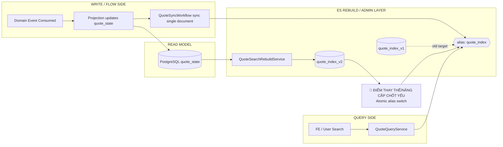

# Tech Note — Ngày 33: Elasticsearch Reindex theo Alias Mindset

> Chủ đề: `quote_index_v1`, `quote_index_v2`, alias `quote_index`, tránh `deleteAll()` trực tiếp khi rebuild.

---

## 1. DASHBOARD TIẾN ĐỘ

### Trạng thái tổng quan

| Hạng mục | Trạng thái |
|---|---|
| Event Sourcing / CQRS foundation | ✅ Đã có |
| Read model `quote_state` | ✅ Đã có |
| Elasticsearch projection/search | ✅ Đã có |
| Rebuild ES bằng `deleteAll()` | ❌ Đã loại khỏi mindset production |
| Rebuild ES bằng alias switch | ✅ Đã thiết kế |
| Zero-downtime reindex hoàn chỉnh | ⚠️ Mới mức demo, chưa có catch-up/dual-write |

### [⚡ ĐIỂM DỪNG HIỆN TẠI]

```txt
Code đang dừng ở lớp Elasticsearch Rebuild:

quote_state
  -> QuoteSearchRebuildService
  -> create quote_index_v2
  -> index toàn bộ document vào quote_index_v2
  -> switch alias quote_index từ quote_index_v1 sang quote_index_v2

Query API vẫn đọc qua alias:
  quote_index

Không còn tư duy:
  searchRepository.deleteAll()
  rồi index lại trực tiếp trên index đang phục vụ user
```

### [🎯 BƯỚC TIẾP THEO]

```txt
Ngày 34 — Observability correlationId end-to-end

Mục tiêu:
  API request
    -> Command
    -> event_store
    -> outbox
    -> Kafka/Consumer
    -> Projection
    -> ES sync

Tất cả log phải trace được bằng cùng một correlationId.
```

---

## 2. MÔ PHỎNG CÂY THƯ MỤC

```txt
src/main/java/com/example/quoteservice
├── readmodel
│   └── quote
│       ├── state
│       │   ├── QuoteStateEntity.java              // read model chính từ projection
│       │   └── QuoteStateRepository.java          // nguồn dữ liệu rebuild ES
│       │
│       └── search
│           ├── QuoteDocument.java                 // ES document, vẫn trỏ alias quote_index
│           ├── QuoteSearchRepository.java         // query/search qua alias
│           ├── QuoteSearchIndexNames.java         // [NEW] tập trung tên alias/index vật lý
│           ├── QuoteIndexAdminService.java        // [NEW] quản lý create index, check index, switch alias
│           ├── QuoteSearchRebuildService.java     // [REFACTOR] rebuild không deleteAll, dùng index mới + alias switch
│           └── QuoteSearchMapper.java             // map quote_state -> QuoteDocument
│
├── flow
│   └── quote
│       └── workflow
│           └── QuoteSyncWorkflow.java             // sync từng event sang ES alias quote_index
│
└── query
    └── quote
        └── QuoteQueryService.java                 // đọc ES qua alias, không biết v1/v2
```

Ghi nhớ nhanh:

```txt
Query code không biết quote_index_v1 hay quote_index_v2.
Query chỉ biết alias quote_index.
Index versioning là trách nhiệm của admin/rebuild layer.
```

---

## 3. SƠ ĐỒ LUỒNG DỮ LIỆU — FLOW



Điểm nâng cấp chính:

```txt
TRƯỚC:
  rebuild tác động trực tiếp index đang phục vụ query

BÂY GIỜ:
  rebuild vào index vật lý mới
  query vẫn đọc alias cũ
  xong mới switch alias
```

---

## 4. CHI TIẾT SỰ DỊCH CHUYỂN LOGIC

File bị tác động mạnh nhất:

```txt
QuoteSearchRebuildService.java
```

### TRƯỚC ĐÓ — Rebuild phá trực tiếp index đang chạy

```java
@Service
public class QuoteSearchRebuildService {

    private final QuoteSearchRepository quoteSearchRepository;
    private final QuoteStateRepository quoteStateRepository;
    private final QuoteSearchMapper mapper;

    public void rebuildAll() {
        // RỦI RO: xóa index/document đang phục vụ query
        quoteSearchRepository.deleteAll();

        List<QuoteStateEntity> states = quoteStateRepository.findAll();

        for (QuoteStateEntity state : states) {
            QuoteDocument document = mapper.toDocument(state);
            quoteSearchRepository.save(document);
        }
    }
}
```

Vấn đề:

```txt
User query trong lúc rebuild có thể thấy:
  - empty result
  - thiếu document
  - dữ liệu rebuild dở dang
  - downtime logic
```

### BÂY GIỜ — Rebuild bằng physical index mới + alias switch

```java
@Service
public class QuoteSearchRebuildService {

    private final QuoteStateRepository quoteStateRepository;
    private final QuoteSearchMapper mapper;
    private final QuoteIndexAdminService indexAdminService;
    private final ElasticsearchOperations elasticsearchOperations;

    public void rebuildAllWithAliasSwitch() {
        String currentIndex = indexAdminService.findCurrentIndexByAlias("quote_index");

        String nextIndex = indexAdminService.nextIndexVersion(
                currentIndex,
                "quote_index"
        );

        indexAdminService.createIndexIfNotExists(nextIndex);

        List<QuoteStateEntity> states = quoteStateRepository.findAll();

        for (QuoteStateEntity state : states) {
            QuoteDocument document = mapper.toDocument(state);

            elasticsearchOperations.save(
                    document,
                    IndexCoordinates.of(nextIndex)
            );
        }

        // 🔴 Điểm nâng cấp chốt yếu:
        // Query code vẫn đọc alias quote_index.
        // Sau khi rebuild xong mới đổi alias sang index mới.
        indexAdminService.switchAlias(
                "quote_index",
                currentIndex,
                nextIndex
        );
    }
}
```

Lý do kiến trúc đổi:

```txt
deleteAll() trực tiếp:
  đơn giản nhưng nguy hiểm cho production

alias switch:
  tách rebuild khỏi query runtime
  giảm downtime logic
  hỗ trợ index versioning
  chuẩn hơn cho zero-downtime reindex
```

---

## 5. QUY LUẬT ĐỌC LẠI 30 GIÂY

Khi mở lại file này, đọc theo thứ tự:

```txt
Bước 1 — Nhìn DASHBOARD
  Xác định hôm nay đang ở bài nào, đã xong gì, mai làm gì.

Bước 2 — Nhìn [⚡ ĐIỂM DỪNG HIỆN TẠI]
  Khôi phục ngay trạng thái code:
    quote_state -> rebuild service -> quote_index_v2 -> switch alias.

Bước 3 — Nhìn cây thư mục
  Nhớ file nào mới:
    QuoteSearchIndexNames
    QuoteIndexAdminService
    QuoteSearchRebuildService

Bước 4 — Nhìn Mermaid
  Nhớ ranh giới:
    Write/Flow side
    Read model
    ES rebuild/admin layer
    Query side

Bước 5 — Nhìn code TRƯỚC / BÂY GIỜ
  Nhớ đúng sự dịch chuyển:
    deleteAll() trực tiếp
      -> create new physical index
      -> bulk/index data
      -> alias switch
```

Câu khóa cần nhớ:

```txt
Query luôn đọc alias quote_index.
Rebuild luôn ghi vào physical index mới.
Chỉ khi rebuild xong mới switch alias.
```

---

## 6. ENTERPRISE RULES CẦN GIỮ

```txt
[1] Không rebuild trực tiếp trên index đang phục vụ user.
[2] Không để Query Service biết tên physical index version.
[3] Alias là contract ổn định giữa Query Service và Elasticsearch.
[4] Rebuild là admin operation, không phải query operation.
[5] Production reindex cần thêm catch-up hoặc dual-write nếu dữ liệu thay đổi trong lúc rebuild.
[6] deleteAll() chỉ chấp nhận trong local/dev demo nhỏ, không dùng như production mindset.
```

---

## 7. TAGS

```txt
Event Sourcing
CQRS
Read Model
Elasticsearch
Zero-downtime Reindex
Alias Switch
Index Versioning
Production Rebuild Strategy
```
