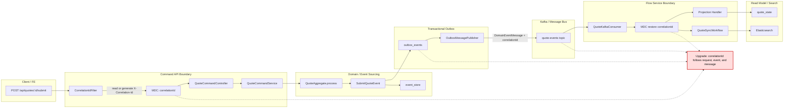

# Tech Note — Ngày 34: Observability với `correlationId` / `requestId`

> Chủ đề: Trace end-to-end `API -> event_store -> outbox -> consumer -> projection -> ES` trong kiến trúc Event Sourcing / CQRS.

---

## 1. DASHBOARD TIẾN ĐỘ

### Trạng thái tổng quan

| Hạng mục | Trạng thái |
|---|---|
| Giai đoạn | Event Sourcing / CQRS nâng cao |
| Ngày | 34 |
| Chủ đề | Observability / Correlation ID |
| Mục tiêu | Mỗi request/event có 1 mã trace xuyên suốt hệ thống |
| Trạng thái | ✅ Hoàn thành lớp trace cơ bản |
| Kết quả chính | Log có thể lần theo cùng `correlationId` từ API đến ES sync |

### ⚡ ĐIỂM DỪNG HIỆN TẠI

Code đang dừng tại trạng thái:

```text
HTTP Request
  -> CorrelationIdFilter tạo/nhận X-Correlation-Id
  -> MDC lưu correlationId cho log
  -> Command Service xử lý command
  -> EventStore append event
  -> OutboxEvent lưu correlation_id
  -> DomainEventMessage mang correlationId
  -> Consumer restore correlationId vào MDC
  -> Projection / Workflow / ES sync log cùng correlationId
```

Điểm đã nâng cấp:

```text
Trước đó:
  Log rời rạc, khó biết request nào sinh ra event/outbox/consumer nào.

Bây giờ:
  Dùng correlationId để trace toàn bộ lifecycle của một Quote command.
```

### 🎯 BƯỚC TIẾP THEO

**Ngày 35 — Production Debug Endpoints**

Mục tiêu ngày mai:

```text
Tạo các endpoint nội bộ để debug Quote end-to-end:
- event timeline
- outbox status
- processed messages
- quote_state
- ES document
- diagnostic summary
```

---

## 2. MÔ PHỎNG CÂY THƯ MỤC

```text
src/main/java/com/example/quoteservice
├── shared
│   ├── observability
│   │   ├── ObservabilityConstants.java          // [NEW] Tên header + MDC key: X-Correlation-Id
│   │   ├── CorrelationIdProvider.java           // [NEW] Interface lấy correlationId hiện tại
│   │   └── MdcCorrelationIdProvider.java        // [NEW] Lấy correlationId từ MDC
│   │
│   ├── web
│   │   └── CorrelationIdFilter.java             // [NEW] Nhận/tạo correlationId cho mỗi HTTP request
│   │
│   └── messaging
│       └── DomainEventMessage.java              // [REFACTOR] Thêm field correlationId
│
├── command
│   └── quote
│       └── infrastructure
│           ├── eventstore
│           │   └── JpaEventStore.java           // [REFACTOR] Log append event kèm correlationId
│           │
│           └── outbox
│               ├── OutboxEventEntity.java       // [REFACTOR] Thêm column correlationId
│               ├── OutboxEventStore.java        // [REFACTOR] Ghi correlationId vào outbox_events
│               └── OutboxMessagePublisher.java  // [REFACTOR] Publish message có correlationId
│
├── flow
│   └── quote
│       └── consumer
│           └── QuoteKafkaConsumer.java          // [REFACTOR] Restore correlationId vào MDC khi consume
│
└── resources
    └── db
        └── migration
            └── V5__add_correlation_id_to_outbox_events.sql
                                                // [NEW] DB migration thêm correlation_id
```

---

## 3. SƠ ĐỒ LUỒNG DỮ LIỆU



---

## 4. CHI TIẾT SỰ DỊCH CHUYỂN LOGIC

File tác động mạnh nhất: `OutboxEventStore.java`

### TRƯỚC ĐÓ

```java
@Component
public class OutboxEventStore {

    private final OutboxEventRepository outboxEventRepository;
    private final ObjectMapper objectMapper;

    public void save(DomainEvent event, long aggregateVersion) {
        OutboxEventEntity entity = new OutboxEventEntity();

        entity.setId(UUID.randomUUID().toString());
        entity.setAggregateId(event.aggregateId());
        entity.setAggregateType("Quote");
        entity.setEventType(event.getClass().getSimpleName());
        entity.setPayload(objectMapper.writeValueAsString(event));
        entity.setAggregateVersion(aggregateVersion);
        entity.setStatus(OutboxEventStatus.PENDING);
        entity.setCreatedAt(LocalDateTime.now());

        outboxEventRepository.save(entity);
    }
}
```

Vấn đề:

```text
Outbox row có event data nhưng không biết event này sinh ra từ request/API call nào.
Khi consumer lỗi, rất khó trace ngược về request ban đầu.
```

### BÂY GIỜ

```java
@Component
public class OutboxEventStore {

    private final OutboxEventRepository outboxEventRepository;
    private final ObjectMapper objectMapper;
    private final CorrelationIdProvider correlationIdProvider;

    public void save(DomainEvent event, long aggregateVersion) {
        OutboxEventEntity entity = new OutboxEventEntity();

        entity.setId(UUID.randomUUID().toString());
        entity.setAggregateId(event.aggregateId());
        entity.setAggregateType("Quote");
        entity.setEventType(event.getClass().getSimpleName());
        entity.setPayload(objectMapper.writeValueAsString(event));
        entity.setAggregateVersion(aggregateVersion);
        entity.setCorrelationId(correlationIdProvider.currentCorrelationId());
        entity.setStatus(OutboxEventStatus.PENDING);
        entity.setCreatedAt(LocalDateTime.now());

        outboxEventRepository.save(entity);
    }
}
```

Lý do đổi kiến trúc:

```text
Observability không phải business logic.
Nó là cross-cutting concern.

CorrelationId phải đi qua:
HTTP Header -> MDC -> EventStore Log -> Outbox Row -> Kafka Message -> Consumer MDC -> Projection/ES Log
```

Hiệu quả:

```text
Một lỗi ở ES sync có thể trace ngược về:
correlationId -> Kafka offset -> outbox row -> event_store row -> API request ban đầu
```

---

## 5. QUY LUẬT ĐỌC LẠI 30 GIÂY

Khi mở lại file này, đọc theo thứ tự:

```text
Giây 0-5:
  Nhìn DASHBOARD TIẾN ĐỘ
  -> biết hôm nay đang ở Ngày 34, chủ đề Observability.

Giây 5-10:
  Nhìn ⚡ ĐIỂM DỪNG HIỆN TẠI
  -> nhớ flow hiện tại dừng ở correlationId xuyên suốt API -> ES.

Giây 10-18:
  Nhìn SƠ ĐỒ MERMAID
  -> tìm ô 🔴 ĐIỂM THAY THẾ/NÂNG CẤP CHỐT YẾU.

Giây 18-25:
  Nhìn CÂY THƯ MỤC
  -> biết file nào mới, file nào refactor.

Giây 25-30:
  Nhìn 🎯 BƯỚC TIẾP THEO
  -> chuyển sang Ngày 35: Debug endpoints.
```

Ghi nhớ ngắn:

```text
Ngày 34 = thêm đường chỉ đỏ correlationId xuyên suốt hệ thống.
Không đổi business rule.
Không đổi aggregate.
Không đổi projection logic.
Chỉ tăng khả năng trace production.
```
