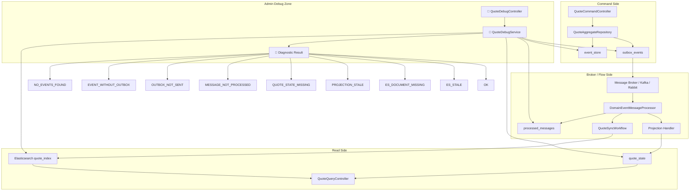

# Tech Note — Ngày 35: Production Debug Endpoints cho Quote Flow

> **Context:** Event Sourcing / CQRS / Event-driven Quote feature  
> **Mục tiêu 30 giây:** Nhìn được Quote đang “kẹt” ở tầng nào: `event_store` → `outbox` → `consumer` → `quote_state` → `Elasticsearch`.

---

## 1. DASHBOARD TIẾN ĐỘ

### Trạng thái tổng quan

| Hạng mục | Trạng thái |
|---|---|
| Command side | ✅ Đã có `event_store` + `outbox_events` |
| Flow side | ✅ Đã có consumer/projection/workflow |
| Query side | ✅ Đã có `quote_state` + ES document |
| Observability | ✅ Có `correlationId` xuyên flow |
| Debug production | ✅ Bổ sung endpoint soi từng tầng theo `quoteId` |
| Mức độ kiến trúc | 🟢 Sẵn sàng debug E2E bất đồng bộ |

### [⚡ ĐIỂM DỪNG HIỆN TẠI]

Code đang dừng tại lớp **Admin/Internal Debug API**:

```txt
GET /api/debug/quotes/{quoteId}/event-timeline
GET /api/debug/quotes/{quoteId}/outbox
GET /api/debug/quotes/{quoteId}/processed-messages
GET /api/debug/quotes/{quoteId}/state
GET /api/debug/quotes/{quoteId}/es-document
GET /api/debug/quotes/{quoteId}/diagnostic
```

Mục đích:

```txt
Không đoán lỗi bằng cảm giác.
Mở quoteId ra và xác định chính xác event đang kẹt ở tầng nào.
```

### [🎯 BƯỚC TIẾP THEO]

**Ngày 36 — Unit test Aggregate**

Trọng tâm ngày mai:

```txt
Test QuoteAggregate độc lập khỏi Spring/DB/Kafka/ES.
Kiểm tra:
- Command hợp lệ -> sinh Event
- Command sai trạng thái -> BusinessException
- Replay events -> state đúng
```

---

## 2. MÔ PHỎNG CÂY THƯ MỤC

```txt
src/main/java/com/example/quoteservice
├── admin
│   └── quote
│       └── api
│           ├── QuoteDebugController.java          // [NEW] Internal REST API để debug theo quoteId
│           ├── QuoteDebugService.java             // [NEW] Gom dữ liệu từ event_store/outbox/processed/state/ES
│           └── dto
│               ├── EventTimelineItem.java         // [NEW] 1 dòng timeline event theo version
│               ├── OutboxDebugItem.java           // [NEW] Trạng thái publish: PENDING/SENT/FAILED
│               ├── ProcessedMessageDebugItem.java // [NEW] Kiểm tra consumer đã xử lý message chưa
│               ├── QuoteStateDebugResponse.java   // [NEW] Snapshot read model trong quote_state
│               ├── EsDocumentDebugResponse.java   // [NEW] Snapshot document trên Elasticsearch
│               └── QuoteDiagnosticResponse.java   // [NEW] Kết luận quote đang lỗi ở tầng nào
│
├── command
│   └── quote
│       └── infrastructure
│           ├── eventstore
│           │   ├── EventStoreEntity.java           // [EXISTING] Source of truth event stream
│           │   └── EventStoreJpaRepository.java    // [USED BY DEBUG] Query timeline theo aggregateId
│           └── outbox
│               ├── OutboxEventEntity.java          // [EXISTING] Message chờ publish sang broker
│               └── OutboxEventRepository.java      // [USED BY DEBUG] Query outbox theo aggregateId
│
├── flow
│   └── quote
│       ├── consumer
│       │   └── DomainEventMessageProcessor.java    // [EXISTING] Xử lý event + mark processed
│       └── projection
│           └── handler                             // [EXISTING] Update quote_state
│
├── readmodel
│   └── quote
│       ├── state
│       │   ├── QuoteStateEntity.java               // [USED BY DEBUG] Read model SQL hiện tại
│       │   └── QuoteStateRepository.java           // [USED BY DEBUG] Query state theo quoteId
│       └── search
│           ├── QuoteDocument.java                  // [USED BY DEBUG] ES document
│           └── QuoteSearchRepository.java          // [USED BY DEBUG] Query ES theo quoteId
│
└── shared
    └── messaging
        └── dedup
            ├── ProcessedMessageEntity.java         // [EXISTING] Idempotency table
            └── ProcessedMessageRepository.java     // [USED BY DEBUG] Kiểm tra duplicate/processed
```

---

## 3. SƠ ĐỒ LUỒNG DỮ LIỆU



### [🔴 ĐIỂM THAY THẾ/NÂNG CẤP CHỐT YẾU]

```txt
Trước đây:
  Debug bằng log rời rạc + tự query DB thủ công.

Bây giờ:
  Có Diagnostic API gom toàn bộ pipeline theo quoteId.
```

---

## 4. CHI TIẾT SỰ DỊCH CHUYỂN LOGIC

### File bị tác động mạnh nhất

```txt
admin/quote/api/QuoteDebugService.java
```

### TRƯỚC ĐÓ

```java
// Debug phân tán, developer phải tự đi từng nơi:

// 1. Check event_store bằng SQL
select * from event_store where aggregate_id = :quoteId;

// 2. Check outbox bằng SQL
select * from outbox_events where aggregate_id = :quoteId;

// 3. Check processed message bằng SQL
select * from processed_messages where aggregate_id = :quoteId;

// 4. Check quote_state bằng SQL
select * from quote_state where id = :quoteId;

// 5. Check Elasticsearch bằng curl/Kibana
GET quote_index/_doc/{quoteId}

// Không có một nơi kết luận quote đang kẹt ở đâu.
```

### BÂY GIỜ

```java
@Service
public class QuoteDebugService {

    public QuoteDiagnosticResponse diagnose(String quoteId) {
        var timeline = getEventTimeline(quoteId);
        var outbox = getOutboxEvents(quoteId);
        var processed = getProcessedMessages(quoteId);
        var state = getQuoteState(quoteId);
        var esDocument = getEsDocument(quoteId);

        if (timeline.isEmpty()) {
            return QuoteDiagnosticResponse.noEventsFound(quoteId);
        }

        if (outbox.isEmpty()) {
            return QuoteDiagnosticResponse.eventWithoutOutbox(quoteId);
        }

        if (hasUnsentOutbox(outbox)) {
            return QuoteDiagnosticResponse.outboxNotSent(quoteId);
        }

        if (processed.isEmpty()) {
            return QuoteDiagnosticResponse.messageNotProcessed(quoteId);
        }

        if (state == null) {
            return QuoteDiagnosticResponse.quoteStateMissing(quoteId);
        }

        if (isProjectionStale(timeline, state)) {
            return QuoteDiagnosticResponse.projectionStale(quoteId);
        }

        if (esDocument == null) {
            return QuoteDiagnosticResponse.esDocumentMissing(quoteId);
        }

        if (isEsStale(state, esDocument)) {
            return QuoteDiagnosticResponse.esStale(quoteId);
        }

        return QuoteDiagnosticResponse.ok(quoteId);
    }
}
```

### Vì sao kiến trúc đổi?

```txt
Vì flow Event Sourcing/CQRS là async và nhiều tầng.

Nếu chỉ nhìn API response:
  Không biết event đã lưu chưa.
  Không biết outbox đã publish chưa.
  Không biết consumer đã xử lý chưa.
  Không biết projection có stale không.
  Không biết ES có stale không.

Debug endpoint biến pipeline bất đồng bộ thành một bảng chẩn đoán có thứ tự.
```

---

## 5. QUY LUẬT ĐỌC LẠI 30 GIÂY

Khi mở lại file này, đọc theo thứ tự:

```txt
1. Nhìn DASHBOARD TIẾN ĐỘ
   -> Biết hôm nay đã thêm "Production Debug Endpoints".

2. Nhìn [⚡ ĐIỂM DỪNG HIỆN TẠI]
   -> Nhớ code đang dừng ở QuoteDebugController/QuoteDebugService.

3. Nhìn Mermaid FLOW
   -> Xác định Debug Zone đang soi vào những tầng nào.

4. Nhìn cây thư mục
   -> Biết file mới nằm ở admin/quote/api và dto.

5. Nhìn TRƯỚC ĐÓ / BÂY GIỜ
   -> Nhớ lý do nâng cấp: từ debug thủ công sang diagnostic theo quoteId.

6. Nhìn [🎯 BƯỚC TIẾP THEO]
   -> Tiếp tục Ngày 36: Unit test Aggregate.
```

---

## 6. GHI NHỚ ENTERPRISE

```txt
Debug endpoint không phải business API.
Debug endpoint là Internal/Admin Observability API.

Production rule:
- Bảo vệ bằng role ADMIN/INTERNAL.
- Không expose public.
- Không trả payload nhạy cảm nếu không cần.
- Log theo correlationId.
- Dùng để giảm MTTR khi sự cố async pipeline.
```

---

## 7. ONE-LINE RECALL

```txt
Ngày 35 = thêm "kính soi X-Ray" cho Quote pipeline:
event_store -> outbox -> processed_messages -> quote_state -> Elasticsearch.
```
