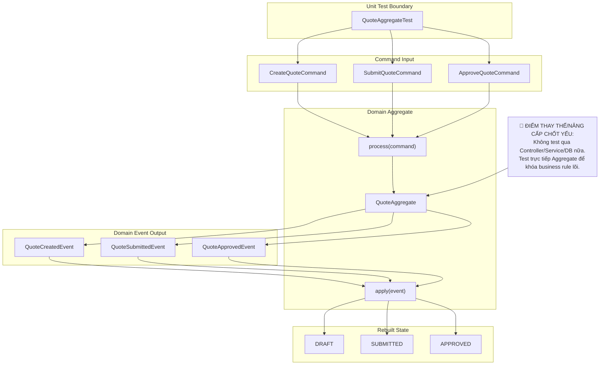

# Tech Note — Ngày 36: Unit Test Aggregate

> **Chủ đề:** Event Sourcing / CQRS nâng cao  
> **Bài học:** Unit test Aggregate — test rule `Create / Submit / Approve`, `process(command)` sinh event đúng, `apply(event)` rebuild state đúng.  
> **Mục tiêu ghi nhớ 30 giây:** Aggregate là nơi giữ business rule; test Aggregate không cần Spring, DB, Kafka, ES.

---

## 1. DASHBOARD TIẾN ĐỘ

### Trạng thái tổng quan

| Hạng mục | Trạng thái |
|---|---|
| Aggregate rule | ✅ Đã test |
| `process(command)` | ✅ Đã verify sinh đúng Domain Event |
| `apply(event)` | ✅ Đã verify rebuild state |
| Replay event history | ✅ Đã test |
| Spring / DB / Kafka | 🚫 Không dùng trong unit test |
| Read Model / Projection | ⏭️ Chưa test ở ngày này |

### ⚡ ĐIỂM DỪNG HIỆN TẠI

```text
Code đang dừng ở tầng Domain/Aggregate.

Đã có:
- QuoteAggregate.process(CreateQuoteCommand)  -> QuoteCreatedEvent
- QuoteAggregate.process(SubmitQuoteCommand) -> QuoteSubmittedEvent
- QuoteAggregate.process(ApproveQuoteCommand)-> QuoteApprovedEvent

Đã test:
- Command hợp lệ sinh event đúng
- Command sai trạng thái thì throw BusinessException
- apply(event) đổi state đúng
- Replay Created -> Submitted -> Approved rebuild ra trạng thái APPROVED
```

**Điểm chốt:**  
`QuoteAggregateTest` đang bảo vệ business rule lõi trước khi đi tiếp sang integration test.

### 🎯 BƯỚC TIẾP THEO

```text
Ngày 37 — Integration test EventStore + AggregateRepository

Mục tiêu:
- Test append event vào PostgreSQL event_store
- Test load/replay Aggregate từ event_store
- Test expectedVersion / optimistic locking
- Test create -> submit -> approve qua AggregateRepository thật
```

---

## 2. MÔ PHỎNG CÂY THƯ MỤC

```text
src
└── main
    └── java
        └── com.example.quoteservice
            ├── domain
            │   └── quote
            │       ├── aggregate
            │       │   └── QuoteAggregate.java
            │       │       // Core Domain Model: giữ state + business rule + process/apply
            │       │
            │       ├── command
            │       │   ├── CreateQuoteCommand.java
            │       │   │   // Input nghiệp vụ cho action Create
            │       │   ├── SubmitQuoteCommand.java
            │       │   │   // Input nghiệp vụ cho action Submit
            │       │   └── ApproveQuoteCommand.java
            │       │       // Input nghiệp vụ cho action Approve
            │       │
            │       ├── event
            │       │   ├── QuoteCreatedEvent.java
            │       │   │   // Fact đã xảy ra: Quote được tạo
            │       │   ├── QuoteSubmittedEvent.java
            │       │   │   // Fact đã xảy ra: Quote được submit
            │       │   └── QuoteApprovedEvent.java
            │       │       // Fact đã xảy ra: Quote được approve
            │       │
            │       └── model
            │           └── QuoteStatus.java
            │               // Enum state: DRAFT / SUBMITTED / APPROVED
            │
            └── shared
                └── exception
                    └── BusinessException.java
                        // Exception khi command vi phạm business rule

src
└── test
    └── java
        └── com.example.quoteservice
            └── domain
                └── quote
                    └── aggregate
                        └── QuoteAggregateTest.java
                            // [NEW] Unit test thuần cho Aggregate, không Spring/DB/Kafka
```

---

## 3. SƠ ĐỒ LUỒNG DỮ LIỆU — FLOW



---

## 4. CHI TIẾT SỰ DỊCH CHUYỂN LOGIC

### File tác động mạnh nhất

```text
QuoteAggregateTest.java
```

### TRƯỚC ĐÓ — test dễ lệ thuộc tầng ngoài

```java
// TRƯỚC ĐÓ: tư duy test qua Service/Controller
@SpringBootTest
class QuoteServiceTest {

    @Autowired
    private QuoteCommandService quoteCommandService;

    @Test
    void submitQuote_shouldBecomeSubmitted() {
        QuoteCommandResponse created = quoteCommandService.create(request);

        QuoteCommandResponse submitted =
                quoteCommandService.submit(created.getQuoteId());

        assertThat(submitted.getStatus()).isEqualTo("SUBMITTED");
    }
}
```

Vấn đề:

```text
- Test bị kéo theo Spring Context
- Có thể phụ thuộc DB / Repository / Mapper
- Khó biết lỗi nằm ở business rule hay infrastructure
- Chạy chậm, feedback loop dài
```

### BÂY GIỜ — test trực tiếp Aggregate

```java
// BÂY GIỜ: test Domain/Aggregate thuần
class QuoteAggregateTest {

    @Test
    void processSubmit_whenQuoteIsDraft_shouldReturnQuoteSubmittedEvent() {
        QuoteAggregate aggregate = new QuoteAggregate();

        aggregate.apply(new QuoteCreatedEvent(
                "Q1",
                "Nguyen Van A",
                "MOTOR",
                BigDecimal.valueOf(1200000),
                "u100",
                "Creator User",
                "tenant-a",
                "org-hcm"
        ));

        QuoteSubmittedEvent event = aggregate.process(new SubmitQuoteCommand(
                "Q1",
                "u200",
                "Submit User",
                "tenant-a",
                "org-hcm"
        ));

        assertThat(event.getQuoteId()).isEqualTo("Q1");
        assertThat(event.getSubmittedBy()).isEqualTo("u200");
    }

    @Test
    void replayEvents_shouldRebuildApprovedState() {
        QuoteAggregate aggregate = new QuoteAggregate();

        aggregate.apply(createdEvent());
        aggregate.apply(submittedEvent());
        aggregate.apply(approvedEvent());

        assertThat(aggregate.getStatus()).isEqualTo(QuoteStatus.APPROVED);
    }
}
```

Lý do kiến trúc đổi:

```text
Aggregate là Enterprise Boundary của business rule.
Unit test Aggregate giúp kiểm tra rule mà không cần Spring, DB, Kafka, Elasticsearch.
```

Quy tắc mới:

```text
process(command):
  - Validate business rule
  - Sinh Domain Event
  - Không mutate state trực tiếp nếu theo style Event Sourcing nghiêm ngặt

apply(event):
  - Mutate state
  - Dùng cho replay
  - Không chứa business validation phức tạp
```

---

## 5. QUY LUẬT ĐỌC LẠI 30 GIÂY

Khi mở lại note này, đọc theo thứ tự:

```text
1. Nhìn DASHBOARD TIẾN ĐỘ
   -> Biết hôm nay đã test Aggregate, chưa đụng DB/Kafka.

2. Nhìn ⚡ ĐIỂM DỪNG HIỆN TẠI
   -> Nhớ code đang dừng ở Domain layer.

3. Nhìn FLOW Mermaid
   -> Khôi phục luồng: Test -> Command -> process -> Event -> apply -> State.

4. Nhìn CHI TIẾT SỰ DỊCH CHUYỂN LOGIC
   -> Nhớ vì sao bỏ test Service trước, chuyển về test Aggregate thuần.

5. Nhìn 🎯 BƯỚC TIẾP THEO
   -> Ngày mai chuyển sang Integration Test EventStore + AggregateRepository.
```

### Câu khóa cần nhớ

```text
Ngày 36 không chứng minh hệ thống chạy end-to-end.
Ngày 36 chứng minh business rule trong Aggregate là đúng.
```

### Mental model

```text
Controller/Service test:
  kiểm tra luồng app

Aggregate unit test:
  kiểm tra luật nghiệp vụ lõi

EventStore integration test:
  kiểm tra lưu/replay event thật
```
