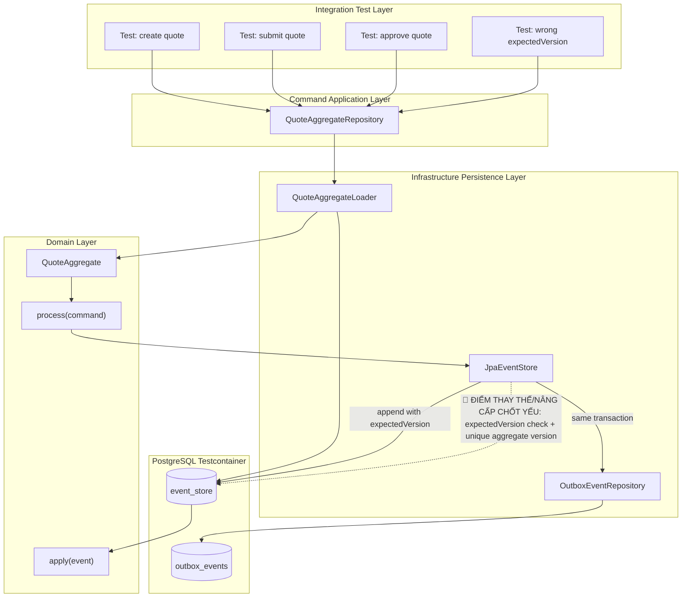

# Tech Note — Ngày 37: Integration Test EventStore + AggregateRepository

> **Chủ đề:** Event Sourcing / CQRS nâng cao  
> **Bài học:** Integration test `EventStore + AggregateRepository`  
> **Trọng tâm:** `create / submit / approve` ghi `event_store` đúng version, `expectedVersion` conflict hoạt động.

---

## 1. DASHBOARD TIẾN ĐỘ

### Tổng quan trạng thái

| Hạng mục | Trạng thái |
|---|---|
| Event Store PostgreSQL | ✅ Đã có |
| Aggregate replay từ event history | ✅ Đã có |
| `QuoteAggregateRepository.create()` | ✅ Đã test |
| `QuoteAggregateRepository.update()` | ✅ Đã test |
| Version tăng tuần tự `v1 -> v2 -> v3` | ✅ Đã test |
| Optimistic Lock bằng `expectedVersion` | ✅ Đã test |
| Outbox đi kèm event append | ✅ Đã kiểm tra cơ bản |
| Kafka / CDC thật | ⏳ Chưa ở ngày này |

---

### ⚡ ĐIỂM DỪNG HIỆN TẠI

Code đang dừng ở tầng **Command-side Persistence Integration**:

```text
Command
  -> QuoteAggregateRepository
  -> load event history
  -> replay QuoteAggregate
  -> process(command)
  -> append event_store với expectedVersion
  -> save outbox_events
```

Trạng thái kiến trúc hiện tại:

```text
AggregateRepository không còn là mock/in-memory.
Nó đã được test với PostgreSQL thật qua Testcontainers.
```

Điểm đã xác nhận:

```text
CreateQuoteCommand   -> QuoteCreatedEvent   -> version 1
SubmitQuoteCommand   -> QuoteSubmittedEvent -> version 2
ApproveQuoteCommand  -> QuoteApprovedEvent  -> version 3
Wrong expectedVersion -> ConcurrencyException
```

---

### 🎯 BƯỚC TIẾP THEO

**Ngày 38 — Integration test Outbox + Consumer + Projection**

Mục tiêu tiếp theo:

```text
event_store + outbox_events đã ghi đúng
  -> publish/consume event
  -> projection update quote_state
  -> processed_messages chống duplicate
```

Trọng tâm ngày mai:

```text
Không chỉ kiểm tra event được lưu.
Phải kiểm tra event được xử lý thành read model.
```

---

## 2. MÔ PHỎNG CÂY THƯ MỤC

```text
src/main/java/com/example/quoteservice
├── domain/
│   └── quote/
│       ├── aggregate/
│       │   └── QuoteAggregate.java
│       │       // Aggregate xử lý command và apply event
│       ├── command/
│       │   ├── CreateQuoteCommand.java
│       │   ├── SubmitQuoteCommand.java
│       │   └── ApproveQuoteCommand.java
│       │       // Command input cho Aggregate
│       └── event/
│           ├── QuoteCreatedEvent.java
│           ├── QuoteSubmittedEvent.java
│           └── QuoteApprovedEvent.java
│               // Domain events được append vào event_store
│
├── command/
│   └── quote/
│       ├── application/
│       │   └── repository/
│       │       └── QuoteAggregateRepository.java
│       │           // [REFACTOR] Abstraction che giấu load/replay/append
│       │
│       └── infrastructure/
│           └── eventsource/
│               ├── EventSourcedQuoteAggregateRepository.java
│               │   // [CHỐT YẾU] Repository thật: load events -> replay -> process -> append
│               ├── QuoteAggregateLoader.java
│               │   // Load event history và rebuild Aggregate
│               ├── LoadedAggregate.java
│               │   // [MỚI] Gói Aggregate + currentVersion
│               ├── EventAppendResult.java
│               │   // [MỚI] Kết quả append event: oldVersion/newVersion/event
│               └── ConcurrencyException.java
│                   // [MỚI] Lỗi expectedVersion conflict
│
├── shared/
│   └── eventstore/
│       ├── EventStore.java
│       │   // Contract append/read event
│       ├── JpaEventStore.java
│       │   // [REFACTOR] Append event có expectedVersion
│       └── EventStoreRecord.java
│           // Record lưu trong event_store
│
└── command/
    └── quote/
        └── infrastructure/
            └── outbox/
                ├── OutboxEventEntity.java
                └── OutboxEventRepository.java
                    // Ghi message chờ publish sau khi event append

src/test/java/com/example/quoteservice
└── command/
    └── quote/
        └── infrastructure/
            └── eventsource/
                └── EventSourcedQuoteAggregateRepositoryIntegrationTest.java
                    // [MỚI] Test create/submit/approve + expectedVersion conflict
```

---

## 3. SƠ ĐỒ LUỒNG DỮ LIỆU



---

## 4. CHI TIẾT SỰ DỊCH CHUYỂN LOGIC

### TRƯỚC ĐÓ — Event append còn đơn giản

```java
// TRƯỚC ĐÓ
public void handle(SubmitQuoteCommand command) {
    QuoteAggregate aggregate = loader.load(command.quoteId());

    DomainEvent event = aggregate.process(command);

    eventStore.append(
        command.quoteId(),
        event
    );

    outboxStore.save(event);
}
```

Vấn đề:

```text
Không kiểm soát version hiện tại.
Hai request đồng thời có thể cùng đọc version cũ và append sai thứ tự.
Test chưa chứng minh được conflict.
```

---

### BÂY GIỜ — AggregateRepository append bằng expectedVersion

```java
// BÂY GIỜ
public AggregateCommandResult<QuoteAggregate> update(
        String aggregateId,
        QuoteCommand command
) {
    LoadedAggregate<QuoteAggregate> loaded =
            quoteAggregateLoader.loadWithVersion(aggregateId);

    QuoteAggregate aggregate = loaded.aggregate();
    long expectedVersion = loaded.version();

    DomainEvent event = aggregate.process(command);

    EventAppendResult appendResult =
            eventStore.append(
                    aggregateId,
                    event,
                    expectedVersion
            );

    aggregate.apply(event);

    return AggregateCommandResult.from(
            aggregateId,
            aggregate,
            appendResult
    );
}
```

Nâng cấp cốt lõi:

```text
expectedVersion = version aggregate tại thời điểm load.
Append chỉ thành công nếu DB vẫn đang ở version đó.
Nếu có request khác ghi trước -> ConcurrencyException.
```

---

### Lý do kiến trúc đổi

```text
Enterprise Event Sourcing cần bảo vệ tính nhất quán của Aggregate.

Không thể chỉ append event.
Phải append event với điều kiện:
  "Tôi đang ghi lên đúng version tôi vừa đọc."

Đây là optimistic locking cho event stream.
```

---

## 5. QUY LUẬT ĐỌC LẠI 30 GIÂY

Khi mở lại note này, đọc theo thứ tự:

```text
1. Nhìn DASHBOARD TIẾN ĐỘ
   -> Biết ngày này đã test xong tầng nào.

2. Nhìn ⚡ ĐIỂM DỪNG HIỆN TẠI
   -> Khôi phục ngay code đang dừng ở flow nào.

3. Nhìn Mermaid Flow
   -> Nhớ đường đi: Test -> Repository -> Loader -> Aggregate -> EventStore -> DB.

4. Nhìn 🔴 ĐIỂM THAY THẾ/NÂNG CẤP CHỐT YẾU
   -> Nhớ bài học chính: expectedVersion + optimistic locking.

5. Nhìn code TRƯỚC ĐÓ / BÂY GIỜ
   -> Nhớ chính xác file bị tác động mạnh nhất:
      EventSourcedQuoteAggregateRepository + JpaEventStore.

6. Nhìn 🎯 BƯỚC TIẾP THEO
   -> Biết ngày sau phải chuyển sang Outbox + Consumer + Projection.
```

---

## Tóm tắt 1 dòng

```text
Ngày 37 biến AggregateRepository từ ý tưởng event sourcing thành persistence integration thật: replay Aggregate, append event đúng version, và bắt được conflict bằng expectedVersion.
```
