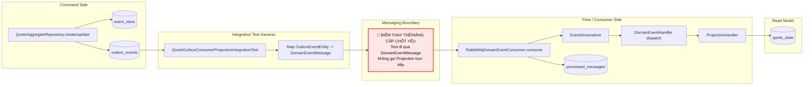

# Tech Note — Ngày 38: Integration Test Outbox + Consumer + Projection

> **Chủ đề:** `submit quote -> outbox message -> consumer xử lý -> quote_state cập nhật đúng version`  
> **Style:** Kiến trúc động — đọc lại trong 30 giây để khôi phục context.

---

## 1. DASHBOARD TIẾN ĐỘ

| Hạng mục | Trạng thái |
|---|---|
| Event Store | ✅ Đã append event theo aggregate version |
| Outbox | ✅ Đã sinh message từ event đã commit |
| Consumer | ✅ Đã xử lý `DomainEventMessage` qua consumer layer |
| Projection | ✅ Đã update `quote_state` đúng version |
| Idempotency | ✅ Đã test consume trùng message không làm sai state |
| Kafka thật | ⏳ Chưa — hiện vẫn gọi consumer trực tiếp trong integration test |
| CDC thật | ⏳ Chưa — hiện vẫn dùng outbox table, chưa Debezium |

### ⚡ ĐIỂM DỪNG HIỆN TẠI

```txt
Đang dừng tại tầng Flow Integration Test.

Command side đã tạo:
  event_store
  outbox_events

Test lấy outbox message:
  outbox_events -> DomainEventMessage

Sau đó gọi consumer:
  RabbitMqDomainEventConsumer.consume(message)
    -> deserialize payload
    -> dispatch handler
    -> projection update quote_state
    -> mark processed_messages

Kết quả cần đúng:
  quote_state.status = SUBMITTED
  quote_state.last_projected_version = 2
```

### 🎯 BƯỚC TIẾP THEO

```txt
Ngày 39 — Integration test Elasticsearch

Mục tiêu:
  quote_state đúng
    -> sync Elasticsearch
    -> search/list/detail đọc được trạng thái mới
```

---

## 2. MÔ PHỎNG CÂY THƯ MỤC

```txt
src
└── test
    └── java
        └── com.example.quoteservice
            └── integration
                └── flow
                    └── QuoteOutboxConsumerProjectionIntegrationTest.java   // [NEW] Test luồng outbox -> consumer -> projection

src
└── main
    └── java
        └── com.example.quoteservice
            ├── command
            │   └── quote
            │       └── infrastructure
            │           └── outbox
            │               ├── OutboxEventEntity.java                      // [EXISTING] Lưu message chờ publish
            │               └── OutboxEventRepository.java                  // [EXISTING] Query outbox message theo aggregate
            │
            ├── flow
            │   └── quote
            │       ├── consumer
            │       │   └── RabbitMqDomainEventConsumer.java                // [REUSE] Consumer entrypoint, test gọi trực tiếp
            │       └── projection
            │           └── handler
            │               ├── QuoteCreatedProjectionHandler.java          // [EXISTING] Tạo quote_state DRAFT version 1
            │               └── QuoteSubmittedProjectionHandler.java        // [EXISTING] Update quote_state SUBMITTED version 2
            │
            ├── readmodel
            │   └── quote
            │       └── state
            │           ├── QuoteStateEntity.java                           // [EXISTING] Read model phục vụ Query API
            │           └── QuoteStateRepository.java                       // [EXISTING] Assert projection result
            │
            └── shared
                └── messaging
                    ├── DomainEventMessage.java                             // [EXISTING] Envelope truyền qua messaging boundary
                    └── dedup
                        ├── ProcessedMessageEntity.java                     // [EXISTING] Idempotency guard
                        └── ProcessedMessageRepository.java                 // [EXISTING] Assert consume trùng không xử lý lại
```

---

## 3. SƠ ĐỒ LUỒNG DỮ LIỆU



---

## 4. CHI TIẾT SỰ DỊCH CHUYỂN LOGIC

### File tác động mạnh nhất

```txt
QuoteOutboxConsumerProjectionIntegrationTest.java
```

### TRƯỚC ĐÓ — test projection còn quá gần handler

```java
// TRƯỚC ĐÓ
// Test có xu hướng gọi trực tiếp projection handler/service.
// Luồng messaging boundary chưa được kiểm chứng.

@Test
void submitQuote_shouldUpdateProjection_directly() {
    QuoteSubmittedEvent event = new QuoteSubmittedEvent(
            quoteId,
            "u200",
            "Submit User"
    );

    projectionHandler.handle(
            new DomainEventEnvelope<>(
                    "message-001",
                    event,
                    2L
            )
    );

    QuoteStateEntity state = quoteStateRepository.findById(quoteId).orElseThrow();

    assertThat(state.getStatus()).isEqualTo(QuoteStatus.SUBMITTED);
    assertThat(state.getLastProjectedVersion()).isEqualTo(2L);
}
```

### BÂY GIỜ — test đi qua outbox message + consumer

```java
// BÂY GIỜ
// Test kiểm chứng đúng boundary:
// outbox_events -> DomainEventMessage -> Consumer -> Projection -> quote_state

@Test
void consumeSubmittedOutboxMessage_shouldUpdateQuoteStateVersion2() {
    // 1. Command side đã tạo event_store + outbox_events
    quoteAggregateRepository.create(createCommand());
    quoteAggregateRepository.update(quoteId, submitCommand(quoteId));

    // 2. Lấy outbox message thật từ DB
    OutboxEventEntity outboxEvent =
            outboxEventRepository
                    .findByAggregateIdOrderByCreatedAtAsc(quoteId)
                    .get(1);

    // 3. Convert row outbox thành message envelope
    DomainEventMessage message = toMessage(outboxEvent);

    // 4. Đi qua consumer layer
    rabbitMqDomainEventConsumer.consume(message);

    // 5. Assert read model
    QuoteStateEntity state = quoteStateRepository.findById(quoteId).orElseThrow();

    assertThat(state.getStatus()).isEqualTo(QuoteStatus.SUBMITTED);
    assertThat(state.getLastProjectedVersion()).isEqualTo(2L);

    // 6. Assert idempotency
    assertThat(processedMessageRepository.existsById(message.getEventId()))
            .isTrue();
}
```

### Vì sao kiến trúc đổi?

```txt
Lý do chính:
  Projection không nên được tin chỉ vì handler chạy đúng.
  Cần chứng minh toàn bộ message boundary chạy đúng.

Trước đó:
  Test gần business handler.

Bây giờ:
  Test gần production flow hơn:
    outbox -> message envelope -> consumer -> projection -> read model.

Giá trị Enterprise:
  - Kiểm chứng contract của DomainEventMessage
  - Kiểm chứng deserialize/dispatch
  - Kiểm chứng versioning projection
  - Kiểm chứng idempotency bằng processed_messages
  - Chuẩn bị thay Rabbit/direct call bằng Kafka thật ở các ngày sau
```

---

## 5. QUY LUẬT ĐỌC LẠI 30 GIÂY

```txt
Mở file này lên, đọc theo thứ tự:

1. Nhìn DASHBOARD TIẾN ĐỘ
   -> Biết bài này đã hoàn thành tầng nào, còn thiếu Kafka/CDC gì.

2. Nhìn ⚡ ĐIỂM DỪNG HIỆN TẠI
   -> Khôi phục ngay code đang dừng ở flow:
      outbox_events -> consumer -> quote_state.

3. Nhìn Mermaid FLOW
   -> Tìm node màu đỏ:
      "Test đi qua DomainEventMessage, không gọi Projection trực tiếp".

4. Nhìn cây thư mục
   -> Biết mở file nào trước:
      QuoteOutboxConsumerProjectionIntegrationTest.java

5. Nhìn phần TRƯỚC ĐÓ / BÂY GIỜ
   -> Nắm sự dịch chuyển logic:
      từ test handler trực tiếp
      sang test messaging boundary.

6. Nhìn 🎯 BƯỚC TIẾP THEO
   -> Đi tiếp Ngày 39:
      quote_state -> Elasticsearch integration test.
```

---

## Ghi nhớ cuối ngày

```txt
Ngày 38 không phải học thêm business rule Quote.
Ngày 38 là nâng độ tin cậy kiến trúc.

Từ hôm nay, projection không chỉ được test riêng lẻ.
Projection được test như một phần của message-driven flow.
```
