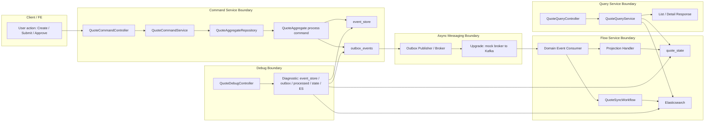

# Tech Note — Ngày 40: E2E + Bug Runbook cho Quote Flow

> **Chủ đề:** Event Sourcing / CQRS / Event-driven Debugging  
> **Mục tiêu đọc lại:** Khôi phục ngữ cảnh trong **30 giây**: flow đang chạy tới đâu, test chứng minh gì, bug đứt tầng nào thì debug ở đâu.

---

## 1. DASHBOARD TIẾN ĐỘ

### Trạng thái tổng quan

```text
✅ Đã hoàn thành nhánh core Quote E2E:
Create -> Submit -> Approve
-> EventStore
-> Outbox
-> Consumer
-> Projection quote_state
-> Elasticsearch
-> Query List/Detail
-> Debug Runbook
```

### [⚡ ĐIỂM DỪNG HIỆN TẠI]

```text
Code đang dừng ở trạng thái:

1. Command API đã ghi được event vào event_store.
2. Outbox đã có event tương ứng để publish.
3. Consumer/Flow xử lý event và update read model.
4. quote_state phản ánh trạng thái mới nhất.
5. Elasticsearch có document phục vụ search/list.
6. Query API đọc từ read model / ES, không đọc Aggregate.
7. Đã có E2E test kiểm tra toàn bộ pipeline.
8. Đã có Bug Runbook để debug khi flow đứt ở từng tầng.
```

**Điểm quan trọng nhất của Ngày 40:**

```text
Command API success chưa đủ.
Màn hình đúng chỉ khi event đi hết pipeline:
event_store -> outbox -> consumer -> projection -> ES -> query.
```

### [🎯 BƯỚC TIẾP THEO]

```text
Ngày 41 — Dựng Kafka local bằng Docker Compose
+ hiểu topic / partition / offset / consumer group.

Mục tiêu:
RabbitMQ/mock broker -> Kafka thật.
```

---

## 2. MÔ PHỎNG CÂY THƯ MỤC

```text
quote-service/
├── command/
│   └── quote/
│       ├── api/
│       │   └── QuoteCommandController.java          // Command API: create/submit/approve
│       ├── application/
│       │   ├── QuoteCommandService.java             // Orchestrate command -> aggregate repository
│       │   └── repository/
│       │       └── QuoteAggregateRepository.java    // Abstraction load/replay/process/append
│       └── infrastructure/
│           ├── eventsource/
│           │   └── EventSourcedQuoteAggregateRepository.java // Event-sourced implementation
│           ├── eventstore/
│           │   ├── EventStoreEntity.java            // DB row cho event_store
│           │   └── EventStoreRepository.java        // Query event timeline
│           └── outbox/
│               ├── OutboxEventEntity.java           // Outbox row chờ publish
│               ├── OutboxEventRepository.java       // Debug/publish outbox
│               └── OutboxMessagePublisher.java      // [REFACTORED] publish event async
│
├── domain/
│   └── quote/
│       ├── aggregate/
│       │   └── QuoteAggregate.java                  // Aggregate: process(command), apply(event)
│       ├── command/
│       │   ├── CreateQuoteCommand.java
│       │   ├── SubmitQuoteCommand.java
│       │   └── ApproveQuoteCommand.java
│       └── event/
│           ├── QuoteCreatedEvent.java
│           ├── QuoteSubmittedEvent.java
│           └── QuoteApprovedEvent.java
│
├── flow/
│   └── quote/
│       ├── consumer/
│       │   └── QuoteDomainEventConsumer.java        // Consumer xử lý event async
│       ├── projection/
│       │   └── QuoteProjectionHandler.java          // Update quote_state
│       └── workflow/
│           └── QuoteSyncWorkflow.java               // Sync ES / notification / side effects
│
├── query/
│   └── quote/
│       ├── api/
│       │   └── QuoteQueryController.java            // Query API: list/detail
│       └── application/
│           └── QuoteQueryService.java               // Read quote_state / Elasticsearch
│
├── readmodel/
│   └── quote/
│       ├── state/
│       │   ├── QuoteStateEntity.java                // Projection table quote_state
│       │   └── QuoteStateRepository.java
│       └── search/
│           ├── QuoteDocument.java                   // Elasticsearch document
│           └── QuoteSearchRepository.java           // Search/List
│
├── admin/
│   └── quote/
│       └── api/
│           └── QuoteDebugController.java            // Debug endpoints: timeline/outbox/state/ES/diagnostic
│
├── src/test/
│   └── java/
│       └── quote/
│           └── QuoteE2ETest.java                    // [NEW] E2E Create->Submit->Approve full pipeline
│
└── docs/
    └── runbook/
        └── quote-e2e-debug-runbook.md               // [NEW] Checklist debug từng tầng
```

---

## 3. SƠ ĐỒ LUỒNG DỮ LIỆU — FLOW



---

## 4. CHI TIẾT SỰ DỊCH CHUYỂN LOGIC

### File bị tác động mạnh nhất

```text
src/test/java/.../QuoteE2ETest.java
```

### TRƯỚC ĐÓ — Test từng tầng rời rạc

```java
// TRƯỚC ĐÓ: test từng phần, chưa chứng minh full pipeline

@Test
void submit_shouldAppendEvent() {
    quoteAggregateRepository.update(quoteId, submitCommand);

    assertThat(eventStoreRepository.findByAggregateId(quoteId))
            .extracting(EventStoreEntity::getEventType)
            .contains("QuoteSubmittedEvent");
}

@Test
void consumeSubmittedEvent_shouldUpdateProjection() {
    DomainEventMessage message = buildSubmittedMessage();

    consumer.consume(message);

    QuoteStateEntity state = quoteStateRepository.findById(quoteId).orElseThrow();
    assertThat(state.getStatus()).isEqualTo(SUBMITTED);
}
```

### BÂY GIỜ — E2E test đi qua toàn bộ pipeline

```java
// BÂY GIỜ: test theo hành vi thật của hệ thống

@Test
void quoteFullFlow_shouldCreateSubmitApproveAndBeQueryable() {
    String quoteId = createQuoteViaCommandApi();

    consumeOutboxUntilProjected(quoteId, 1);
    assertDetailStatus(quoteId, "DRAFT");
    assertListContainsStatus(quoteId, "DRAFT");

    submitQuoteViaCommandApi(quoteId);

    consumeOutboxUntilProjected(quoteId, 2);
    assertDetailStatus(quoteId, "SUBMITTED");
    assertListContainsStatus(quoteId, "SUBMITTED");

    approveQuoteViaCommandApi(quoteId);

    consumeOutboxUntilProjected(quoteId, 3);
    assertDetailStatus(quoteId, "APPROVED");
    assertListContainsStatus(quoteId, "APPROVED");

    assertEventTimeline(quoteId, "QuoteCreatedEvent", "QuoteSubmittedEvent", "QuoteApprovedEvent");
    assertDiagnosticOk(quoteId);
}
```

### Lý do kiến trúc đổi

```text
Trước đó:
  Test chứng minh từng class chạy đúng.

Bây giờ:
  Test chứng minh toàn bộ business flow chạy đúng qua nhiều boundary.

Lý do:
  Trong Event Sourcing / CQRS, bug thường không nằm ở 1 class.
  Bug thường nằm ở điểm nối giữa:
  command -> event -> outbox -> consumer -> projection -> ES -> query.
```

---

## 5. BUG RUNBOOK — CHECKLIST DEBUG NHANH

```text
1. API lỗi?
   -> Check HTTP status, response body, correlationId.

2. Command chạy nhưng không có event?
   -> Check event_store by aggregate_id.

3. Có event nhưng không có outbox?
   -> Check transaction append event + insert outbox.

4. Outbox còn PENDING?
   -> Publisher/broker lỗi.

5. Outbox SENT nhưng read model không đổi?
   -> Consumer chưa chạy / message chưa processed / DLQ.

6. processed_messages có row nhưng quote_state stale?
   -> Projection handler/version check lỗi.

7. quote_state đúng nhưng ES sai?
   -> Workflow/ES sync/alias/index lỗi.

8. ES đúng nhưng List/Detail sai?
   -> Query API/filter/mapper lỗi.
```

---

## 6. QUY LUẬT ĐỌC LẠI 30 GIÂY

Khi mở lại file này, đọc theo thứ tự:

```text
Bước 1 — Nhìn DASHBOARD
  -> Biết hôm nay đã xong gì, đang dừng ở đâu, ngày mai làm gì.

Bước 2 — Nhìn FLOW Mermaid
  -> Khôi phục luồng Create -> Submit -> Approve -> Projection -> ES -> Query.

Bước 3 — Nhìn điểm 🔴
  -> Nhớ phần sẽ nâng cấp tiếp theo: broker/mock/Rabbit -> Kafka thật.

Bước 4 — Nhìn TREE
  -> Biết file nào mới/refactor, mở đúng file khi quay lại code.

Bước 5 — Nhìn TRƯỚC ĐÓ / BÂY GIỜ
  -> Nhớ sự dịch chuyển từ unit/integration rời rạc sang E2E pipeline test.

Bước 6 — Nhìn BUG RUNBOOK
  -> Khi flow đứt, debug theo tầng; không đoán mò.
```

---

## 7. CÂU CHỐT NGÀY 40

```text
E2E trong CQRS/Event Sourcing không chỉ test API.
E2E phải chứng minh event đi hết pipeline:
Command -> EventStore -> Outbox -> Consumer -> Projection -> ES -> Query.
```
