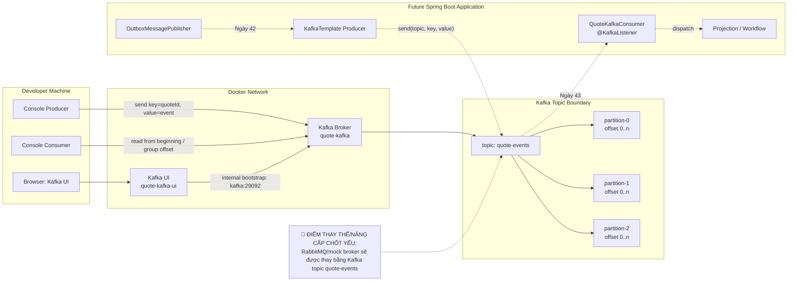

# Tech Note — Ngày 41: Kafka Local bằng Docker Compose

> Vai trò note: **Kiến trúc động** — lưu lại trạng thái hiện tại của roadmap Event Sourcing / CQRS trước khi chuyển từ RabbitMQ/mock broker sang Kafka thật.

---

## 1. DASHBOARD TIẾN ĐỘ

| Hạng mục | Trạng thái |
|---|---|
| Roadmap | Event Sourcing / CQRS nâng cao |
| Ngày học | **Ngày 41** |
| Chủ đề | Dựng Kafka local + hiểu `topic` / `partition` / `offset` / `consumer group` |
| Mức độ hoàn thành | ✅ Hoàn thành nền tảng Kafka local |
| Code business bị đổi | ❌ Chưa đổi Java business code |
| Infrastructure mới | ✅ `docker-compose.kafka.yml` |
| Topic chính | `quote-events` |
| Kafka UI | `http://localhost:8085` |
| Kafka broker cho app local | `localhost:9092` |
| Kafka broker cho container nội bộ | `kafka:29092` |

### ⚡ ĐIỂM DỪNG HIỆN TẠI

```txt
Hiện tại hệ thống mới dừng ở tầng INFRASTRUCTURE.

Đã có:
  - Kafka broker chạy local bằng Docker Compose
  - Kafka UI để quan sát broker/topic/message/consumer group
  - Topic quote-events
  - Console producer gửi message vào topic
  - Console consumer đọc message từ topic
  - Hiểu message key = quoteId / aggregateId

Chưa có:
  - Spring Kafka Producer
  - Spring Kafka Consumer
  - KafkaTemplate
  - @KafkaListener
  - Retry/DLT
  - CDC/Debezium
```

### 🎯 BƯỚC TIẾP THEO

```txt
Ngày 42:
  Thay RabbitMQ/OutboxPublisher bằng Spring Kafka Producer

Mục tiêu:
  OutboxPublisher
    -> KafkaTemplate.send("quote-events", aggregateId, DomainEventMessage)

Business rule không đổi.
Chỉ thay transport từ RabbitMQ/mock sang Kafka thật.
```

---

## 2. MÔ PHỎNG CÂY THƯ MỤC

```txt
quote-service/
├── docker-compose.kafka.yml                  # [NEW] Kafka local stack: kafka + kafka-ui
│
├── src/
│   └── main/
│       ├── java/
│       │   └── com/example/quoteservice/
│       │       ├── command/
│       │       │   └── quote/
│       │       │       └── infrastructure/
│       │       │           └── outbox/
│       │       │               └── OutboxMessagePublisher.java
│       │       │                   # [UNCHANGED] Vẫn chưa publish Kafka bằng code Java
│       │       │
│       │       ├── flow/
│       │       │   └── quote/
│       │       │       └── consumer/
│       │       │           └── RabbitMqDomainEventConsumer.java
│       │       │               # [UNCHANGED] Consumer cũ vẫn chưa thay bằng @KafkaListener
│       │       │
│       │       └── shared/
│       │           └── messaging/
│       │               └── DomainEventMessage.java
│       │                   # [UNCHANGED] Sau này sẽ là Kafka message value
│       │
│       └── resources/
│           └── application.yml
│               # [UNCHANGED] Chưa thêm spring.kafka.*
│
└── docs/
    └── architecture/
        └── kafka-local-day41.md              # [NEW] Tech note ngày 41
```

---

## 3. SƠ ĐỒ LUỒNG DỮ LIỆU



---

## 4. CHI TIẾT SỰ DỊCH CHUYỂN LOGIC

> Ngày 41 chưa đổi Java business code. File bị tác động mạnh nhất là **Docker Compose infrastructure**. Java flow bên dưới thể hiện sự dịch chuyển kiến trúc từ “chưa có Kafka transport” sang “chuẩn bị có Kafka transport”.

### TRƯỚC ĐÓ — RabbitMQ/mock broker mindset

```java
// OutboxMessagePublisher.java

@Component
public class OutboxMessagePublisher {

    private final RabbitTemplate rabbitTemplate;

    public void publish(DomainEventMessage message) {
        rabbitTemplate.convertAndSend(
                "quote.exchange",
                "quote.events",
                message
        );
    }
}
```

### BÂY GIỜ — Kafka local đã sẵn sàng, Java chưa đổi

```java
// Ngày 41: Chưa sửa Java.
// Kafka mới được dựng ở tầng infrastructure.

docker compose -f docker-compose.kafka.yml up -d

// Topic đã sẵn sàng:
quote-events

// Message key đã được xác định:
key = aggregateId / quoteId

// Ngày 42 mới chuyển thành:
kafkaTemplate.send(
        "quote-events",
        message.getAggregateId(),
        message
);
```

### Lý do kiến trúc đổi

```txt
RabbitMQ mindset:
  exchange + routingKey + queue + ack

Kafka mindset:
  topic + key + partition + offset + consumer group

Với Event Sourcing / CQRS:
  DomainEvent là dòng sự kiện.
  Kafka topic là event log.
  Flow-service đọc event theo consumer group riêng.
```

---

## 5. QUY LUẬT ĐỌC LẠI 30 GIÂY

Khi mở lại note này, đọc theo thứ tự:

```txt
Bước 1 — Nhìn DASHBOARD
  Xác định hôm nay đang ở ngày nào, đã có gì, chưa có gì.

Bước 2 — Nhìn [⚡ ĐIỂM DỪNG HIỆN TẠI]
  Biết code/infrastructure đang dừng ở đâu.
  Tránh nhầm rằng Java đã có KafkaTemplate.

Bước 3 — Nhìn [🎯 BƯỚC TIẾP THEO]
  Biết ngày mai phải làm gì.
  Ngày 42 = thêm Spring Kafka Producer.

Bước 4 — Nhìn Mermaid Flow
  Khôi phục nhanh ranh giới:
    Developer Machine
    Docker Network
    Kafka Topic
    Future Spring Boot Application

Bước 5 — Nhìn phần TRƯỚC ĐÓ / BÂY GIỜ
  Nhớ đúng điểm chuyển:
    RabbitMQ/mock transport
      -> Kafka topic quote-events
```

---

## 6. GHI NHỚ KIẾN TRÚC

```txt
Kafka không chỉ là queue khác.

Kafka là distributed event log:
  topic      = dòng sự kiện
  partition  = nhánh lưu trữ có thứ tự riêng
  offset     = vị trí message trong partition
  group      = service đọc topic theo tiến độ riêng
  key        = cách gom event cùng aggregate vào cùng partition
```

```txt
Trong Quote flow:
  topic = quote-events
  key   = aggregateId / quoteId
  value = DomainEventMessage
```

---

## 7. SNAPSHOT TRẠNG THÁI CUỐI NGÀY

```txt
✅ Kafka local chạy được
✅ Kafka UI mở được
✅ Tạo topic quote-events
✅ Gửi message bằng console producer
✅ Đọc message bằng console consumer
✅ Hiểu consumer group offset
✅ Hiểu vì sao key = quoteId

⏭️ Next:
  Ngày 42 — Spring Kafka Producer
```
