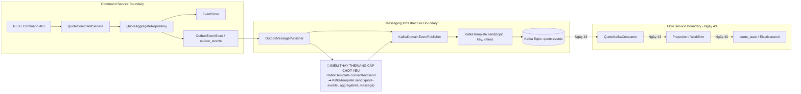

# Tech Note — Ngày 42: Spring Kafka Producer thay RabbitMQ Publisher

> **Chủ đề:** Publish `DomainEventMessage` vào Kafka topic `quote-events` với `key = aggregateId`  
> **Vai trò kiến trúc:** Chuyển tầng Messaging Transport từ RabbitMQ sang Kafka trong Outbox Publishing Layer  
> **Context:** Event Sourcing / CQRS / Transactional Outbox

---

## 1. DASHBOARD TIẾN ĐỘ

### Trạng thái tổng quan

| Hạng mục | Trạng thái |
|---|---|
| Event Store | ✅ Đã có |
| Outbox Table | ✅ Đã có |
| RabbitMQ Publisher | 🟡 Đang bị thay thế |
| Spring Kafka Producer | ✅ Đã thêm |
| Kafka Topic `quote-events` | ✅ Đã chuẩn bị |
| Kafka Consumer | ⏭️ Ngày 43 |
| Retry / DLT | ⏭️ Ngày 44 |
| CDC / Debezium | ⏭️ Ngày 46+ |

### [⚡ ĐIỂM DỪNG HIỆN TẠI]

Code đang dừng ở trạng thái:

```txt
Command API
  -> AggregateRepository
  -> EventStore append
  -> OutboxEvent insert
  -> OutboxMessagePublisher
  -> KafkaDomainEventPublisher
  -> KafkaTemplate.send("quote-events", aggregateId, DomainEventMessage)
```

Điểm đã hoàn thành trong ngày:

```txt
RabbitTemplate.convertAndSend(...)
  đã được thay bằng
KafkaTemplate.send(topic, key, value)
```

Quy tắc mới:

```txt
topic = quote-events
key   = aggregateId / quoteId
value = DomainEventMessage JSON
```

### [🎯 BƯỚC TIẾP THEO]

Ngày 43:

```txt
Thêm Spring Kafka Consumer
  -> @KafkaListener(topics = "quote-events", groupId = "quote-flow-service")
  -> deserialize DomainEventMessage
  -> dispatch Projection / Workflow
```

---

## 2. MÔ PHỎNG CÂY THƯ MỤC

```txt
src/main/java/com/example/quoteservice
├── command
│   └── quote
│       ├── application
│       │   └── service
│       │       └── QuoteCommandService.java
│       │           # Không gọi Kafka trực tiếp. Vẫn chỉ xử lý command use case.
│       │
│       └── infrastructure
│           ├── outbox
│           │   ├── OutboxEventEntity.java
│           │   │   # Row trung gian chứa event cần publish.
│           │   │
│           │   ├── OutboxEventRepository.java
│           │   │   # Query PENDING outbox events.
│           │   │
│           │   └── OutboxMessagePublisher.java
│           │       # [REFACTOR] Trước gọi RabbitMQ, bây giờ gọi KafkaDomainEventPublisher.
│           │
│           └── kafka
│               └── KafkaDomainEventPublisher.java
│                   # [NEW] Adapter publish DomainEventMessage vào Kafka topic quote-events.
│
├── shared
│   └── messaging
│       ├── DomainEventMessage.java
│       │   # Message contract dùng giữa command-service và flow-service.
│       │
│       └── kafka
│           └── QuoteKafkaTopicNames.java
│               # [NEW] Centralize topic name: quote-events.
│
└── resources
    └── application.yml
        # [REFACTOR] Thêm spring.kafka.producer config.
```

---

## 3. SƠ ĐỒ LUỒNG DỮ LIỆU



---

## 4. CHI TIẾT SỰ DỊCH CHUYỂN LOGIC

### File tác động mạnh nhất

```txt
OutboxMessagePublisher.java
```

### TRƯỚC ĐÓ — RabbitMQ Publisher

```java
@Component
public class OutboxMessagePublisher {

    private final RabbitTemplate rabbitTemplate;
    private final OutboxEventRepository outboxEventRepository;

    public void publishOne(OutboxEventEntity outboxEvent) {
        DomainEventMessage message = toMessage(outboxEvent);

        rabbitTemplate.convertAndSend(
                QuoteRabbitConfig.QUOTE_EXCHANGE,
                QuoteRabbitConfig.QUOTE_SYNC_ES_ROUTING_KEY,
                message
        );

        outboxEvent.markSent(LocalDateTime.now());
        outboxEventRepository.save(outboxEvent);
    }
}
```

### BÂY GIỜ — Spring Kafka Producer

```java
@Component
public class OutboxMessagePublisher {

    private final OutboxEventRepository outboxEventRepository;
    private final KafkaDomainEventPublisher kafkaDomainEventPublisher;

    public void publishOne(OutboxEventEntity outboxEvent) {
        DomainEventMessage message = toMessage(outboxEvent);

        kafkaDomainEventPublisher.publish(message);

        outboxEvent.markSent(LocalDateTime.now());
        outboxEventRepository.save(outboxEvent);
    }
}
```

### Adapter mới

```java
@Component
public class KafkaDomainEventPublisher {

    private final KafkaTemplate<String, DomainEventMessage> kafkaTemplate;

    public void publish(DomainEventMessage message) {
        kafkaTemplate.send(
                QuoteKafkaTopicNames.QUOTE_EVENTS,
                message.getAggregateId(),
                message
        );
    }
}
```

### Lý do kiến trúc đổi

```txt
RabbitMQ mindset:
  exchange + routingKey + queue

Kafka mindset:
  topic + key + value
```

Điểm enterprise quan trọng:

```txt
aggregateId được dùng làm Kafka message key
  -> các event cùng aggregate có xu hướng đi cùng partition
  -> giữ thứ tự event theo từng Quote tốt hơn
```

Không thay đổi:

```txt
Domain rule
Aggregate processing
EventStore
Outbox pattern
Projection/Workflow contract
```

Chỉ thay đổi:

```txt
Messaging Transport Adapter:
  RabbitMQ adapter -> Kafka producer adapter
```

---

## 5. QUY LUẬT ĐỌC LẠI 30 GIÂY

Khi mở lại file này, đọc theo thứ tự:

### 0–5 giây

Nhìn ngay vào:

```txt
[⚡ ĐIỂM DỪNG HIỆN TẠI]
```

Để nhớ code đang dừng ở flow nào.

### 5–12 giây

Nhìn vào:

```txt
[🎯 BƯỚC TIẾP THEO]
```

Để biết ngày tiếp theo cần code gì.

### 12–20 giây

Nhìn vào Mermaid flow, tập trung ô:

```txt
🔴 ĐIỂM THAY THẾ/NÂNG CẤP CHỐT YẾU
```

Để nhớ thay đổi kiến trúc chính.

### 20–27 giây

Nhìn vào cây thư mục:

```txt
[NEW] KafkaDomainEventPublisher.java
[REFACTOR] OutboxMessagePublisher.java
[NEW] QuoteKafkaTopicNames.java
```

Để biết phải mở file nào trước khi code tiếp.

### 27–30 giây

Nhìn vào cặp code:

```txt
TRƯỚC ĐÓ -> BÂY GIỜ
```

Để khôi phục chính xác logic đã migrate.

---

## Kết luận siêu ngắn

```txt
Ngày 42 không thay đổi Domain.
Ngày 42 thay Transport Adapter.

OutboxMessagePublisher không còn publish RabbitMQ.
Nó publish DomainEventMessage vào Kafka topic quote-events.

key = aggregateId
value = DomainEventMessage
```

Ngày tiếp theo:

```txt
Ngày 43: Thêm QuoteKafkaConsumer để đọc lại chính message này từ Kafka.
```
