# Tech Note — Ngày 43: Spring Kafka Consumer thay Rabbit Listener

> **Context:** Event Sourcing / CQRS nâng cao  
> **Bài học:** `@KafkaListener` đọc `quote-events`, deserialize `DomainEventMessage`, dispatch Projection/Workflow  
> **Trạng thái:** Đã chuyển Consumer từ RabbitMQ sang Kafka ở tầng Flow Service

---

## 1. DASHBOARD TIẾN ĐỘ

### Tổng quan trạng thái

| Hạng mục | Trạng thái |
|---|---|
| Producer Kafka | ✅ Đã có từ Ngày 42 |
| Topic chính | ✅ `quote-events` |
| Message key | ✅ `aggregateId` / `quoteId` |
| Consumer Kafka | ✅ Thêm mới `QuoteKafkaConsumer` |
| Consumer group | ✅ `quote-flow-service` |
| Deserialize message | ✅ `DomainEventMessage` |
| Dispatch event | ✅ Qua `DomainEventMessageProcessor` |
| Projection / Workflow | ✅ Giữ nguyên handler cũ |
| Rabbit listener | ⚠️ Cần disable / profile hóa |
| Retry + DLT | ⏭️ Sang Ngày 44 |

---

### ⚡ ĐIỂM DỪNG HIỆN TẠI

Code đang dừng ở trạng thái:

```txt
Kafka topic quote-events
  -> QuoteKafkaConsumer
  -> DomainEventMessageProcessor
  -> EventDeserializer
  -> DomainEventHandler
  -> Projection / Workflow
  -> processed_messages
```

Điểm quan trọng nhất:

```txt
Transport đã đổi:
RabbitMQ queue -> Kafka topic

Business logic chưa đổi:
deserialize -> dispatch -> projection/workflow
```

File trọng tâm hôm nay:

```txt
QuoteKafkaConsumer.java
DomainEventMessageProcessor.java
application.yml
```

---

### 🎯 BƯỚC TIẾP THEO

Ngày mai:

```txt
Ngày 44 — Kafka retry + DLQ cơ bản
```

Mục tiêu ngày mai:

```txt
Consumer lỗi
  -> retry vài lần
  -> nếu vẫn lỗi
  -> đẩy message sang quote-events-dlt
```

---

## 2. MÔ PHỎNG CÂY THƯ MỤC

```txt
src/main/java/com/example/quoteservice
├── shared
│   ├── messaging
│   │   ├── DomainEventMessage.java                  # Message chuẩn đi qua broker
│   │   ├── dedup
│   │   │   ├── MessageDedupService.java             # Check/mark processed message
│   │   │   └── ProcessedMessageRepository.java      # Lưu idempotency table
│   │   └── kafka
│   │       └── QuoteKafkaTopicNames.java            # NEW: constant topic quote-events
│   │
│   ├── eventstore
│   │   └── EventDeserializer.java                   # Deserialize payload -> DomainEvent
│   │
│   └── eventbus
│       ├── DomainEventEnvelope.java                 # Envelope đưa event vào handler
│       └── DomainEventHandler.java                  # Interface handler projection/workflow
│
├── command
│   └── quote
│       └── infrastructure
│           └── kafka
│               └── KafkaDomainEventPublisher.java   # FROM DAY 42: publish Kafka
│
├── flow
│   └── quote
│       ├── consumer
│       │   ├── DomainEventMessageProcessor.java     # NEW/REFACTOR: xử lý chung message
│       │   └── kafka
│       │       └── QuoteKafkaConsumer.java          # NEW: @KafkaListener đọc quote-events
│       │
│       ├── projection
│       │   └── handler
│       │       ├── QuoteCreatedProjectionHandler.java    # Giữ nguyên
│       │       ├── QuoteSubmittedProjectionHandler.java  # Giữ nguyên
│       │       └── QuoteApprovedProjectionHandler.java   # Giữ nguyên
│       │
│       └── workflow
│           └── QuoteSyncWorkflow.java               # Giữ nguyên workflow sync/read model/ES
│
└── infrastructure
    └── rabbit
        └── RabbitMqDomainEventConsumer.java         # DEPRECATED/DISABLE: listener cũ
```

---

## 3. SƠ ĐỒ LUỒNG DỮ LIỆU

```mermaid
graph LR
    subgraph Command_Service["Command Service"]
        A[QuoteCommandService]
        B[AggregateRepository]
        C[(event_store)]
        D[(outbox_events)]
        E[OutboxPublisher]
        F[KafkaDomainEventPublisher]
    end

    subgraph Kafka_Broker["Kafka Broker"]
        K[topic: quote-events]
    end

    subgraph Flow_Service["Flow Service"]
        G["QuoteKafkaConsumer<br/>@KafkaListener"]
        H[DomainEventMessageProcessor]
        I[EventDeserializer]
        J[DomainEventHandler Dispatcher]
        P[Projection Handlers]
        W[QuoteSyncWorkflow]
        M[(processed_messages)]
        S[(quote_state)]
        ES[(Elasticsearch)]
    end

    subgraph Deprecated_Transport["Deprecated Transport"]
        R["RabbitMqDomainEventConsumer<br/>@RabbitListener"]
    end

    A --> B
    B --> C
    B --> D
    D --> E
    E --> F
    F -->|"send(topic, aggregateId, DomainEventMessage)"| K

    K -->|"consume by group quote-flow-service"| G
    G --> H
    H --> M
    H --> I
    I --> J
    J --> P
    J --> W
    P --> S
    W --> ES

    R -. "🔴 ĐIỂM THAY THẾ/NÂNG CẤP CHỐT YẾU<br/>Rabbit listener bị thay bằng Kafka listener" .-> G
```



**🔴 Điểm thay thế/nâng cấp chốt yếu:**

```txt
@RabbitListener(queue)
  -> @KafkaListener(topics = quote-events, groupId = quote-flow-service)
```

---

## 4. CHI TIẾT SỰ DỊCH CHUYỂN LOGIC

File bị tác động mạnh nhất:

```txt
RabbitMqDomainEventConsumer.java
  -> QuoteKafkaConsumer.java
  -> DomainEventMessageProcessor.java
```

---

### TRƯỚC ĐÓ — Rabbit listener xử lý trực tiếp

```java
@Component
public class RabbitMqDomainEventConsumer {

    private final EventDeserializer eventDeserializer;
    private final List<DomainEventHandler<? extends DomainEvent>> handlers;
    private final MessageDedupService messageDedupService;

    @RabbitListener(queues = "quote-event-queue")
    @Transactional
    public void consume(DomainEventMessage message) {
        if (messageDedupService.isProcessed(message.getEventId())) {
            return;
        }

        DomainEvent event = eventDeserializer.deserialize(message);

        for (DomainEventHandler<?> handler : handlers) {
            if (handler.eventType().equals(event.getClass())) {
                handler.handle(event);
            }
        }

        messageDedupService.markProcessed(message);
    }
}
```

---

### BÂY GIỜ — Kafka listener chỉ nhận transport, processor xử lý nghiệp vụ

```java
@Component
public class QuoteKafkaConsumer {

    private final DomainEventMessageProcessor processor;

    @KafkaListener(
        topics = QuoteKafkaTopicNames.QUOTE_EVENTS,
        groupId = "${spring.kafka.consumer.group-id:quote-flow-service}"
    )
    @Transactional
    public void consume(
            DomainEventMessage message,
            ConsumerRecord<String, DomainEventMessage> record
    ) {
        log.info(
            "[KAFKA_CONSUMER] topic={}, partition={}, offset={}, key={}, eventType={}, aggregateId={}",
            record.topic(),
            record.partition(),
            record.offset(),
            record.key(),
            message.getEventType(),
            message.getAggregateId()
        );

        processor.process(message);
    }
}
```

```java
@Component
public class DomainEventMessageProcessor {

    private final EventDeserializer eventDeserializer;
    private final List<DomainEventHandler<? extends DomainEvent>> handlers;
    private final MessageDedupService messageDedupService;

    public void process(DomainEventMessage message) {
        if (messageDedupService.isProcessed(message.getEventId())) {
            return;
        }

        DomainEvent event = eventDeserializer.deserialize(message);

        dispatchToHandlers(event, message);

        messageDedupService.markProcessed(message);
    }
}
```

---

### Vì sao kiến trúc đổi?

```txt
1. Tách transport khỏi business processing
   Kafka consumer chỉ biết Kafka metadata: topic, partition, offset, key.

2. Giữ Projection/Workflow không phụ thuộc Kafka
   Handler vẫn nhận DomainEventEnvelope như cũ.

3. Dễ thay broker trong tương lai
   RabbitMQ / Kafka / Debezium adapter đều có thể gọi chung DomainEventMessageProcessor.

4. Debug enterprise tốt hơn
   Kafka log có topic + partition + offset + key + correlationId.

5. Chuẩn bị cho retry/DLT
   Listener phải throw exception ra ngoài để Spring Kafka xử lý retry/DLT.
```

---

## 5. QUY LUẬT ĐỌC LẠI 30 GIÂY

Khi mở lại file này, đọc theo thứ tự:

### Bước 1 — Nhìn Dashboard trước

Tìm ngay:

```txt
⚡ ĐIỂM DỪNG HIỆN TẠI
🎯 BƯỚC TIẾP THEO
```

Mục tiêu:

```txt
Biết hôm nay đang dừng ở Kafka Consumer, ngày mai sang Retry + DLT.
```

---

### Bước 2 — Nhìn Flow Mermaid

Tập trung vào đường chính:

```txt
outbox_events
  -> Kafka topic quote-events
  -> QuoteKafkaConsumer
  -> DomainEventMessageProcessor
  -> Projection/Workflow
```

Bỏ qua chi tiết phụ nếu chỉ có 30 giây.

---

### Bước 3 — Nhìn cây thư mục

Nhớ 3 file chính:

```txt
QuoteKafkaConsumer.java
DomainEventMessageProcessor.java
RabbitMqDomainEventConsumer.java
```

Ý nghĩa:

```txt
File mới nhận Kafka.
File mới xử lý message chung.
File cũ Rabbit bị disable/deprecated.
```

---

### Bước 4 — Nhìn phần TRƯỚC ĐÓ / BÂY GIỜ

Chỉ cần nhớ:

```txt
Trước:
  Rabbit listener vừa nhận message vừa xử lý logic.

Bây giờ:
  Kafka listener chỉ nhận message.
  DomainEventMessageProcessor xử lý logic chung.
```

---

### Bước 5 — Nhớ câu khóa

```txt
Kafka chỉ là transport.
Business flow vẫn là:
DomainEventMessage -> DomainEvent -> Handler -> Projection/Workflow.
```

---

## 6. TÓM TẮT 1 DÒNG

```txt
Ngày 43 hoàn thành việc thay Rabbit listener bằng Kafka consumer, đồng thời tách logic xử lý message sang DomainEventMessageProcessor để chuẩn bị cho retry/DLT và CDC/Debezium.
```
