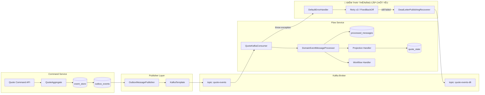

# Tech Note — Ngày 44: Kafka Retry + DLQ cơ bản

> **Chủ đề:** Consumer lỗi thì retry có kiểm soát, sau đó đẩy message sang `quote-events-dlt` để debug.  
> **Kiểu note:** Kiến trúc động — đọc lại trong 30 giây để khôi phục context.

---

## 1. DASHBOARD TIẾN ĐỘ

### Trạng thái tổng quan

```txt
Event Sourcing / CQRS Demo

Day 42  ✅ Kafka Producer: OutboxPublisher -> Kafka topic quote-events
Day 43  ✅ Kafka Consumer: @KafkaListener -> Projection/Workflow
Day 44  ✅ Retry + DLT: Consumer lỗi -> retry -> quote-events-dlt
Day 45  ⏭️ Integration Test: Outbox -> Kafka -> Consumer -> quote_state + DLT
```

### [⚡ ĐIỂM DỪNG HIỆN TẠI]

```txt
Code đang dừng tại tầng FLOW / Kafka Consumer resiliency.

Hiện tại:
- QuoteKafkaConsumer đọc topic quote-events.
- Consumer gọi DomainEventMessageProcessor.
- Processor check idempotency bằng processed_messages.
- Processor dispatch Projection/Workflow.
- Nếu handler lỗi:
  - Consumer KHÔNG nuốt exception.
  - Exception được throw ra ngoài Kafka listener.
  - DefaultErrorHandler retry 3 lần.
  - Nếu vẫn lỗi, DeadLetterPublishingRecoverer đẩy message sang quote-events-dlt.

Điểm quan trọng:
- markProcessed chỉ chạy sau khi handler thành công.
- Message lỗi không được ghi processed_messages.
- quote-events-dlt là nơi debug, chưa reprocess tự động.
```

### [🎯 BƯỚC TIẾP THEO]

```txt
Ngày 45:
Viết Kafka Integration Test thật.

Mục tiêu:
- OutboxPublisher publish Kafka thật.
- QuoteKafkaConsumer consume Kafka thật.
- quote_state update đúng.
- processed_messages có record.
- Consumer lỗi -> retry -> message vào quote-events-dlt.
```

---

## 2. MÔ PHỎNG CÂY THƯ MỤC

```txt
src/main/java/com/example/quoteservice
├── shared
│   └── messaging
│       └── kafka
│           ├── QuoteKafkaTopicNames.java                 // [UPDATED] thêm QUOTE_EVENTS_DLT
│           ├── KafkaConsumerErrorHandlerConfig.java      // [NEW] cấu hình retry + DLT
│           └── KafkaListenerContainerConfig.java         // [OPTIONAL/NEW] gắn DefaultErrorHandler vào listener factory nếu auto-config không nhận
│
├── flow
│   └── quote
│       └── consumer
│           ├── DomainEventMessageProcessor.java          // [REFINED] xử lý idempotency + deserialize + dispatch handler
│           └── kafka
│               ├── QuoteKafkaConsumer.java               // [UPDATED] phải throw exception để Kafka retry/DLT hoạt động
│               └── QuoteKafkaDltConsumer.java            // [NEW] listen quote-events-dlt để log/debug poison message
│
└── readmodel
    └── quote
        └── state
            ├── QuoteStateEntity.java                     // read model được projection update khi consume thành công
            └── QuoteStateRepository.java                 // verify quote_state sau khi consumer xử lý
```

---

## 3. SƠ ĐỒ LUỒNG DỮ LIỆU



### Ý nghĩa điểm nâng cấp

```txt
Trước Day 44:
Consumer lỗi -> log lỗi / retry chưa rõ / dễ mất message hoặc kẹt partition.

Sau Day 44:
Consumer lỗi -> throw exception -> Kafka retry có kiểm soát -> DLT để debug.
```

---

## 4. CHI TIẾT SỰ DỊCH CHUYỂN LOGIC

### File bị tác động mạnh nhất

```txt
QuoteKafkaConsumer.java
KafkaConsumerErrorHandlerConfig.java
```

### TRƯỚC ĐÓ — Day 43: consumer chỉ consume và dispatch

```java
@KafkaListener(
        topics = QuoteKafkaTopicNames.QUOTE_EVENTS,
        groupId = "quote-flow-service"
)
@Transactional
public void consume(DomainEventMessage message) {
    log.info("[KAFKA_CONSUMER] Consuming event: {}", message.getEventType());

    // Nếu processor lỗi mà catch rồi nuốt exception,
    // Kafka có thể hiểu nhầm là message đã xử lý xong.
    processor.process(message);
}
```

### BÂY GIỜ — Day 44: consumer lỗi phải throw ra ngoài để retry/DLT hoạt động

```java
@KafkaListener(
        topics = QuoteKafkaTopicNames.QUOTE_EVENTS,
        groupId = "quote-flow-service"
)
@Transactional
public void consume(
        DomainEventMessage message,
        ConsumerRecord<String, DomainEventMessage> record
) {
    try {
        log.info(
                "[KAFKA_CONSUMER] topic={}, partition={}, offset={}, key={}, eventType={}, aggregateId={}, version={}",
                record.topic(),
                record.partition(),
                record.offset(),
                record.key(),
                message.getEventType(),
                message.getAggregateId(),
                message.getAggregateVersion()
        );

        processor.process(message);
    } catch (Exception exception) {
        log.error(
                "[KAFKA_CONSUMER] Failed. topic={}, partition={}, offset={}, key={}, eventId={}",
                record.topic(),
                record.partition(),
                record.offset(),
                record.key(),
                message.getEventId(),
                exception
        );

        // Bắt buộc throw để DefaultErrorHandler nhận lỗi.
        throw exception;
    }
}
```

### Config mới — Retry + DLT

```java
@Configuration
public class KafkaConsumerErrorHandlerConfig {

    @Bean
    public DefaultErrorHandler kafkaDefaultErrorHandler(
            KafkaTemplate<String, DomainEventMessage> kafkaTemplate
    ) {
        DeadLetterPublishingRecoverer recoverer =
                new DeadLetterPublishingRecoverer(
                        kafkaTemplate,
                        (record, exception) -> new TopicPartition(
                                QuoteKafkaTopicNames.QUOTE_EVENTS_DLT,
                                record.partition()
                        )
                );

        FixedBackOff fixedBackOff = new FixedBackOff(1000L, 3L);

        return new DefaultErrorHandler(recoverer, fixedBackOff);
    }
}
```

### Vì sao kiến trúc đổi?

```txt
Vấn đề:
- Kafka consumer là async pipeline.
- Nếu consumer lỗi mà không có retry/DLT, message có thể làm kẹt flow hoặc bị xử lý không rõ trạng thái.

Giải pháp:
- Throw exception ra khỏi listener.
- Để Spring Kafka DefaultErrorHandler quản lý retry.
- Sau retry hết, DeadLetterPublishingRecoverer đưa message sang DLT.
- DLT giữ lại poison message để debug/reprocess thủ công.

Nguyên tắc Enterprise:
- Không nuốt lỗi trong consumer.
- Không mark processed trước khi side effect thành công.
- Không tự động reprocess DLT ngay.
```

---

## 5. QUY LUẬT ĐỌC LẠI 30 GIÂY

Khi mở lại file này, đọc theo thứ tự:

```txt
00s - 05s:
Nhìn DASHBOARD TIẾN ĐỘ
-> Biết đang ở Day 44, đã có retry + DLT.

05s - 10s:
Nhìn [⚡ ĐIỂM DỪNG HIỆN TẠI]
-> Nhớ code đang dừng ở Kafka Consumer resiliency.

10s - 18s:
Nhìn Mermaid Flow
-> Tìm vùng RESILIENCY và dòng:
   Consumer -> DefaultErrorHandler -> Retry -> DLT.

18s - 25s:
Nhìn cây thư mục
-> Tập trung 3 file:
   QuoteKafkaConsumer.java
   KafkaConsumerErrorHandlerConfig.java
   QuoteKafkaDltConsumer.java

25s - 30s:
Nhìn [🎯 BƯỚC TIẾP THEO]
-> Ngày 45 viết integration test thật:
   Outbox -> Kafka -> Consumer -> quote_state + DLT.
```

---

## Ghi nhớ nhanh

```txt
Day 44 = Resilient Kafka Consumer.

Success path:
quote-events -> QuoteKafkaConsumer -> Projection/Workflow -> processed_messages

Failure path:
quote-events -> QuoteKafkaConsumer -> throw exception -> retry -> quote-events-dlt

Golden rule:
Handler thành công rồi mới mark processed.
Handler lỗi thì throw, để Kafka retry/DLT xử lý.
```
