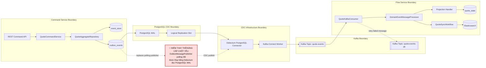

# Tech Note — Ngày 46: CDC/Debezium Outbox Architecture

> **Context:** Event Sourcing / CQRS nâng cao — thay `OutboxPublisher` polling bằng CDC Debezium đọc `outbox_events` từ PostgreSQL WAL rồi đẩy Kafka.

---

## 1. DASHBOARD TIẾN ĐỘ

| Hạng mục | Trạng thái |
|---|---|
| Event Store | ✅ Có `event_store` ghi Domain Event |
| Outbox Pattern | ✅ Có `outbox_events` ghi cùng transaction với event |
| Kafka Producer thủ công | ✅ Có `OutboxMessagePublisher -> KafkaTemplate` |
| Kafka Consumer | ✅ Có `QuoteKafkaConsumer -> Projection/Workflow` |
| Retry + DLT | ✅ Có `quote-events-dlt` |
| CDC/Debezium | 🟡 Đã hiểu architecture, **chưa dựng connector thật** |
| Eventuate thật | 🔴 Chưa áp dụng framework thật |

### [⚡ ĐIỂM DỪNG HIỆN TẠI]

```text
Code hiện đang dừng ở mô hình TRANSITIONAL OUTBOX:

CommandService
  -> AggregateRepository
  -> event_store
  -> outbox_events
  -> OutboxMessagePublisher        # TEMPORARY: polling DB
  -> KafkaTemplate.send(...)
  -> quote-events
  -> QuoteKafkaConsumer
  -> Projection / Workflow
```

**Điểm quan trọng:**

```text
OutboxMessagePublisher.java hiện vẫn còn hoạt động.
Nhưng từ ngày 46, file này được đánh dấu là cơ chế tạm thời.
Nó sẽ được thay bởi Debezium/Kafka Connect ở các ngày tiếp theo.
```

### [🎯 BƯỚC TIẾP THEO]

```text
Ngày 47 — Dựng Kafka Connect + Debezium + PostgreSQL logical replication bằng Docker Compose.

Mục tiêu ngày mai:
  [ ] postgres wal_level=logical
  [ ] kafka running
  [ ] kafka-connect running
  [ ] Debezium PostgresConnector available
  [ ] sẵn sàng tạo connector capture outbox_events
```

---

## 2. MÔ PHỎNG CÂY THƯ MỤC

```text
src/main/java/com/example/quoteservice
├── command
│   └── quote
│       ├── application
│       │   └── QuoteCommandService.java                 # ghi command -> aggregate -> event_store/outbox
│       └── infrastructure
│           ├── eventstore
│           │   ├── JpaEventStore.java                   # append Domain Event vào event_store
│           │   └── EventStoreRecord.java                # record event đã persisted
│           ├── outbox
│           │   ├── OutboxEventEntity.java               # row outbox_events; nguồn CDC sau này
│           │   ├── OutboxEventRepository.java           # query outbox hiện tại
│           │   └── OutboxMessagePublisher.java          # [TEMP][SẼ BỊ THAY] polling outbox -> Kafka
│           └── kafka
│               └── KafkaDomainEventPublisher.java       # [TEMP][SẼ BỊ THAY] KafkaTemplate producer thủ công
│
├── flow
│   └── quote
│       ├── consumer
│       │   ├── DomainEventMessageProcessor.java         # xử lý chung: dedup -> deserialize -> dispatch
│       │   └── kafka
│       │       ├── QuoteKafkaConsumer.java              # consume quote-events
│       │       └── QuoteKafkaDltConsumer.java           # consume quote-events-dlt để debug
│       ├── projection
│       │   └── QuoteProjectionHandler.java              # update quote_state
│       └── workflow
│           └── QuoteSyncWorkflow.java                   # sync ES / side effects
│
├── shared
│   └── messaging
│       ├── DomainEventMessage.java                      # message contract nội bộ
│       └── kafka
│           ├── QuoteKafkaTopicNames.java                # quote-events, quote-events-dlt
│           └── KafkaConsumerErrorHandlerConfig.java     # retry + DLT
│
└── docs
    └── architecture
        └── cdc-debezium-outbox.md                       # [NEW] note kiến trúc CDC target

infra
└── docker-compose.cdc.yml                               # [NEXT] Postgres + Kafka + Kafka Connect + Debezium
```

---

## 3. SƠ ĐỒ LUỒNG DỮ LIỆU — TARGET CDC FLOW



---

## 4. CHI TIẾT SỰ DỊCH CHUYỂN LOGIC

### File bị tác động mạnh nhất

```text
command/quote/infrastructure/outbox/OutboxMessagePublisher.java
```

### TRƯỚC ĐÓ — Application tự polling Outbox rồi publish Kafka

```java
// TRƯỚC ĐÓ: Polling publisher nằm trong application runtime
@Component
public class OutboxMessagePublisher {

    private final OutboxEventRepository outboxEventRepository;
    private final KafkaDomainEventPublisher kafkaDomainEventPublisher;

    @Transactional
    public void publishPendingEvents() {
        List<OutboxEventEntity> pendingEvents =
                outboxEventRepository.findTop50ByStatusOrderByCreatedAtAsc(PENDING);

        for (OutboxEventEntity outboxEvent : pendingEvents) {
            DomainEventMessage message = toMessage(outboxEvent);

            kafkaDomainEventPublisher.publish(message); // app tự publish Kafka

            outboxEvent.markSent(now());                // app tự quản lý SENT/FAILED
            outboxEventRepository.save(outboxEvent);
        }
    }
}
```

### BÂY GIỜ — Application chỉ ghi DB; CDC chịu trách nhiệm publish Kafka

```java
// BÂY GIỜ: Command side chỉ đảm bảo transaction ghi event_store + outbox_events
@Transactional
public AggregateCommandResult<QuoteAggregate> update(
        String aggregateId,
        QuoteCommand command
) {
    QuoteAggregate aggregate = aggregateLoader.load(aggregateId);

    DomainEvent event = aggregate.process(command);

    EventAppendResult appendResult = eventStore.append(
            aggregateId,
            event,
            expectedVersion
    );

    outboxEventStore.save(appendResult); // chỉ INSERT outbox_events

    // Không gọi kafkaTemplate.send(...)
    // Không polling PENDING
    // Không mark SENT ở application layer

    return AggregateCommandResult.from(aggregate, appendResult);
}
```

### Lý do đổi kiến trúc

```text
Enterprise reason:
  Tách trách nhiệm publish event khỏi application code.

Before:
  Application = business command + outbox polling + Kafka publishing + retry publish.

After:
  Application = business command + DB transaction only.
  Debezium/Kafka Connect = CDC infrastructure publishing.
  Flow Service = consume + projection/workflow.
```

---

## 5. QUY LUẬT ĐỌC LẠI 30 GIÂY

```text
Khi mở lại file này, đọc theo thứ tự:

1. Nhìn DASHBOARD TIẾN ĐỘ
   -> biết mình đã làm được gì, còn thiếu gì.

2. Nhìn [⚡ ĐIỂM DỪNG HIỆN TẠI]
   -> nhớ code đang dừng ở OutboxPublisher polling, chưa có Debezium thật.

3. Nhìn Mermaid FLOW
   -> nắm ngay ranh giới Command / DB CDC / Kafka Connect / Kafka / Flow.

4. Nhìn [🔴 ĐIỂM THAY THẾ/NÂNG CẤP CHỐT YẾU]
   -> nhớ phần cần thay: OutboxMessagePublisher -> Debezium WAL reader.

5. Nhìn code TRƯỚC ĐÓ vs BÂY GIỜ
   -> nhớ logic dịch chuyển từ application publishing sang infrastructure CDC.

6. Nhìn [🎯 BƯỚC TIẾP THEO]
   -> tiếp tục Ngày 47: Docker Compose cho Postgres logical + Kafka Connect + Debezium.
```

---

## 6. GHI NHỚ ENTERPRISE

```text
Outbox Pattern:
  ghi event cần publish vào DB cùng transaction với business event.

CDC:
  biến DB changes thành Kafka messages mà không cần application polling.

Debezium:
  connector đọc PostgreSQL WAL/logical replication.

Kafka Connect:
  runtime chạy Debezium connector.

Flow Service:
  vẫn consume Kafka, vẫn projection/workflow, không cần biết command transaction.
```

**Một câu nhớ nhanh:**

```text
Application ghi sự thật vào DB.
Debezium đọc sự thật từ WAL.
Kafka phát tán sự thật.
Flow Service phản ứng với sự thật.
```
